# (CSC 361) - Computer Networks - Complete Notes - Fall 2022


[TOC]

- [Class Intro](#class-intro)
  * [Content](#content)
      - [First month](#first-month)
      - [Second month](#second-month)
      - [Third month](#third-month)
  * [Lecture Slides](#lecture-slides)
  * [Course evaluation](#course-evaluation)
- [Written Assignments](#written-assignments)
  * [Worksheet 1 Answers](#worksheet-1-answers)
- [MIDTERM 2](#midterm-2)
  * [Midterm Content](#midterm-content)
- [Chapter 1 - Computer Networks and the Internet](#chapter-1---computer-networks-and-the-internet)
  * [1.1.2 - A services Description](#112---a-services-description)
  * [1.1.3 - What is a protocol](#113---what-is-a-protocol)
  * [1.2.1 Access networks](#121-access-networks)
      - [DSL](#dsl)
      - [Cable Internet Access](#cable-internet-access)
      - [Fiber](#fiber)
      - [Broadband Over Powerline (BPL)](#broadband-over-powerline--bpl-)
        * [Analog Dial-up](#analog-dial-up)
        * [Nyquist, Shannon Limit and Bandwidth, sample, symbol, bit, data rate](#nyquist--shannon-limit-and-bandwidth--sample--symbol--bit--data-rate)
          + [Nyquist Limit (idealistic, noiseless channel)](#nyquist-limit--idealistic--noiseless-channel-)
          + [Shannon Limit (Noisy Channel)](#shannon-limit--noisy-channel-)
          + [Bandwidth, sample, symbol, bit, data rate](#bandwidth--sample--symbol--bit--data-rate)
      - [Internet Access: LAN](#internet-access--lan)
      - [Internet access: WLAN](#internet-access--wlan)
      - [Internet access: Wireless MAN](#internet-access--wireless-man)
      - [Internet access: Wireless *AN](#internet-access--wireless--an)
      - [Internet access: cellular networks](#internet-access--cellular-networks)
  * [1.3 Packet Switching](#13-packet-switching)
      - [Sending One packet](#sending-one-packet)
      - [Sending 3 packets](#sending-3-packets)
      - [Delays and packet loss](#delays-and-packet-loss)
      - [Circuit Switching](#circuit-switching)
      - [Multiplexing in Circuit-Switched Networks](#multiplexing-in-circuit-switched-networks)
      - [Circuit switching example](#circuit-switching-example)
      - [Packet switching vs Circuit switching Pros/Cons](#packet-switching-vs-circuit-switching-pros-cons)
  * [1.3 A Network of Networks](#13-a-network-of-networks)
      - [Internet Service Providers](#internet-service-providers)
  * [1.3.1 Multiplexing Technologies](#131-multiplexing-technologies)
      - [Frequency division multiplexing (FDM)](#frequency-division-multiplexing--fdm-)
      - [Wavelength division multiplexing](#wavelength-division-multiplexing)
      - [Time division multiplexing](#time-division-multiplexing)
      - [Communication satellite](#communication-satellite)
  * [1.4 Packet Delay](#14-packet-delay)
      - [Definitions](#definitions)
      - [Traceroute](#traceroute)
  * [1.5 Protocol Layers and Layered Architecture](#15-protocol-layers-and-layered-architecture)
      - [Application Layer](#application-layer)
      - [Transport Layer](#transport-layer)
        * [**TCP (Transmission control Protocol)**](#--tcp--transmission-control-protocol---)
        * [**UDP (User Diagram Protocol)**](#--udp--user-diagram-protocol---)
      - [Network Layer](#network-layer)
      - [Link Layer](#link-layer)
      - [Physical Layer](#physical-layer)
      - [Encapsulation](#encapsulation)
- [Chapter 2 - Application Layer](#chapter-2---application-layer)
  * [The Interface Between the Process and the Computer Network](#the-interface-between-the-process-and-the-computer-network)
  * [HTTP](#http)
      - [Request methods](#request-methods)
      - [Response Codes](#response-codes)
      - [HTTP Request message level views](#http-request-message-level-views)
  * [Transport Services Available to Applications](#transport-services-available-to-applications)
      - [Reliable Data Transfer](#reliable-data-transfer)
      - [Throughput](#throughput)
      - [Timing](#timing)
  * [TCP services](#tcp-services)
      - [Connection-oriented service](#connection-oriented-service)
      - [Reliable data transfer service](#reliable-data-transfer-service)
  * [UDP Services](#udp-services)
  * [2.1.5 Application-Layer Protocols](#215-application-layer-protocols)
  * [2.2 The Web and HTTP](#22-the-web-and-http)
  * [2.2.2 Non-Persistent and Persistent Connections](#222-non-persistent-and-persistent-connections)
      - [HTTP with Non-Persistent Connections](#http-with-non-persistent-connections)
        * [HTTP with non-persistant concurrent connections](#http-with-non-persistant-concurrent-connections)
      - [HTTP with Persistent Connections](#http-with-persistent-connections)
  * [2.2.3 HTTP Message Format](#223-http-message-format)
  * [2.2.4 Cookies](#224-cookies)
  * [2.2.5 Web caching](#225-web-caching)
      - [Process of web caching](#process-of-web-caching)
      - [Pros of Web caching](#pros-of-web-caching)
      - [Calculating the bottleneck of delay](#calculating-the-bottleneck-of-delay)
        * [Calculating: The traffic intensity on the LAN](#calculating--the-traffic-intensity-on-the-lan)
        * [Calculating: Traffic intensity on the access link](#calculating--traffic-intensity-on-the-access-link)
        * [Conditional GET](#conditional-get)
  * [2.4 DNS - The Internet’s Directory Service](#24-dns---the-internet-s-directory-service)
      - [Additional services provided by DNS](#additional-services-provided-by-dns)
      - [Resource Records](#resource-records)
      - [DNS Messages](#dns-messages)
  * [2.7 Socket Programming: Creating Network Applications](#27-socket-programming--creating-network-applications)
      - [UDP Server-Client Example (Python)](#udp-server-client-example--python-)
        * [UDP Client](#udp-client)
        * [UDP Server](#udp-server)
      - [TCP Server-Client Example (Python)](#tcp-server-client-example--python-)
        * [TCP Client](#tcp-client)
        * [TCP Server](#tcp-server)
- [Chapter 3 - Transport Layer](#chapter-3---transport-layer)
  * [3.1 Relationship between Transport and Network layers](#31-relationship-between-transport-and-network-layers)
      - [Transport-layer protocol Elements](#transport-layer-protocol-elements)
      - [Transport Layer Services](#transport-layer-services)
      - [Network layer services](#network-layer-services)
  * [3.2 Multiplexing and Demultiplexing](#32-multiplexing-and-demultiplexing)
      - [Connectionless Multiplexing and Demultiplexing](#connectionless-multiplexing-and-demultiplexing)
      - [Connection-Oriented Multiplexing and Demultiplexing](#connection-oriented-multiplexing-and-demultiplexing)
      - [What's under a socket?](#what-s-under-a-socket-)
      - [Socket container (Encapsulation)](#socket-container--encapsulation-)
  * [3.3 Connectionless Transport: UDP](#33-connectionless-transport--udp)
      - [Why UDP over TCP?](#why-udp-over-tcp-)
      - [UDP Segment Structure](#udp-segment-structure)
      - [UDP Checksum](#udp-checksum)
  * [3.4 Principles of Reliable Data Transfer](#34-principles-of-reliable-data-transfer)
      - [What could go wrong?](#what-could-go-wrong-)
      - [Error Detection](#error-detection)
      - [Error and Delay solutions](#error-and-delay-solutions)
        * [Sender Timer](#sender-timer)
        * [Timeout Value](#timeout-value)
      - [Nagle's Algorithm (Sender approach)](#nagle-s-algorithm--sender-approach-)
      - [David Clark Algorithm (Receiver approach)](#david-clark-algorithm--receiver-approach-)
      - [Consider three possibilities for handling corrupted ACKs or NAKs:](#consider-three-possibilities-for-handling-corrupted-acks-or-naks-)
      - [Duplicate packets](#duplicate-packets)
      - [Duplicate ACKS](#duplicate-acks)
      - [Reliable Data Transfer over a Lossy Channel with Bit Errors](#reliable-data-transfer-over-a-lossy-channel-with-bit-errors)
      - [Stop-and-wait vs pipelined protocol](#stop-and-wait-vs-pipelined-protocol)
        * [Pipelining](#pipelining)
          + [Go-Back-N (GBN)](#go-back-n--gbn-)
          + [Selective Repeat (SR)](#selective-repeat--sr-)
  * [3.5 Connection-Oriented Transport: TCP](#35-connection-oriented-transport--tcp)
        * [TCP Connection ID](#tcp-connection-id)
      - [TCP Segment Structure](#tcp-segment-structure)
        * [URG Pointers (Flag Fields)](#urg-pointers--flag-fields-)
        * [Sequence Numbers and Acknowledgment Numbers](#sequence-numbers-and-acknowledgment-numbers)
          + [Sequence Numbers](#sequence-numbers)
          + [Acknowledgement numbers](#acknowledgement-numbers)
      - [Round-Trip Time Estimation and Timeout](#round-trip-time-estimation-and-timeout)
        * [Estimating the Round-Trip Time](#estimating-the-round-trip-time)
        * [Fast Retransmit](#fast-retransmit)
        * [Is TCP Selective or a GBN Protocol?](#is-tcp-selective-or-a-gbn-protocol-)
      - [Flow Control](#flow-control)
        * [TCP Receive window](#tcp-receive-window)
          + [Window space](#window-space)
      - [TCP connection Management](#tcp-connection-management)
  * [3.6 Principals of congestion control](#36-principals-of-congestion-control)
      - [Load-Gain Curve](#load-gain-curve)
        * [The 3 Stages (I, II and III):](#the-3-stages--i--ii-and-iii--)
      - [The Causes and the Costs of Congestion](#the-causes-and-the-costs-of-congestion)
        * [Scenario 1: Two Senders, a Router with Infinite Buffers](#scenario-1--two-senders--a-router-with-infinite-buffers)
        * [Scenario 2: Two Senders and a Router with Finite Buffers](#scenario-2--two-senders-and-a-router-with-finite-buffers)
        * [Scenario 3: Four Senders, Routers with Finite Buffers, and Multihop Paths](#scenario-3--four-senders--routers-with-finite-buffers--and-multihop-paths)
      - [Approaches to Congestion Control](#approaches-to-congestion-control)
  * [3.7 TCP Congestion Control](#37-tcp-congestion-control)
      - [Why congestion control?](#why-congestion-control-)
      - [Load-Gain Curve](#load-gain-curve-1)
      - [Slow start (In the first section of the curve)](#slow-start--in-the-first-section-of-the-curve-)
        * [Network Congestion](#network-congestion)
      - [Congestion Avoidance (In the middle section of the curve)](#congestion-avoidance--in-the-middle-section-of-the-curve-)
        * [Congestion window](#congestion-window)
      - [Congestion control techniques](#congestion-control-techniques)
        * [Timeout Retransmit (In the 3rd section of the curve)](#timeout-retransmit--in-the-3rd-section-of-the-curve-)
        * [Fast Retransmit](#fast-retransmit-1)
          + [Steps for fast retransmit](#steps-for-fast-retransmit)
        * [Fast Recovery](#fast-recovery)
          + [Steps for Fast recovery](#steps-for-fast-recovery)
      - [Other TCP congestion controls](#other-tcp-congestion-controls)
        * [TCP Cubic](#tcp-cubic)
        * [Explicit Congestion Notification (ECN): Network-assisted Congestion Control](#explicit-congestion-notification--ecn---network-assisted-congestion-control)
      - [Fairness of segments on the network](#fairness-of-segments-on-the-network)
- [Chapter 4 - The Network Layer: Data Plane (Forwarding)](#chapter-4---the-network-layer--data-plane--forwarding-)
  * [4.1 Overview of Network Layer](#41-overview-of-network-layer)
      - [4.1.1 Forwarding and Routing: The Network Data and Control Planes](#411-forwarding-and-routing--the-network-data-and-control-planes)
        * [Forwarding and Routing](#forwarding-and-routing)
        * [Control Plane: The traditional approach](#control-plane--the-traditional-approach)
        * [Control Plane: The SDN Approach](#control-plane--the-sdn-approach)
      - [4.1.2 Network Service Models](#412-network-service-models)
        * [List of services used by Network Layer:](#list-of-services-used-by-network-layer-)
  * [4.3 The Internet Protocol (IP): IPv4, Addressing, IPv6, and More](#43-the-internet-protocol--ip---ipv4--addressing--ipv6--and-more)
      - [4.3.1 - IPv4 Datagram Format](#431---ipv4-datagram-format)
        * [The key fields in the IPv4 datagram are the following:](#the-key-fields-in-the-ipv4-datagram-are-the-following-)
      - [4.3.2 - IPv4 Addressing](#432---ipv4-addressing)
          + [Subnets](#subnets)
        * [Obtaining a Block of Addresses](#obtaining-a-block-of-addresses)
        * [Obtaining a Host Address: The Dynamic Host Configuration Protocol (DHCP)](#obtaining-a-host-address--the-dynamic-host-configuration-protocol--dhcp-)
          + [DHCP 4 step proccess for new clients](#dhcp-4-step-proccess-for-new-clients)
      - [4.3.3 - Network Address Translation (NAT)](#433---network-address-translation--nat-)
        * [Internal vs External Network IPs](#internal-vs-external-network-ips)
        * [Downsides of NAT](#downsides-of-nat)
      - [4.3.4 - IPv6](#434---ipv6)
        * [IPv6 Datagram Format](#ipv6-datagram-format)
        * [Transitioning to IPv6 from IPv4](#transitioning-to-ipv6-from-ipv4)
- [Chapter 5 - The Network Layer: Control Plane (Routing)](#chapter-5---the-network-layer--control-plane--routing-)
  * [5.1 - Introduction](#51---introduction)
  * [5.2 - routing Algorithms](#52---routing-algorithms)
        * [A Comparison of LS and DV Routing Algorithms](#a-comparison-of-ls-and-dv-routing-algorithms)
          + [DV Algorithm](#dv-algorithm)
          + [LS Algorithm](#ls-algorithm)
      - [5.2.1 The Link-State (LS) Routing Algorithm (Dijkstra's Algorithm)](#521-the-link-state--ls--routing-algorithm--dijkstra-s-algorithm-)
        * [Solutions to congestion caused by oscillations](#solutions-to-congestion-caused-by-oscillations)
      - [5.2.2 The Distance-Vector (DV) Routing Algorithm (Bellman-Ford Algorithm)](#522-the-distance-vector--dv--routing-algorithm--bellman-ford-algorithm-)
        * [DV Algorithm: Link-Cost changes and Link Failure](#dv-algorithm--link-cost-changes-and-link-failure)
        * [Count-to-infinity](#count-to-infinity)
  * [5.3 - Intra-AS Routing in the Internet: OSPF](#53---intra-as-routing-in-the-internet--ospf)
        * [Routing Information Protocol (RIP)](#routing-information-protocol--rip-)
          + [Routing Information Protocol Advertisements](#routing-information-protocol-advertisements)
        * [Open Shortest Path First (OSPF)](#open-shortest-path-first--ospf-)
          + [OSPF Messages](#ospf-messages)
          + [Hierarchical OSPF](#hierarchical-ospf)
  * [5.4 - Routing Among the ISPs: BGP](#54---routing-among-the-isps--bgp)
      - [5.4.1 The Role of BGP](#541-the-role-of-bgp)
      - [5.4.2 Advertising BGP Route Information](#542-advertising-bgp-route-information)
        * [BGP connections](#bgp-connections)
      - [5.4.3 Determining the Best Routes](#543-determining-the-best-routes)
        * [BGP Messages](#bgp-messages)
        * [Hot Potato Routing](#hot-potato-routing)
          + [Algorithm steps:](#algorithm-steps-)
          + [Summery of the "Hot Potato Algorithm](#summery-of-the--hot-potato-algorithm)
        * [Route-Selection Algorithm](#route-selection-algorithm)
          + [Algorithm Steps:](#algorithm-steps-)
      - [5.4.4 IP-Anycast](#544-ip-anycast)
      - [5.4.5 Routing Policy](#545-routing-policy)
      - [5.4.6 Putting the Pieces Together: Obtaining Internet Presence](#546-putting-the-pieces-together--obtaining-internet-presence)
        * [Summery](#summery)
  * [5.6 - ICMP: The Internet Control Message Protocol](#56---icmp--the-internet-control-message-protocol)
      - [**ICMP Code table:**](#--icmp-code-table---)
      - [How does a Traceroute source know when to stop sending UDP segments?](#how-does-a-traceroute-source-know-when-to-stop-sending-udp-segments-)
      - [ICMPv6](#icmpv6)
- [Chapter 6 - The Link Layer and LANs](#chapter-6---the-link-layer-and-lans)
  * [6.1 - Introduction to the Link Layer](#61---introduction-to-the-link-layer)
      - [6.1.1 - The Services Provided by the Link Layer](#611---the-services-provided-by-the-link-layer)
      - [6.1.1.1 Flow Control (Lecture Slides)](#6111-flow-control--lecture-slides-)
        * [Sliding-window-based flow control](#sliding-window-based-flow-control)
      - [6.1.1.2 representative link layer protocols (Lecture Slides)](#6112-representative-link-layer-protocols--lecture-slides-)
        * [HDLC (High-level Data Link Control)](#hdlc--high-level-data-link-control-)
        * [SLIP (Serial Line Internet Protocol)](#slip--serial-line-internet-protocol-)
        * [PPP (Point-to-Point Protocol)](#ppp--point-to-point-protocol-)
      - [6.1.2 - Where Is the Link Layer Implemented?](#612---where-is-the-link-layer-implemented-)
  * [6.2 - Error-Detection and -Correction Techniques](#62---error-detection-and--correction-techniques)
        * [Byte-oriented framing](#byte-oriented-framing)
        * [Bit-oriented framing](#bit-oriented-framing)
        * [Error control, Hamming and Hamming's code](#error-control--hamming-and-hamming-s-code)
      - [6.2.1 - Parity Checks](#621---parity-checks)
        * [Even vs odd parity bits](#even-vs-odd-parity-bits)
        * [Two-Dimensional Parity bit check](#two-dimensional-parity-bit-check)
      - [6.2.2 - Check summing Methods](#622---check-summing-methods)
        * [Check Summing vs Cyclic Redundancy](#check-summing-vs-cyclic-redundancy)
      - [6.2.3 - Cyclic Redundancy Check (CRC)](#623---cyclic-redundancy-check--crc-)
        * [CRC Algorithm](#crc-algorithm)
        * [Error Recovery](#error-recovery)
  * [6.3 - Multiple Access Links and Protocols](#63---multiple-access-links-and-protocols)
      - [6.3.1 - Channel Partitioning Protocols](#631---channel-partitioning-protocols)
        * [**Frequency-division multiplexing (FDM)**](#--frequency-division-multiplexing--fdm---)
        * [**Time-division multiplexing (TDM)**](#--time-division-multiplexing--tdm---)
        * [**Code division multiple access (CDMA)**](#--code-division-multiple-access--cdma---)
      - [6.3.2 - Random Access Protocols](#632---random-access-protocols)
        * [Slotted ALOHA](#slotted-aloha)
          + [Properties:](#properties-)
          + [Operation:](#operation-)
          + [Pros:](#pros-)
          + [Cons:](#cons-)
          + [Efficiency:](#efficiency-)
        * [Pure ALOHA](#pure-aloha)
          + [Efficiency:](#efficiency--1)
        * [Carrier Sense Multiple Access (CSMA)](#carrier-sense-multiple-access--csma-)
        * [Carrier Sense Multiple Access with Collison detection (CSMA/CD)](#carrier-sense-multiple-access-with-collison-detection--csma-cd-)
      - [6.3.3 - Taking-Turns Protocols](#633---taking-turns-protocols)
  * [6.4 - Switched Local Area Networks](#64---switched-local-area-networks)
      - [6.4.1 - Link-Layer Addressing and ARP](#641---link-layer-addressing-and-arp)
      - [6.4.2 - Ethernet](#642---ethernet)
      - [6.4.3 - Link-Layer Switches](#643---link-layer-switches)
  * [6.7 - Retrospective: A Day in the Life of a Web Page Request](#67---retrospective--a-day-in-the-life-of-a-web-page-request)
      - [6.7.1 - Getting Started: DHCP, UDP, IP, and Ethernet](#671---getting-started--dhcp--udp--ip--and-ethernet)
      - [6.7.2 - Still Getting Started: DNS and ARP](#672---still-getting-started--dns-and-arp)
      - [6.7.3 - Still Getting Started: Intra-Domain Routing to the DNS Server](#673---still-getting-started--intra-domain-routing-to-the-dns-server)
      - [6.7.4 - Web Client-Server Interaction: TCP and HTTP](#674---web-client-server-interaction--tcp-and-http)
- [Chapter 7 - Wireless and Mobile Networks](#chapter-7---wireless-and-mobile-networks)
  * [7.1 - Introduction](#71---introduction)
  * [7.2 - Wireless Links and Network Characteristics](#72---wireless-links-and-network-characteristics)
      - [7.2.1 - CDMA](#721---cdma)
  * [7.3 - WiFi: 802.11 Wireless LANs](#73---wifi--80211-wireless-lans)
      - [7.3.1 - The 802.11 Architecture](#731---the-80211-architecture)
      - [7.3.2 - The 802.11 MAC Protocol](#732---the-80211-mac-protocol)
      - [7.3.3 - The IEEE 802.11 Frame](#733---the-ieee-80211-frame)


# Class Intro

>Office hours: Monday 10am - 12pm on zoom
>
>pan@uvic.ca
>
>https://web.uvic.ca/~pan
>
>tutorial starts sept 9th 1:30PM

## Content

#### First month

- IPS
- http and DNS

#### Second month

- TCP and UDP

#### Third month

- Network layers: IP addressing and routing
- link layers: logical link, media access

## Lecture Slides

[Lecture 1](assets/L1.pdf)

[Lecture 2](assets/L2.pdf)

[Lecture 3](assets/L3.pdf)

[Lecture 4](assets/L4.pdf)

[Lecture 5](assets/L5.pdf)

[Lecture 6](assets/L6.pdf)

[Lecture 7](assest/L7.pdf)

[Lecture 8](assets/L8.pdf)

[Lecture 9](assets/L9.pdf)

[Lecture 10](assets/L10.pdf)

[Lecture 11](assets/L11.pdf)

[Lecture 12](assets/L12.pdf)

[Lecture 13](assets/L13.pdf)

[Lecture 14](assets/L14.pdf)

[Lecture 15](assets/L15.pdf)

[Lecture 16](assets/L16.pdf)

[Lecture 17](assets/L17.pdf)

[Lecture 18](assets/L18.pdf)

[Lecture 19](assets/L19.pdf)

[Lecture 20](assets/L20.pdf)

[Lecture 21](assets/L21.pdf)

[Lecture 22](assets/L22.pdf)

## Course evaluation

- one written assignment (5%)
- Three in class midterms (45%)
- Three programming assignments (35%) 
- Weekly homework (10%) + participation (5%)

# Written Assignments

## Worksheet 1 Answers

Internet access over telephone lines has been driven by our desire for higher speed. Given the following fact: voice bandwidth: 3000 Hz, signal-to-noise ratio between two phone sets: 30dB, modem sampling rate: 2400 baud, please explain concisely:

- **how your old modem was improved from 2.4 to 9.6 and 28.8kbps in speed.**
  - ANS: By packing more bits in a denser symbol from 1 to 4 bits/symbol at 2400 samples per second for 2.4 to 9.6 kbps
- **Why does the improvement stop around 33.6 Kbps?**
  - ANS: due to limited S/N (30dB = 3B = 10^3) and bandwidth (3kHz) [3000* log_2 (1+10^3) = about 30kbps]
- **How was 56 Kbps achieved otherwise?**
  - ANS: By removing the modem at ISP so higher S/N and asymetric bandwidth allocation so 56kbps downlink
- How does your modem or ONT achieve higher speeds?
  - ANS: By removing the filter at the switch so higher bandwidth over shorter distances, or much better bandwidth with fiber.

 (for the lecture next week on HTTP) A simplified HTML document is at http://a.b.com/index.html

```html
<html>
<a href="fig/tiny.gif"></a>


</html>
```

Please show your work. For a web browser that loads images (GIF files) automatically, how long (in round-trip
time) does it take, excluding the DNS overhead, to display the entire Web page if all files are small enough to
be accommodated in one packet and:

**(a) non-persistent, non-parallel HTTP connections are used [0.5]**

ANS: 2RTTs for index, 2 for small, 2 for big and 2 for huge (2+2+2+2 = 8RTTs with 4 TCP connections) 

**(b) non-persistent HTTP connections with at most two parallel connections are used [0.5]**

ANS: 2RTTs for index, 2 for small and big in 2 parallel connections and 2 for huge. (2+2+2=6 RTTs with 2 TCPs)

**(c) persistent, non-parallel HTTP connections without pipelining are used [0.5]**

ANS: 2 RTTs for index , 1 for small, 1 for huge and 2 RTTs for big on x.y.com (2+1+1+2 = 6 RTTS with 2TCPs)

**(d) persistent, non-parallel HTTP connections with pipelining are used. [0.5]**

ANS:2 RTTs for index, 1 for both small and huge, and 2 RTTs for big on x.y.com (2+1+2 = 5RTTs with 2TCPs)

# MIDTERM 2 

## Midterm Content

> 3.1 - 5.2 
>
> - **Chapter 3: Transport Layer (TCP // UDP)**
>
>   - **<u>3.1 - Intro</u>**
>
>     - 3.1.1 Relationship Between Transport and Network Layers
>     - 3.1.2 Overview of the Transport Layer in the Internet
>
>   - <u>**3.2 - Multiplexing and Demultiplexing**</u>
>
>   - <u>**3.3 - Connectionless Transport: UDP**</u>
>
>     - 3.3.1 UDP Segment Structure
>     - 3.3.2 UDP Checksum
>
>   - **<u>3.4 - Principles of Reliable Data Transfer</u>**
>
>     - 3.4.1 Building a Reliable Data Transfer Protocol 
>     - 3.4.2 Pipelined Reliable Data Transfer Protocols 
>     - 3.4.3 Go-Back-N (GBN) 
>     - 3.4.4 Selective Repeat (SR)
>
>   - **<u>3.5 - Connection-Oriented Transport: TCP</u>**
>
>     - 3.5.1 The TCP Connection
>     - 3.5.2 TCP Segment Structure
>     - 3.5.3 Round-Trip Time Estimation and Timeout 
>     - 3.5.4 Reliable Data Transfer
>     - 3.5.5 Flow Control 
>     - 3.5.6 TCP Connection Management
>
>   - **<u>3.6 - Principles of Congestion Control</u>**
>
>     - 3.6.1 The Causes and the Costs of Congestion 
>     - 3.6.2 Approaches to Congestion Control
>
>   - **<u>3.7 - TCP Congestion Control</u>**
>
>     - 3.7.1 Fairness
>     - 3.7.2 Explicit Congestion Notification (ECN): Network-assisted Congestion Control
>
>     
>
> - **Chapter 4: The Network Layer  (Data Plane)** 
>
>   - **<u>4.1 - Overview of Network Layer</u>**
>
>     - 4.1.1 Forwarding and Routing: The Network Data and Control Planes
>     - 4.1.2 Network Service Models
>
>   - **<u>4.3 - The Internet Protocol (IP): IPv4, Addressing, IPv6, and More</u>**
>
>     - 4.3.1 IPv4 Datagram Format
>     - 4.3.2 IPv4 Datagram Fragmentation 
>     - 4.3.3 IPv4 Addressing
>     - 4.3.4 Network Address Translation (NAT) 
>     - 4.3.5 IPv6
>
>     
>
> - **Chapter 5: The Network Layer (Control Plane)**
>
>   - <u>**5.1 - Introduction**</u>
>   - <u>**5.2 - Routing Algorithms**</u>
>     - 5.2.1 The Link-State (LS) Routing Algorithm 
>     - 5.2.2 The Distance-Vector (DV) Routing Algorithm

> <u>**Note:**</u> 
>
> - **pros and cons of:**
>   - The Link-State (LS) Routing Algorithm
>   - The Distance-Vector (DV) Routing Algorithm
> - **Calculate shortest path of:**
>   - The Link-State (LS) Routing Algorithm
>   - The Distance-Vector (DV) Routing Algorithm

# Chapter 1 - Computer Networks and the Internet

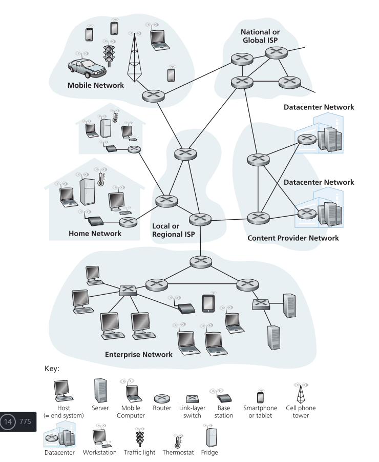

End systems are made up of: 

- Communication links
- packet switches

These can consist of variable speeds depending on the link used, each one can effect the **transmission rate** (Bps). 

>  **Packet switch** 
>
> - takes an incoming packet and forwards it to the necessary location. (ex. Routers and link layered switches)

## 1.1.2 - A services Description

- The applications are said to be distributed applications, since they involve multiple end systems that exchange data with each other. Although packet switches facilitate the exchange of data among end systems, they are not concerned with the application that is the source or sink of data.

> **Socket Interface**
>
> - Specifies how a program running on one end system asks the Internet infrastructure to deliver data to a specific destination program running on another end system.
> - Sets rules that an application must have in order to access the internet.
> - Sets standardization.

## 1.1.3 - What is a protocol

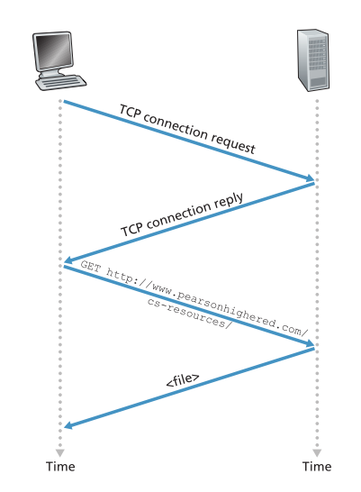

> **Protocol**
>
> - protocol defines the format and the order of messages exchanged between two or more communicating entities, as well as the actions taken on the transmission and/or receipt of a message or other event.

Note: Hosts and End-systems are interchangeable so they mean the same thing.

## 1.2.1 Access networks

There are 3 popular types of broadband:

- DSL (Digital subscriber line)
- Cable 
- Fiber
- Broadband Over Powerline (BPL)

#### DSL 

DSL uses phone line and the residential telephone line carries both data and traditional telephone signals simultaneously, which are encoded at different frequencies:

- A high-speed downstream channel, in the 50 kHz to 1 MHz band
- A medium-speed upstream channel, in the 4 kHz to 50 kHz band
- An ordinary two-way telephone channel, in the 0 to 4 kHz band

This approach makes the single DSL link appear as if there were three separate links, so that a telephone call and an Internet connection can share the DSL link at the same time.

As with DSL, access is typically asymmetric, with the downstream channel typically allocated a higher transmission rate than the upstream channel.

#### Cable Internet Access

makes use of the cable television company’s existing cable television infrastructure. A residence obtains cable Internet access from the same company that provides its cable television.

Traditionally, cable TV is 1-way broadcast

- One-way amplifier 
- Shared coaxial cable

#### Fiber 

HFC (Hybrid Fiber Connection)  or Data over cable service interface specification(DOCSIS).

- two-way communication channels
  - small upstream bandwidth
  - larger downstream bandwidth
- smaller (shared) cable segment
  - Security

#### Broadband Over Powerline (BPL)

- **high voltage lines**
  - very noisy
- **medium voltage lines**
  - coupler or repeater
    - to bypass transformer
- **low voltage lines**
  - bridge
    - wired/wireless access point
  - customer
    - plug-and-play

##### Analog Dial-up

- to computer w/ ISA, PCI, serial, USB
- to modem w/ RJ11
- to telephone line
  - unshielded twisted pair (UTP) or flat
- up to 56 Kbps downstream

##### Nyquist, Shannon Limit and Bandwidth, sample, symbol, bit, data rate

Some factors can limit the maximum transmission rate of a transmission system. 

- Nyquist's theorem specifies the maximum data rate for noiseless condition
- Shannon theorem specifies the maximum data rate under a noise condition.

> Legend:
>
> H: channel bandwidth 
>
> V: # of different kinds of symbols 
>
> S: signal 
>
> N: noise
>
> S/N: signal-to-noise ratio (SNR)

###### Nyquist Limit (idealistic, noiseless channel)

$$
2H\log_{2}{V}
$$

###### Shannon Limit (Noisy Channel)

- analog local loop: H=3000~4000Hz; S/N=30dB=10^3

$$
H\log_{2}{(1+\frac{S}{N})}
$$

###### Bandwidth, sample, symbol, bit, data rate

- (bits / symbol) * (symbols / second) = bps
- baud rate: 2400; data rate: 9.6, 19.2, 28.8, 33.6Kbps

#### Internet Access: LAN

Types of Connections:

- RJ-45 (AUI, BNC w/ coaxal)
- UTP Cat 3 (10Mbps)
- UTP Cat 5: (100 Mbps) 
  - More twists per inch

#### Internet access: WLAN

Type of connections:

- 802.11b: 2.4GHz, 100ft@11Mbps
- 802.11a: 5GHz, 54Mbps
- 802.11g: 2.4GHz, 54Mbps

#### Internet access: Wireless MAN

Wireless Cable form building to building

- MMDS: 198MHz@2.5GHz - (range: 25~50km; 3Mbps downstream 200Kbps up)
- LMDS: 1.3GHz@28~31GHz - (range: 2~5km, line-of-sight! / wireless DSL: 36Gbps downstream 1Mbps up/sector)
- IEEE 802.16: WiMax - (10~66GHz (802.16a: 2-11GHz NLOS), OFDM)

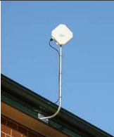

#### Internet access: Wireless *AN

- Personal area network (IEEE 802.15) - bluetooth
  - range: 10 meters
- Local area network (802.11)
  - Range: 100 meters
- Metropolitan area network (802.16)
  - range: up to 50km

#### Internet access: cellular networks

- 1st generation (80’s): analog voice (9.6Kbps)
- 2G (90’s): digital voice (14.4Kbps)

- 3G: digital voice and data (384Kbps, 2Mbps)

## 1.3 Packet Switching 

> **Store and foreword transmission**
>
> the packet switch must receive the entire packet before it can begin to transmit the first bit of the packet onto the outbound link.

if the switch instead forwarded bits as soon as they arrive (without first receiving the entire packet), then the total delay would be L/R since bits are not held up at the router. But, as we will discuss in Section 1.4, routers need to receive, store, and process the entire packet before forwarding.

one packet from source to destination over a path consisting of N links each of rate R (thus, there are N-1 routers between source and destination).
$$
d(end-to-end) = N\frac{L}{R}
$$
Where: 

- L = Bits 
- N = Links 
- R = rate 

#### Sending One packet

The source begins to transmit at time 0; at time L/R seconds, the source has transmitted the entire packet, and the entire packet has been received and stored at the router (since there is no propagation delay). At time L/R seconds, since the router has just received the entire packet, it can begin to transmit the packet onto the outbound link towards the destination; at time 2L/R, the router has transmitted the entire packet, and the entire packet has been received by the destination. Thus, the total delay is 2L/R.

TL;DR

1. Time: 0 (Packet is send from source to router/switch)
2. Time: L/R (Packet received in full at router/switch - Starts to now transmit)
3. Time: 2(L/R) (Router transmitted the entire packet to the destination)
4. Done.

#### Sending 3 packets

Now let’s calculate the amount of time that elapses from when the source begins to send the first packet until the destination has received all three packets. As before, at time L/R, the router begins to forward the first packet. But also at time L/R the source will begin to send the second packet, since it has just finished sending the entire first packet. Thus, at time 2L/R, the destination has received the first packet and the router has received the second packet. Similarly, at time 3L/R, the destination has received the first two packets and the router has received the third packet. Finally, at time 4L/R the destination has received all three packets!

1. Time: 0 (Packet is send from source to router/switch)
2. Time: L/R (Packet received in full at router/switch - Starts to now transmit)
3. Time: 2(L/R) (Router transmitted the entire packet to the destination) [Packet 1]
4. Time: 3(L/R) (Router transmitted the entire packet to the destination) [Packet 2]
5. Time: 4(L/R) (Router transmitted the entire packet to the destination) [Packet 3]
6. Done.

#### Delays and packet loss

Each packet switch has multiple links attached to it. For each attached link, the packet switch has an output buffer (also called an output queue). Thus, in addition to the store-and-forward delays, packets suffer output buffer queuing delays.

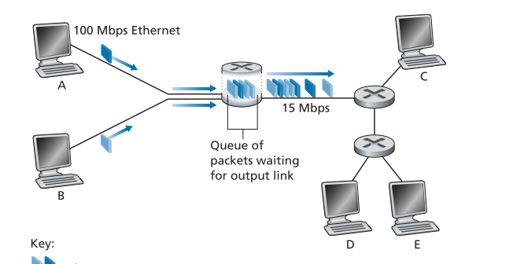

Buffer space is **finite** thus packet loss will occur—either the arriving packet or one of the already-queued packets will be dropped.

#### Circuit Switching

There are two fundamental approaches to moving data through a network of links and switches: **circuit switching** and **packet switching**

> **Circuit Switching Networks**
>
> The resources needed along a path (buffers, link
> transmission rate) to provide for communication between the end systems are reserved for the duration of the communication session between the end systems.

> **Packet-Switched Networks**
>
> The resources are not reserved; a session’s messages use the resources on demand and, as a consequence, may have to wait (that is, queue) for access to a communication link.

#### Multiplexing in Circuit-Switched Networks

> **Frequency-division multiplexing (FDM)** 
>
> The frequency spectrum of a link is divided up among the connections established across the link. Specifically, the link dedicates a frequency band to each connection for the duration of the connection.
>
> 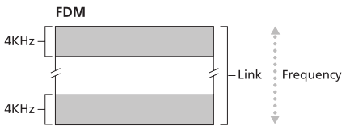

> **time-division multiplexing (TDM)**
>
> Time is divided into frames of fixed duration, and each frame is
> divided into a fixed number of time slots. When the network establishes a connection across a link, the network dedicates one time slot in every frame to this connection.
>
> 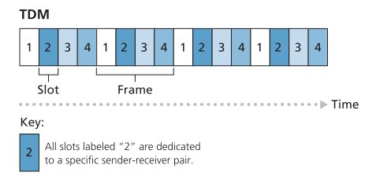

Proponents of packet switching have always argued that circuit switching is wasteful because the dedicated circuits are idle during silent periods.

ex. *when one person in a telephone call stops talking, the idle network resources (frequency bands or time slots in the links along the connection’s route) cannot be used by other ongoing connections.*

#### Circuit switching example

**Q:**  Let us consider how long it takes to send a file of 640,000 bits from Host A to Host B over a circuit-switched network. Suppose that all links in the network use TDM with 24 slots and have a bit rate of 1.536 Mbps. Also suppose that it takes 500 msec to establish an end-to-end circuit before Host A can begin to transmit the file. How long does it take to send the file?

**A:** Each circuit has a transmission rate of (1.536 Mbps)/24 = 64 kbps, so it takes (640,000 bits)/(64 kbps) = 10 seconds to transmit the file. To this 10 seconds we add the circuit establishment time, giving 10.5 seconds to send the file.

**Note:** *Note that the transmission time is independent of the number of links: The transmission time would be 10 seconds if the end-to-end circuit passed through one link or a hundred links.* 

#### Packet switching vs Circuit switching Pros/Cons

- Packet switching
  - Con
    - Not suitable for real world, real time services because of its variable and unpredictable end-to-end delays.
  - Pros
    - It offers better sharing of transmission capacity than circuit switching
    - it is simpler, more efficient, and less costly to implement than circuit switching

## 1.3 A Network of Networks

#### Internet Service Providers

Over the years, the network of networks that forms the Internet has evolved into a very complex structure.

Hierarchy:

- Tier-1 ISPs (AT&T, sprint, TELUS, Shaw)
- Regional ISPs (explornet, Pris)
- Access ISPs (Local businesses that connect to either regional or Tier 1)

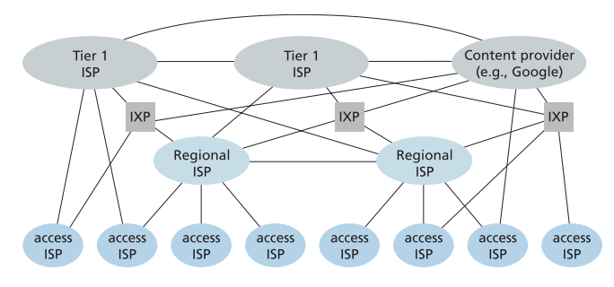

## 1.3.1 Multiplexing Technologies

#### Frequency division multiplexing (FDM)

Used by fiber to segment the signals into sections to be sent down the same line.

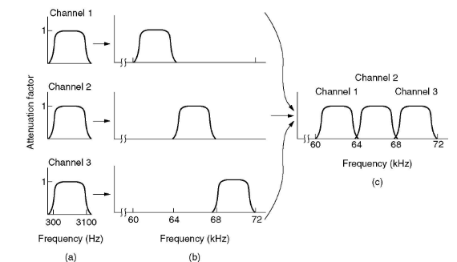

#### Wavelength division multiplexing

a technology which [multiplexes](https://en.wikipedia.org/wiki/Multiplexing) a number of [optical carrier](https://en.wikipedia.org/wiki/Optical_carrier) signals onto a single [optical fiber](https://en.wikipedia.org/wiki/Optical_fiber) by using different [wavelengths](https://en.wikipedia.org/wiki/Wavelength) (i.e., colors) of [laser](https://en.wikipedia.org/wiki/Laser) [light](https://en.wikipedia.org/wiki/Light).[[1\]](https://en.wikipedia.org/wiki/Wavelength-division_multiplexing#cite_note-:0-1)This technique enables [bidirectional](https://en.wikipedia.org/wiki/Duplex_(telecommunications)) communications over a single strand of fiber, also called **wavelength-division duplexing**, as well as multiplication of capacity.[[1\]](https://en.wikipedia.org/wiki/Wavelength-division_multiplexing#cite_note-:0-1)

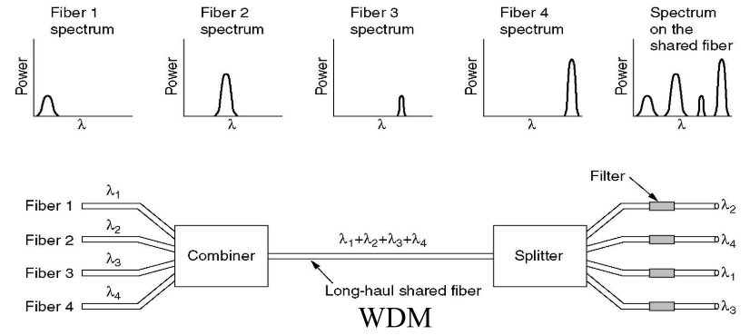
$$
Frequency * Wavelength = Signal(Speed)
$$

#### Time division multiplexing

is a method of transmitting and receiving independent signals over a common signal path by means of synchronized switches at each end of the transmission line so that each signal appears on the line only a fraction of time in an alternating pattern. This method transmits two or more digital signals or analog signals over a common channel.

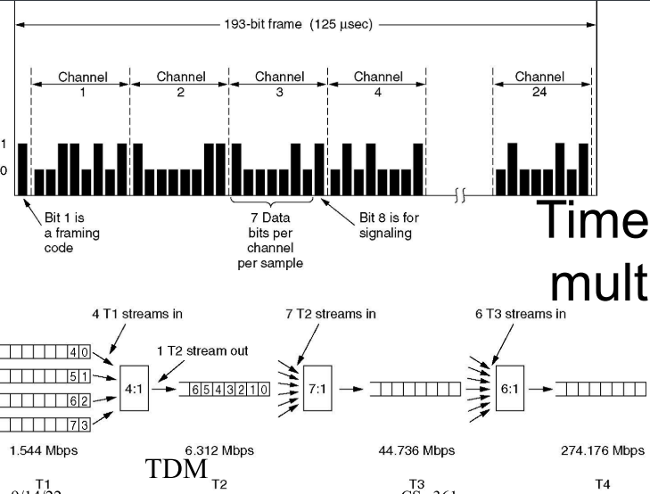

#### Communication satellite

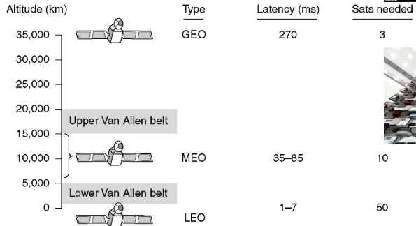

## 1.4 Packet Delay

Types of delay:

- Nodal processing delay 
- Queuing delay 
- Transmission delay
- Propagation delay
- Total Nodal delay (Aggregate of above)

#### Definitions 

> **Processing Delay**
>
> The time required to examine the packet’s header and determine where to direct the packet

> **Queuing Delay**
>
> Time taken to wait to be transmitted onto the link. The length of the queuing delay of a specific packet will depend on the number of earlier-arriving packets that are queued and waiting for transmission onto the link.

> **Transmission Delay**
>
> Assuming that packets are transmitted in a first-come-first-served manner, as is common in packet-switched networks, our packet can be transmitted only after all the packets that have arrived before it have been transmitted.
>
> Note: for a 10 Mbps Ethernet link, the rate is R = 10 Mbps; for a 100 Mbps Ethernet link, the rate is R = 100 Mbps. <u>The transmission delay is L/R (calculated above)</u>

> **Propagation Delay**
>
> Once a bit is pushed into the link, it needs to propagate to router B. The time required to propagate from the beginning of the link to router B is the propagation delay.
>
> Range of Propagation delay: 
> $$
> 2* 10^8 m/s \leftarrow \rightarrow 3*10^8 m/s
> $$
> propagation delay is d/s, where d is the distance between router A and router B and s is the propagation speed of the link.

> **End-to-End Delay**
>
> The nodal delays accumulate and give an end-to-end delay.
> $$
> d(end-end) = N(d[proc] + d[trans] + d[prop])
> $$
> 

#### Traceroute

As these packets work their way toward the destination, they pass through a series of routers. When a router receives one of these special packets, it sends back to the source a short message that contains the name and address of the router.

suppose there are N - 1 routers between the source and the
destination. Then the source will send N special packets into the network, with each packet addressed to the ultimate destination.

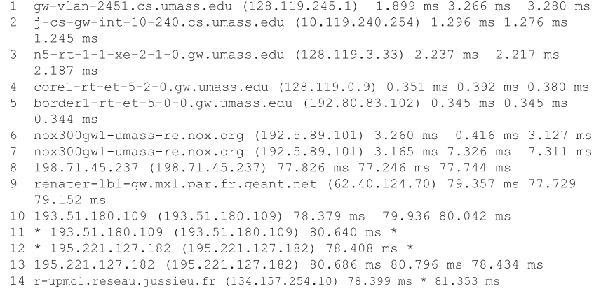

Note: **These round-trip delays include all of the delays just discussed, including transmission delays, propagation delays, router processing delays, and queuing delay.**


## 1.5 Protocol Layers and Layered Architecture 

> **Protocol Stack**
>
> When taken together, the protocols of the various layers are called the protocol stack. The Internet protocol stack consists of five layers: the physical, link, network, transport, and application layers

| Priority | Name        |
| -------- | ----------- |
| 1        | Application |
| 2        | Transport   |
| 3        | Network     |
| 4        | Link        |
| 5        | Physical    |

#### Application Layer

The application layer is where network applications and their application-layer protocols reside. Includes:

- HTTP
- FTP
- SMTP

We’ll refer to this packet of information at the application layer as a message.

#### Transport Layer

The Internet’s transport layer transports application-layer messages between application endpoints. In the Internet, there are two transport protocols, TCP and UDP, either of which can transport application-layer messages.

##### **TCP (Transmission control Protocol)**

- provides a connection-oriented service to its applications. This service includes guaranteed delivery of application-layer messages to the destination and flow control (that is, sender/receiver speed matching).
- Breaks long messages into shorter segments and provides a congestion-control mechanism, so that a source throttles its transmission rate when the network is congested.

##### **UDP (User Diagram Protocol)**

- Provides a connectionless service to its applications
- This is a no-frills service that provides no reliability, no flow control, and no congestion control.

#### Network Layer

The Internet’s network layer is responsible for moving network-layer packets known as datagrams from one host to another. The Internet’s network layer includes the celebrated IP protocol, which defines
the fields in the datagram as well as how the end systems and routers act on these fields. 

This may include:

- IP addresses
- mac addresses 

> **Datagram**
>
> A datagram is an independent, self-contained message sent over the network whose arrival, arrival time, and content are not guaranteed.

#### Link Layer

The Internet’s network layer routes a datagram through a series of routers between the source and destination. To move a packet from one node (host or router) to the next node in the route, the network layer relies on the services of the link layer.

The services provided by the link layer depend on the specific link-layer protocol that is employed over the link.

This may Include:

- Ethernet
- WIFI
- Cable access networks

#### Physical Layer

the job of the physical layer is to move the individual bits within the frame from one node to the next. The protocols in this layer are again link dependent and further depend on the actual transmission medium of the link (for example, twisted-pair copper wire, single-mode fiber optics).

This may include:

- Fiber 
- copper wire
- coax / BNC

#### Encapsulation 

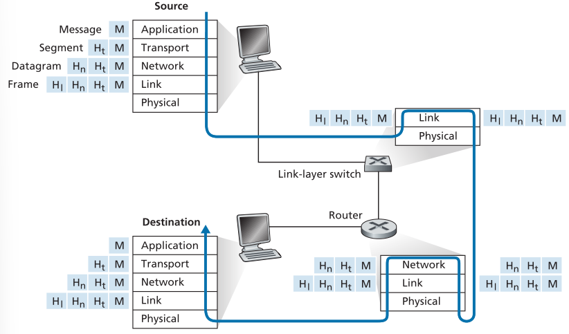

# Chapter 2 - Application Layer

## The Interface Between the Process and the Computer Network

> **Socket** 
>
> A process sends messages into, and receives messages from, the network through a software interface called a socket

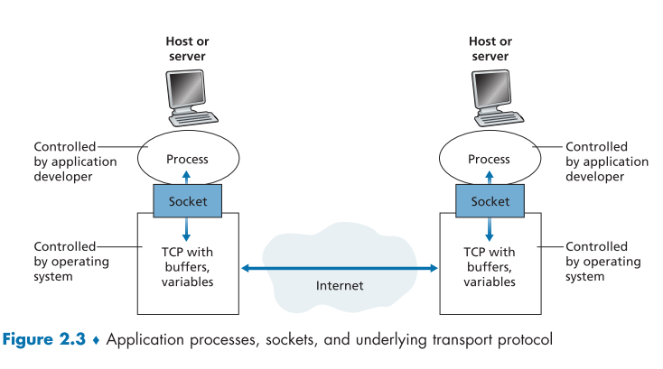


## HTTP

#### Request methods

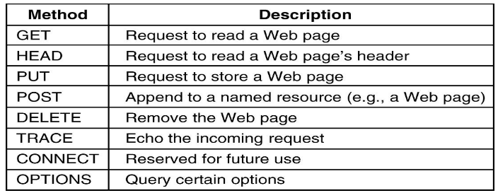

#### Response Codes

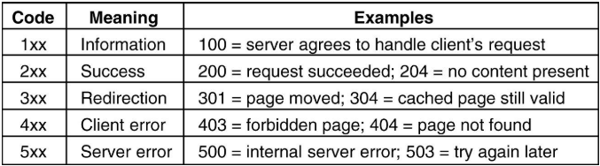

#### HTTP Request message level views

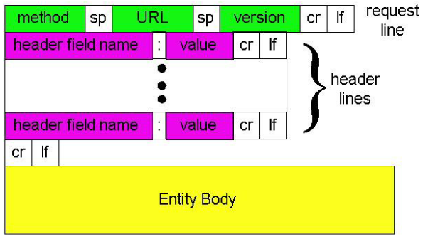

## Transport Services Available to Applications

Many networks, including the Internet, provide more than one transport-layer protocol. We can broadly classify the possible services along four dimensions: reliable data transfer, throughput, timing, and security.

#### Reliable Data Transfer

If a protocol provides such a guaranteed data delivery service, it is said to provide reliable data transfer.

When a transport-layer protocol doesn’t provide reliable data transfer, some of the data sent by the sending process may never arrive at the receiving process. This may be acceptable for loss-tolerant applications, most notably multimedia applications such as conversational audio/video that can tolerate some amount of data loss.

#### Throughput

> **Throughput**
>
> Is the rate at which the sending process can deliver bits to the receiving process.

For example, if an Internet telephony application encodes voice at 32 kbps, it needs to send data into the network and have data delivered to the receiving application at this rate. If the transport protocol cannot provide this throughput, the application would need to encode at a lower rate (and receive enough throughput to sustain this lower coding rate) or may have to give up, since receiving, say, half of the needed throughput is of little or no use to this Internet telephony application.

Applications that have throughput requirements are said to be **bandwidth-sensitive applications**. Many current multimedia applications are bandwidth sensitive

#### Timing

A transport-layer protocol can also provide timing guarantees. For non-real-time applications, lower delay is always preferable to higher delay, but no tight constraint is placed on the end-to-end delays.

## TCP services 

#### Connection-oriented service

- TCP has the client and server exchange transport layer control information with each other before the application-level messages begin to flow.
- The connection is a full-duplex connection in that the two processes can send messages to each other over the connection at the same time.
- When the application finishes sending messages, it must tear down the connection.

#### Reliable data transfer service

- The communicating processes can rely on TCP to deliver all data sent without error and in the proper order.
- No missing or duplicate bytes.
- includes a congestion-control mechanism - throttles a sending process if traffic congested

## UDP Services

- UDP is a no-frills, lightweight transport protocol, providing minimal services. UDP is connectionless, so there is no handshaking before the two processes start to communicate. UDP provides an unreliable data transfer service—that is, when a process sends a message into a UDP socket, UDP provides no guarantee that the message will ever reach the receiving process. Furthermore, messages that do arrive at the receiving process may arrive out of order.

- not include a congestion-control mechanism, so the sending side of
  UDP can pump data into the layer below (the network layer) at any rate it pleases.

## 2.1.5 Application-Layer Protocols

An application-layer protocol defines how an application’s processes, running on different end systems, pass messages to each other. In particular, an application-layer protocol defines:

- Types of messages 
- The syntax of the message type
- The Semantics 
- Rules for processing messages

## 2.2 The Web and HTTP

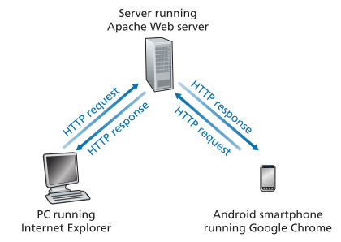

## 2.2.2 Non-Persistent and Persistent Connections

> **Persistent vs non-persistent** 
>
> Should each request/response pair be sent over a separate TCP connection, or should all of the requests and their corresponding responses be sent over the same TCP connection? In the former approach, the application is said to use **non-persistent connections**; and in the latter approach, **persistent connections.**

#### HTTP with Non-Persistent Connections

1. he HTTP client process initiates a TCP connection to the server
2. The HTTP client sends an HTTP request message to the server via its socket.
3. Server gets file, encapsulates the object in an HTTP response message, and sends the response message to the client via its socket.
4. The HTTP server process tells TCP to close the TCP connection. 
5. The HTTP client receives the response message.
6. The first four steps are then repeated for each of the referenced JPEG objects.

> 1. open connection
> 2. client sends request
> 3. server sends file back to client
> 4. server closes connection
> 5. client receives message
> 6. repeat

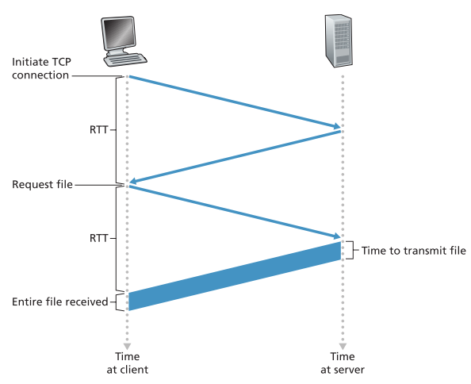

**One object per TCP connection**:

- default behavior in HTTP/1.0
- network cost: ~2*RTT per object
- end-host cost: 1 socket() for each object

> 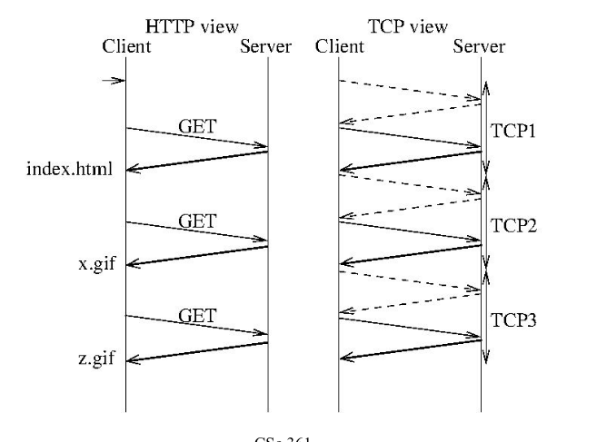
>
> TCP establishes a new connection before data gets transmitted

##### HTTP with non-persistant concurrent connections

> 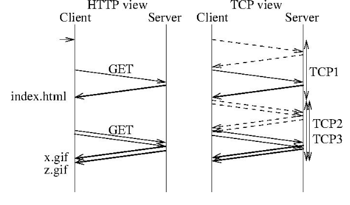
>
> TCP does the same but also parallels requests 

#### HTTP with Persistent Connections

Non-persistent connections have some shortcomings:

- a brand-new connection must be established and maintained for each requested object.
- TCP buffers must be allocated and TCP variables must be kept in both the client and server.
- each object suffers a delivery delay of two RTTs—one RTT to establish the TCP connection and one RTT to request and receive an object.

Persistent Pros:

- These requests for objects can be made back-to-back, without waiting for replies to pending requests (pipelining)
- server closes a connection when it isn’t used for a certain time (timeout)

> 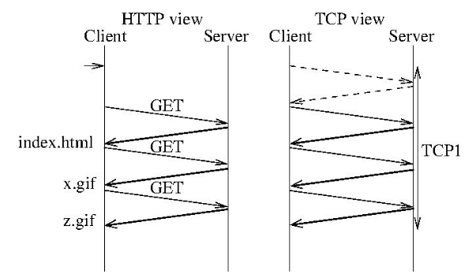

> 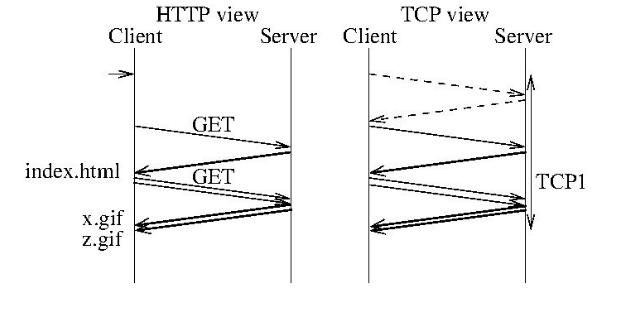
>
> Persistent with pipelining
>
> - one tcp request 
> - open connection with parallel 

> 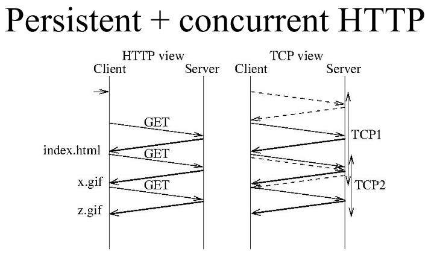

## 2.2.3 HTTP Message Format

HTTP Request Message

```html
GET /somedir/page.html HTTP/1.1 
Host: www.someschool.edu 
Connection: close 
User-agent: Mozilla/5.0 
Accept-language: fr
```

HTTP Response Message

```html
HTTP/1.1 200 OK 
Connection: close 
Date: Tue, 18 Aug 2015 15:44:04 GMT 
Server: Apache/2.2.3 (CentOS) 
Last-Modified: Tue, 18 Aug 2015 15:11:03 GMT 
Content-Length: 6821 
Content-Type: text/html 

(data data data data data ...)
```

the first line of a HTTP request message is called the **request line**; the subsequent lines are called the **header lines**.

The method field can take on several different values, including:

- GET
- POST
- HEAD
- PUT
- DELETE

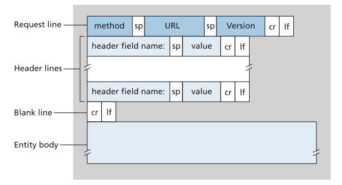

## 2.2.4 Cookies

- HTTP itself is stateless.

- Many applications require states

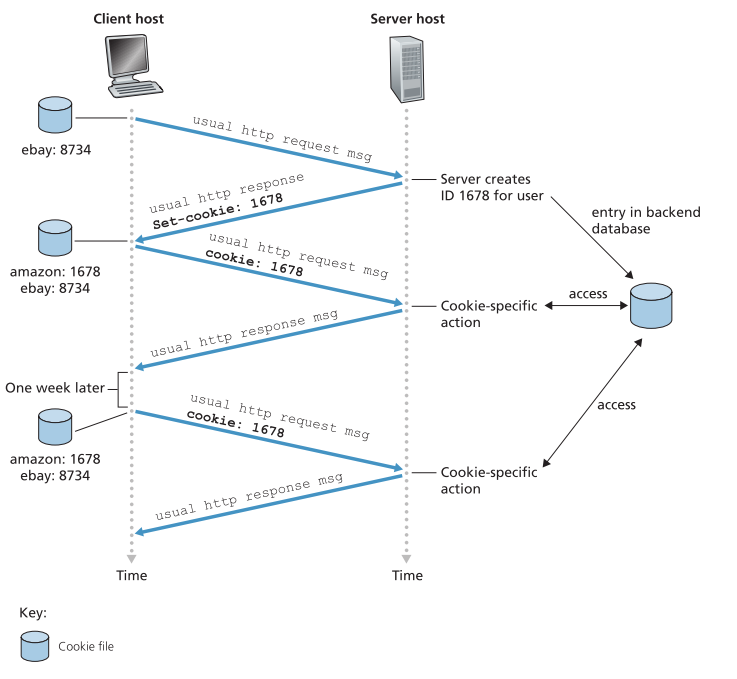

## 2.2.5 Web caching

> **Web caching // Proxy Server**
>
> A network entity that satisfies HTTP requests on the behalf of an origin Web server.

#### Process of web caching

1. The browser establishes a TCP connection to the Web cache and sends an HTTP request for the object to the Web cache.
2. The Web cache checks to see if it has a copy of the object stored locally. If it does, the Web cache returns the object within an HTTP response message to the client browser.
3. If the Web cache does not have the object, the Web cache opens a TCP connection to the origin server, that is, to www.someschool.edu. The Web cache.
4. When the Web cache receives the object, it stores a copy in its local storage and sends a copy, within an HTTP response message, to the client browser (over the existing TCP connection between the client browser and the Web cache).

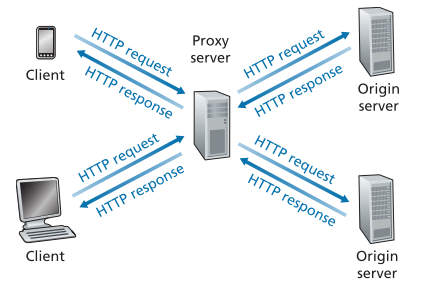

***Note:** a cache is both a server and a client at the same time.*

Typically a Web cache is purchased and installed by an ISP. For example, a university might install a cache on its campus network and configure all of the campus browsers to point to the cache.

#### Pros of Web caching

- Web cache can substantially reduce the response time for a client request, particularly if the bottleneck bandwidth between the client and the origin server is much less than the bottleneck bandwidth between the client and the cache.
- Web caches can substantially reduce traffic on an institution’s access link to the Internet. By reducing traffic, the institution (for example, a company or a university) does not have to upgrade bandwidth as quickly, thereby reducing costs. 
- Web caches can substantially reduce Web traffic in the Internet as a whole, thereby improving performance for all applications.

#### Calculating the bottleneck of delay 

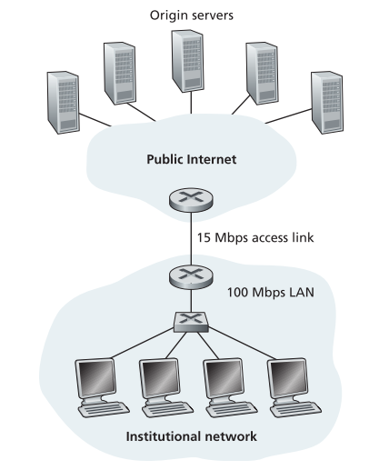

##### Calculating: The traffic intensity on the LAN

$$
(15 requests/sec) * (1 Mbits/request)/(100 Mbps) = 0.15
$$

##### Calculating: Traffic intensity on the access link

$$
(15 requests/sec) * (1 Mbits/request)/(15 Mbps) = 1
$$

The 0.15 delays negligible but the 1 delay is growing without bound and very bad.

##### Conditional GET

HTTP has a mechanism that allows a cache to verify that its objects are up to date. This mechanism is called the conditional GET [RFC 7232]. An HTTP request message is a so-called conditional GET message if (1) the request message uses the GET method and (2) the request message includes an If-Modified-Since: header line.

**Normal client-server response:**

```html
GET /fruit/kiwi.gif HTTP/1.1 
Host: www.exotiquecuisine.com
```

```html
HTTP/1.1 200 OK 
Date: Sat, 3 Oct 2015 15:39:29 
Server: Apache/1.3.0 (Unix) 
Last-Modified: Wed, 9 Sep 2015 09:23:24 
Content-Type: image/gif
(data data data data data ...)
```

**Using the conditional GET request:**

```html
GET /fruit/kiwi.gif 
HTTP/1.1 Host: www.exotiquecuisine.com 
If-modified-since: Wed, 9 Sep 2015 09:23:24
```

```html
HTTP/1.1 304 Not Modified 
Date: Sat, 10 Oct 2015 15:39:29 
Server: Apache/1.3.0 (Unix)
(empty entity body)
```

## 2.4 DNS - The Internet’s Directory Service

#### Additional services provided by DNS

> **Host Aliasing** 
>
> A host with a complicated hostname can have one or more alias names. For example, a hostname such as relay1.west-coast .enterprise.com could have, say, two aliases such as enterprise.com and www.enterprise.com. In this case, the hostname relay1 .west-coast.enterprise.com is said to be a canonical hostname.

> **Mail server aliasing**
>
> ex. bob@relay1.west-coast.yahoo.com -> bob@yahoo.com

> **Load distribution**
>
> DNS is also used to perform load distribution among replicated servers, such as replicated Web servers. Busy sites, such as cnn.com, are replicated over multiple servers, with each server running on a different end system and each having a different IP address.

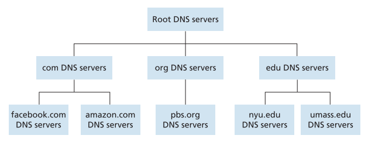

> **Root DNS Servers**
>
> more than 1000 root servers instances scattered all over the world, as shown in Figure 2.18. These root servers are copies of 13 different root servers, managed by 12 different organizations, and coordinated through the Internet Assigned Numbers Authority [IANA 2020]

> **Top-Level domain (TLD) Servers**
>
> For each of the top-level domains—top-level domains such as com, org, net, edu, and gov, and all of the country top-level domains such as uk, fr, ca, and jp—there is TLD server (or server cluster).

> **Authoritative DNS servers**
>
> Every organization with publicly accessible hosts (such as Web servers and mail servers) on the Internet must provide publicly accessible DNS records that map the names of those hosts to IP addresses. An organization’s authoritative DNS server houses these DNS records. An

#### Resource Records

(Name, Value, Type, TTL)

> **TTL - Time to live**
>
> it determines when a resource should be removed from a cache.

| Type  | Definition                                                   |
| ----- | ------------------------------------------------------------ |
| A     | Type A record provides the standard hostname-to-IP address mapping. |
| NS    | Name server hostname of an authoritative DNS server that knows how to obtain the IP addresses for hosts in the domain. |
| CNAME | A canonical hostname for the alias hostname Name.            |
| MX    | The canonical name of a mail server that has an alias hostname Name. |

#### DNS Messages 

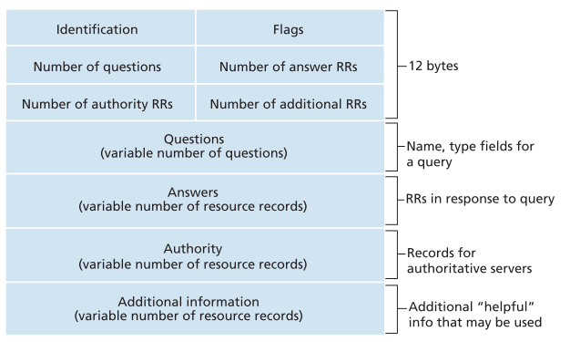

- First 12 bytes is the *Header* section. The first field is a 16-bit number that identifies the query.
- The question section contains information about the query that is being made.
- The answer section contains the resource records for the name that was originally queried. 
- The authority section contains records of other authoritative servers.
- The additional section contains other helpful records.

How would you like to send a DNS query message directly from the host you’re working on to some DNS server? This can easily be done with the "nslookup" program

## 2.7 Socket Programming: Creating Network Applications

#### UDP Server-Client Example (Python)


##### UDP Client

```python
from socket import *

# Server name and port.
serverName = ’hostname’
serverPort = 12000 

# Open new client socket.
clientSocket = socket(AF_INET, SOCK_DGRAM) 
# AF_INET = Uses IPv4
# SOCK_DGRAM = Uses UDP

# Input message to send to server.
message = input(’Input lowercase sentence:’) clientSocket.sendto(message.encode(),(serverName, serverPort)) 

# Recieve the incomming message and print out.
modifiedMessage, serverAddress = clientSocket.recvfrom(2048) print(modifiedMessage.decode()) 

clientSocket.close()
```

##### UDP Server

```python
from socket import * 

serverPort = 12000 
serverSocket = socket(AF_INET, SOCK_DGRAM) 

serverSocket.bind(("", serverPort)) 
print("The server is ready to receive") 

while True: 
    message, clientAddress = serverSocket.recvfrom(2048)
    modifiedMessage = message.decode().upper()
    serverSocket.sendto(modifiedMessage.encode(),clientAddress)
```

#### TCP Server-Client Example (Python)


##### TCP Client 

```python
from socket import *

serverName = ’servername’ 
serverPort = 12000 

clientSocket = socket(AF_INET, SOCK_STREAM) 
clientSocket.connect((serverName,serverPort)) 
sentence = input("Input lowercase sentence:") 

clientSocket.send(sentence.encode()) modifiedSentence = clientSocket.recv(1024) 
print("From Server: ", modifiedSentence.decode()) 

clientSocket.close()
```

##### TCP Server

```python
from socket import * 

serverPort = 12000 
serverSocket = socket(AF_INET,SOCK_STREAM) 

serverSocket.bind(("",serverPort)) 
serverSocket.listen(1) 
print("The server is ready to receive")

while True:
    connectionSocket, addr = serverSocket.accept() sentence =
    connectionSocket.recv(1024).decode() capitalizedSentence =
    sentence.upper()
    connectionSocket.send(capitalizedSentence.encode())
    connectionSocket.close()
```

# Chapter 3 - Transport Layer

## 3.1 Relationship between Transport and Network layers

Recall that the Internet makes two distinct transport-layer protocols available to the application layer. One of these protocols is UDP (User Datagram Protocol), which provides an unreliable, connectionless service to the invoking application. The second of these protocols is TCP (Transmission Control Protocol), which provides a reliable, connection-oriented service to the invoking application.

> **Segment** 
>
> Transport layer packet. 
>
> Note:
>
> -  UDP is a datagram
> - TCP is a segment.


#### Transport-layer protocol Elements

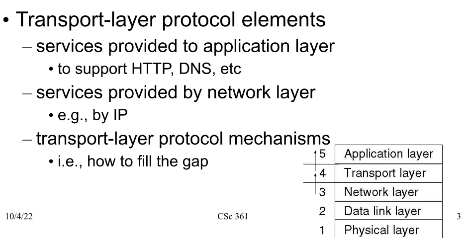

**Transport-layer protocol elements** 

- Services provided to application layer 
  - To support HTTP, DNS, etc.
- **Services provided by network layer**
  - ex. by IP.
- **Transport-layer protocol mechanisms**
  - ex. how to fill the gap

| Level       | Type of service Layer |
| ----------- | --------------------- |
| 5 (Highest) | Application           |
| 4           | Transport             |
| 3           | Network               |
| 2           | Data Link             |
| 1 (Lowest)  | Physical              |

#### Transport Layer Services

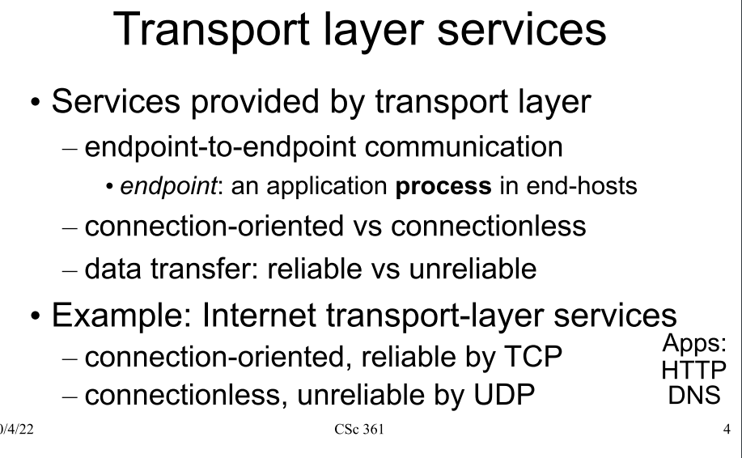

**Services Provided by the transport layer**

- Endpoint to endpoint communication
  - endpoint: an application process in end-hosts
- connection-oriented vs connectionless
- data transfer: reliable vs unreliable

**Example: Internet transport-layer services**

- connection-oriented, reliable by TCP 
- connectionless, unreliable by UDP

#### Network layer services

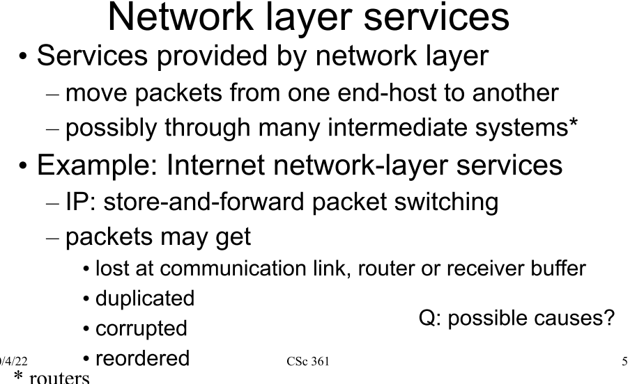

**Services provided by network layer**

- Move packets from one end-host to another
- Possibly through many intermediate systems (Ex. routers)

**Example: Internet network-layer services**

- IP: store-and-forward packet switching
- packets may get:
  - lost at communication link, router or receiver buffer
  - duplicated
  - corrupted
  - reordered


## 3.2 Multiplexing and Demultiplexing 

> **Sockets**
>
> doors through which data passes from the network to the process and through which data passes from the process to the network.

> **Demultiplexing** 
>
> Delivering the data in a transport-layer segment to the correct socket.

> **Multiplexing** 
>
> gathering data chunks at the source host from different sockets, encapsulating each data chunk with header information (that will later be used in demultiplexing) to create segments, and passing the segments to the network layer

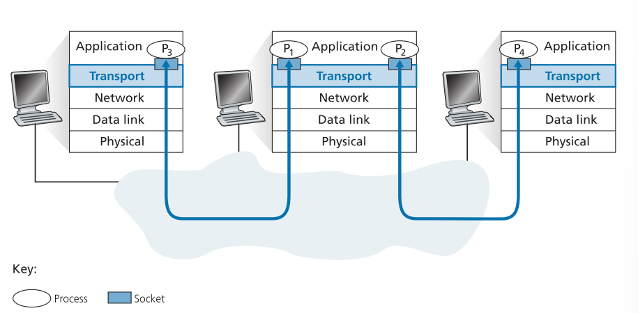

**Multiplexing requires:**

- That sockets have unique identifiers.
- Each segment have special fields that indicate the socket to which the segment is to be delivered.

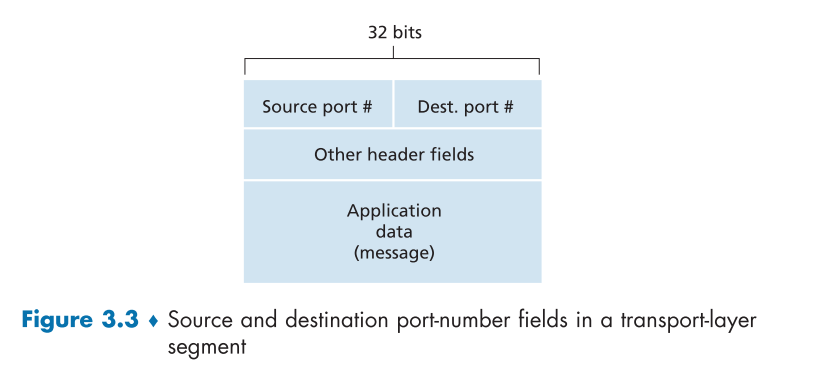

#### Connectionless Multiplexing and Demultiplexing 

```python
clientSocket = socket(AF_INET, SOCK_DGRAM)
```

This auto assigns an unused port unless specified by the .bind() command.

#### Connection-Oriented Multiplexing and Demultiplexing

**TCP uses all 4 values of the tuple to deliver data:**

- source IP address
- source port number
- destination IP address
- destination port number

**Process of TCP server creation:**

- Creates a "Welcome socket" that waits for clients to connect.
- creates the socket via:

```python
clientSocket = socket(AF_INET, SOCK_STREAM) clientSocket.connect((serverName,12000))
```

- Accepts the client server connection via:

```python
connectionSocket, addr = serverSocket.accept()
```

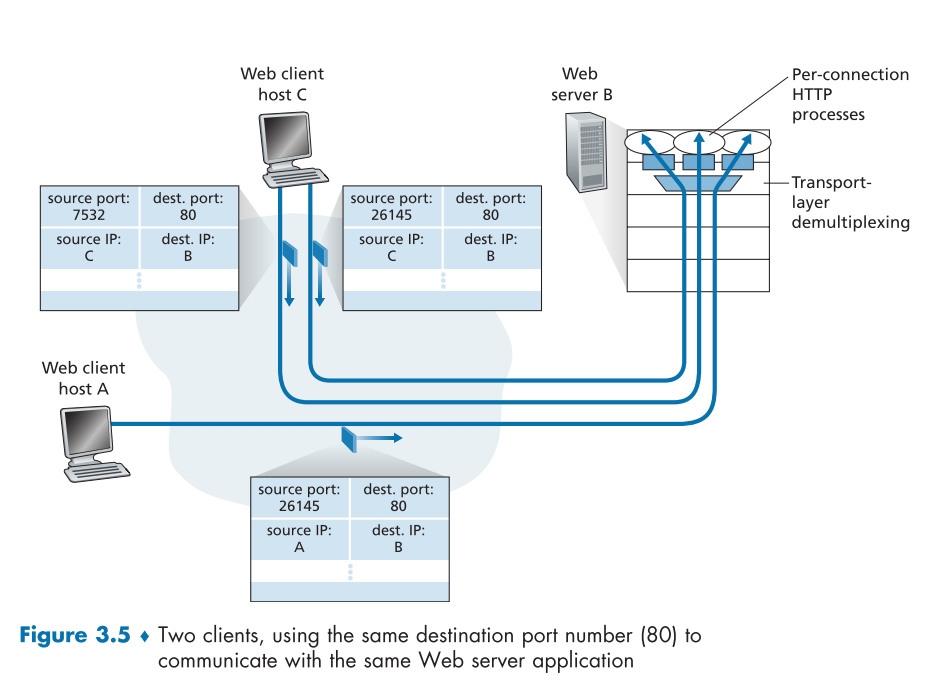

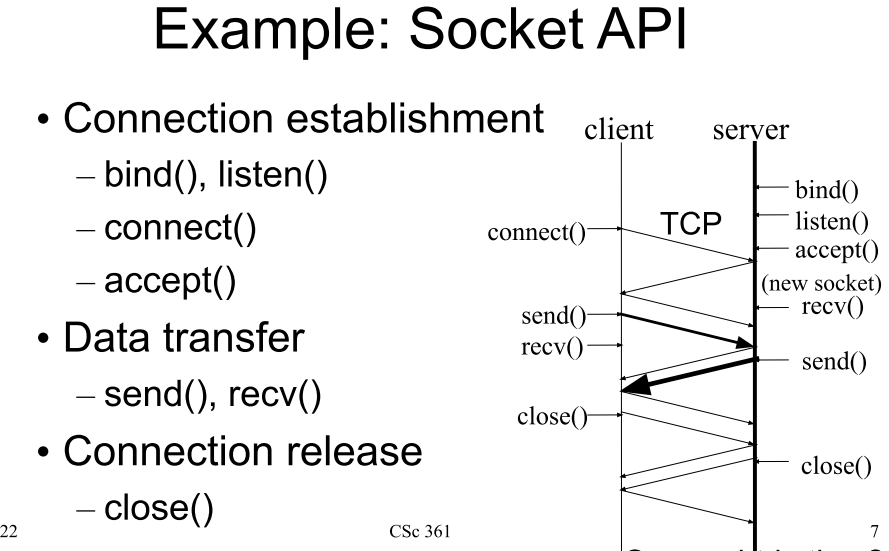

#### What's under a socket?

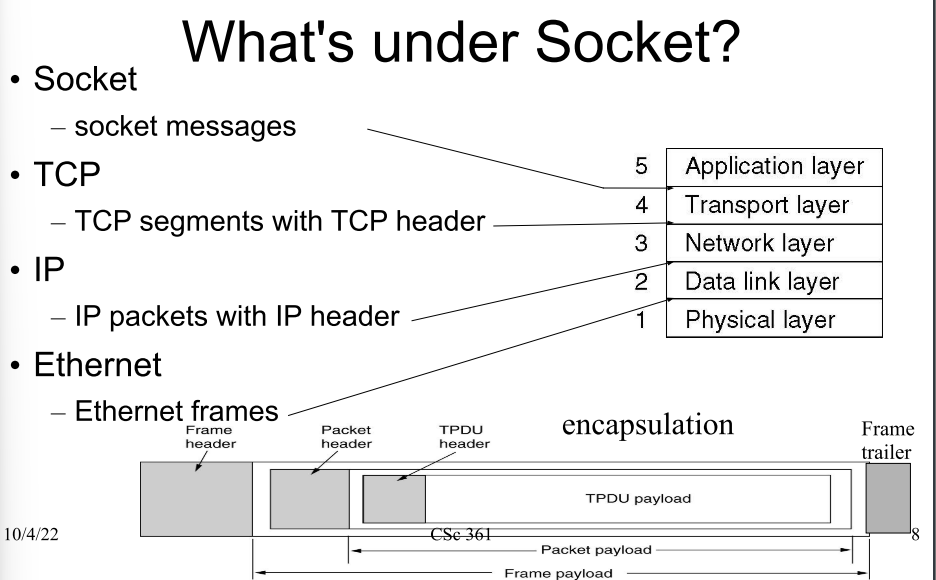

#### Socket container (Encapsulation)

- Frame Header (Physical Layer)
- Frame Payload:
  - Packet Header (Network Layer)
  - Packet Payload:
    - TPDU header (Transport Layer)
    - Payload:
      - DATA

- Frame Trailer


## 3.3 Connectionless Transport: UDP

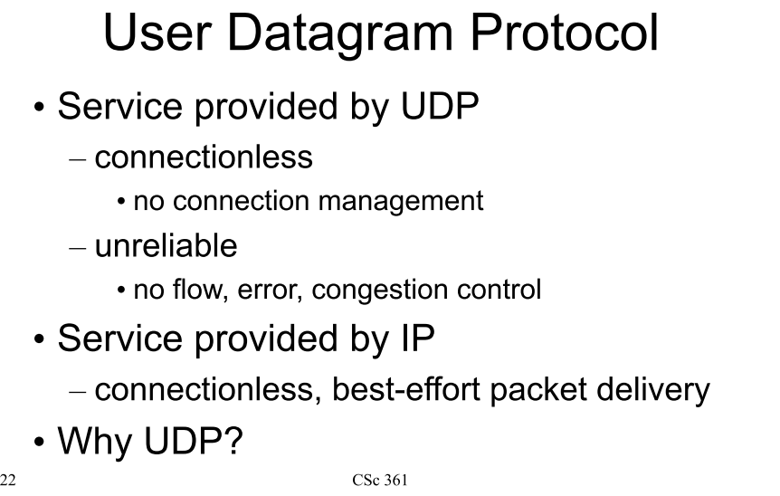

#### Why UDP over TCP?

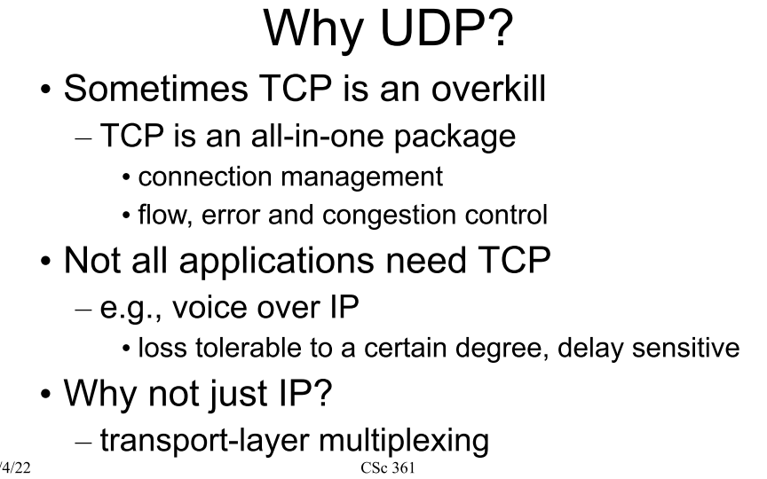

- Finer application-level control over what data is sent, and when.
- No connection establishment.
- No connection state.
- Small packet header overhead.
  - TCP overhead = 20 bytes
  - UDP overhead = 8 bytes

#### UDP Segment Structure

The UDP header has only **four fields**, each consisting of **two bytes** (8 bytes total).

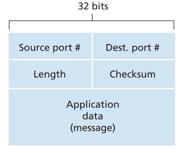

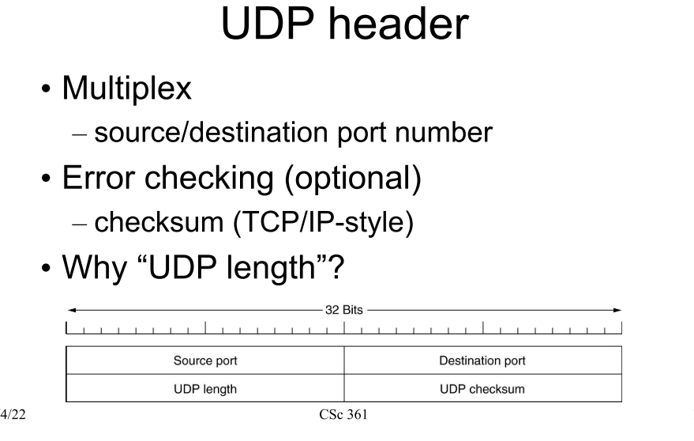

#### UDP Checksum

UDP at the sender side performs the 1s complement of the sum of all the 16-bit words in the segment, with any overflow encountered during the sum being wrapped around. This result is put in the checksum field of the UDP segment.

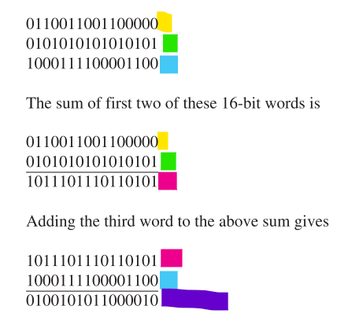

Note that this last addition had overflow, which was wrapped around. The 1s
complement is obtained by converting all the 0s to 1s and converting all the 1s to 0s. Thus, the 1s complement of the sum 0100101011000010 is 1011010100111101, which becomes the checksum. 

At the receiver, all four 16-bit words are added, including the checksum. If no errors are introduced into the packet, then clearly the sum at the receiver will be 1111111111111111. 

If one of the bits is a 0, then we know that errors have been introduced into the packet.

> ***Note:*** Some implementations of UDP simply discard the damaged segment; others pass the damaged segment to the application with a warning.

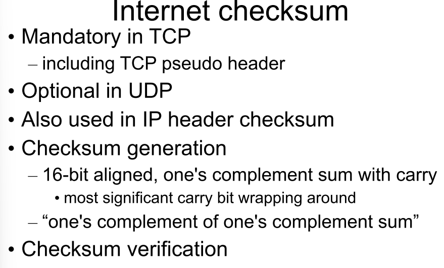

## 3.4 Principles of Reliable Data Transfer

#### What could go wrong?

- Lost:
  - Transmission error or network congestion
- Duplicated:
  - Deleted by referring to sequence number; **done**
- corrupted:
  - Arrived but in “bad shape”
- reordered:
  - Rearranged by referring to sequence number; **done**

#### Error Detection

- Corrupted packets
  - Detected by TCP checksum
    - Action: drop!
- Lost packets
  - How do you tell if something is already lost?
  - TCP sender
    - Timer for acknowledgment
  - TCP receiver (cumulative acknowledgment)
    - duplicate acknowledgment

#### Error and Delay solutions

##### Sender Timer

- start a timer when sending out a packet
  - In reality: one timer per a window of packets
- On acknowledgment “covering” this packet • cancel the timer and setup another one.
- If timer timeouts: indicate packet may be lost

##### Timeout Value

- Too soon: unnecessary transmission
- Too late: “slow response”


> **ARQ (Automatic Repeat reQuest) protocols.**
>
> If a TCP packet received in error, ARQ will ask for a re transmit.

Three additional protocol capabilities are required in ARQ protocols to handle the presence of bit errors:

- Error detection
- Receiver feedback
- Retransmission

**ACK packets** - correct data transmitted

**NAK packets** - the protocol retransmits the last packet and waits for an ACK or NAK to be returned by the receiver in response to the retransmitted data packet

the sender will not send the next bit of data until the ACK or NAK has been received.

#### Nagle's Algorithm (Sender approach)

> **Problem**
>
> Data gets written byte-by-byte which leads to huge traffic of:
>
> - Data packets
> - ACK packets
>
> **Solution: The algorithm**
>
> Goal: Send either big packets or lower packet overhead.
>
> *Cons of the algorithm:*
>
> - Mouse movement, delays updates
> - Delayed acknowledgements

#### David Clark Algorithm (Receiver approach)

> **Problem**
>
> - silly window syndrome: application keeps reading data byte-by-byte
> - receiver keeps advertising small window (thus small packets)
>
> **Solution: The Algorithm**
>
> Goal: Try and advertise bigger windows.
>
> receiver only advertises:
>
> - at least one MSS, or
> - half window size
>
> *Cons of the algorithm:* 
>
> - Extra Delay

#### Consider three possibilities for handling corrupted ACKs or NAKs:

- If both are corrupt then you get a loop of retransmitting
- A second alternative is to add enough checksum bits to allow the sender not only to detect, but also to recover from, bit errors. 
- A third approach is for the sender simply to resend the current data packet when it receives a garbled ACK or NAK packet.
  - This can create duplicate packets

#### Duplicate packets

> **sequence number**
>
> Singular bit to tell whether the data packet is a retransmission or not. Either a 1 or a 0

#### Duplicate ACKS

After 3 consecutive duplicate ack numbers, the packet is considered LOST.

#### Reliable Data Transfer over a Lossy Channel with Bit Errors

If the sender is willing to wait long enough so that it is certain that a packet has been lost, it can simply retransmit the data packet.

This might also produce duplicate packets but the sequence number takes care of that normally.

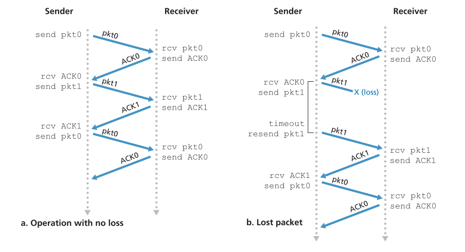

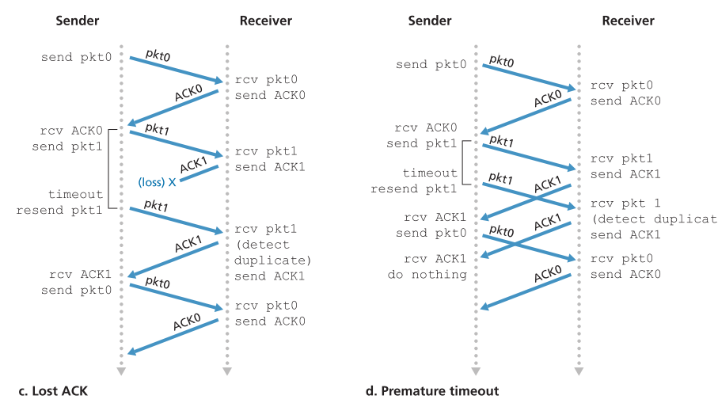

#### Stop-and-wait vs pipelined protocol

ex. The speed-of-light round-trip propagation delay between these two end systems, RTT, is approximately 30 milliseconds. Suppose that they are connected by a channel with a transmission rate, R, of 1 Gbps (109 bits per second). With a packet size, L, of 1,000 bytes (8,000 bits) per packet, including both header fields and data, the time needed to actually transmit the packet into the 1 Gbps link is
$$
d(trans) = \frac{L}{R} = \frac{800 bits}{10^9 bit/sec} = 8  microseconds
$$
**Utilization**

With our stop-and-wait protocol, if the sender begins sending the packet at t = 0, then at t = L/R = 8 microseconds, the last bit enters the channel at the sender side. The packet then makes its 15-msec cross-country journey, with the last bit of the packet emerging at the receiver at t = RTT/2 + L/R = 15.008 msec. Assuming for simplicity that ACK packets are extremely small (so that we can ignore their transmission time) and that the receiver can send an ACK as soon as the last bit of a data packet is received, the ACK emerges back at the sender at t = RTT + L/R = 30.008 msec. At this point, the sender can now transmit the next message. Thus, in 30.008 msec, the sender was sending for only 0.008 msec. If we define the utilization of the sender (or the channel) as the fraction of time the sender is actually busy sending bits into the channel, the analysis in Figure 3.18(a) shows that the stop-and-wait protocol has a rather dismal sender utilization
$$
Usender = \frac{L/R}{RTT + L/R} = \frac{.008}{30.008} = 0.00027
$$
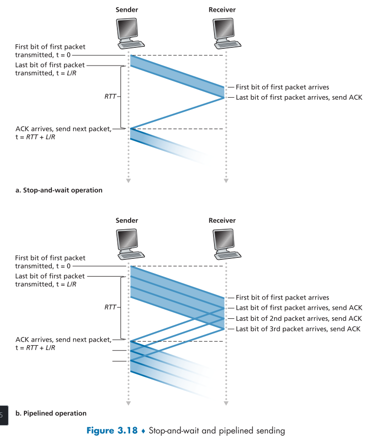

##### Pipelining 

> **Pipelining**
>
> if the sender is allowed to transmit three packets before having to wait for acknowledgments, the utilization of the sender is essentially tripled. Since the many in-transit sender-to-receiver packets can be visualized as filling a pipeline.

**Pipelining has the following consequences for reliable data transfer protocols:**

- The range of sequence numbers must be increased, since each in-transit packet (not counting retransmissions) must have a unique sequence number and there may be multiple, in-transit, unacknowledged packets.
- The sender and receiver sides of the protocols may have to buffer more than one packet.
-  The range of sequence numbers needed and the buffering requirements will depend on the manner in which a data transfer protocol responds to lost, corrupted, and overly delayed packets.

Two basic approaches toward pipelined error recovery can be identified: **Go-Back-N** and **selective repeat**.

###### Go-Back-N (GBN)

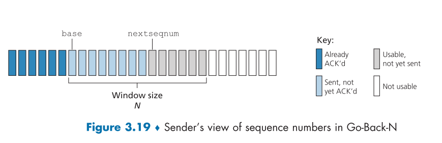

the sender is allowed to transmit multiple packets (when available) without waiting for an acknowledgment, but is constrained to have no more than some maximum allowable number, N, of unacknowledged packets in the pipeline.

> ***Note:*** N is often referred to as the **window size** and the GBN protocol itself as a **sliding-window protocol**.

**The GBN sender must respond to three types of events:**

- Invocation from above.
- Receipt of an ACK.
- A timeout event.

An acknowledgment for a packet with sequence number n will be taken to be a **cumulative acknowledgment**, indicating that all packets with a sequence number up to and including n have been correctly received at the receiver.

In our GBN protocol, the receiver discards out-of-order packets.

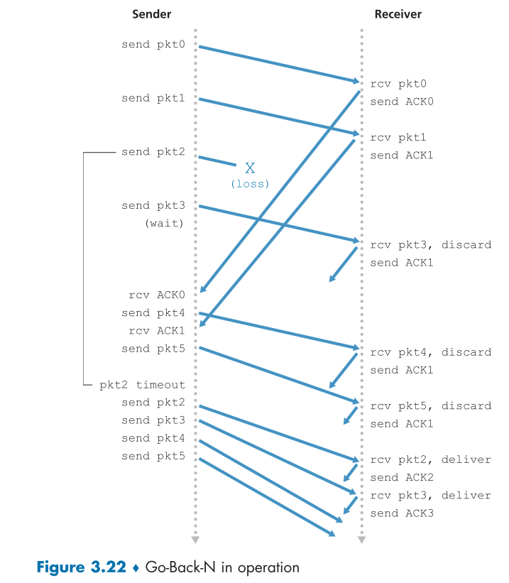

###### Selective Repeat (SR)

**Why GBN might not work:**

- when the window size and bandwidth-delay product are both large, many packets can be in the pipeline. A single packet error can thus cause GBN to retransmit a large number of packets, many unnecessarily. As the probability of channel errors increases, the pipeline can become filled with these unnecessary retransmissions. 

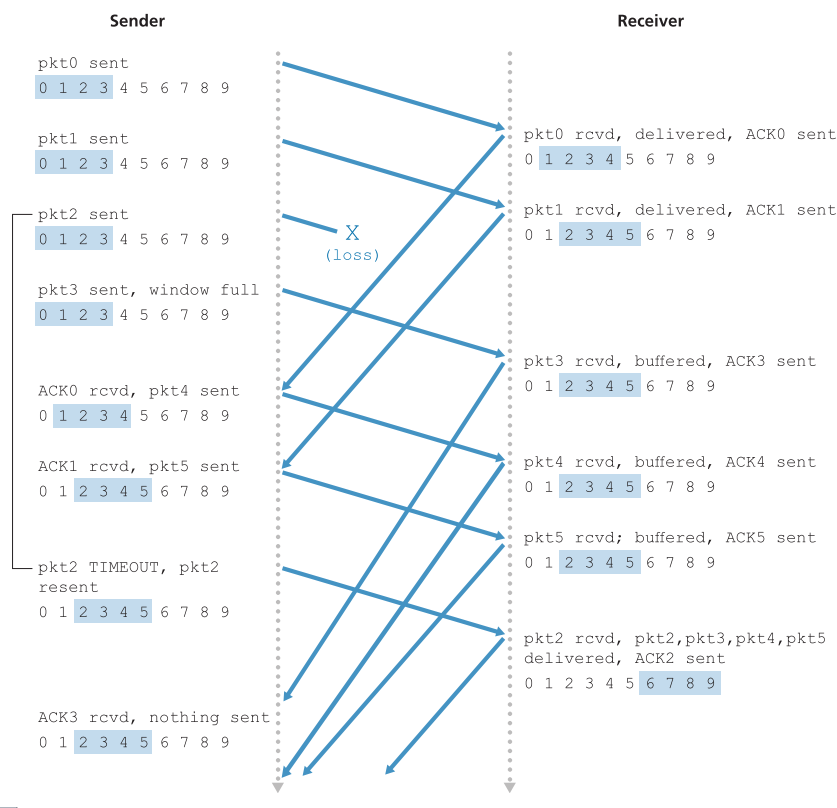

## 3.5 Connection-Oriented Transport: TCP

TCP is said to be **connection-oriented** because before one application process can begin to send data to another, the two processes must first “handshake” with each other—that is, they must send some preliminary segments to each other to establish the parameters of the ensuing data transfer.

A TCP connection provides a **full-duplex service**: If there is a TCP connection between Process A on one host and Process B on another host, then application-layer data can flow from Process A to Process B at the same time as application-layer data flows from Process B to Process A.

> **TCP three-way handshake** 
>
> The first two segments carry no payload, that is, no application-layer data; the third of these segments may carry a payload.

The maximum amount of data that can be grabbed and placed in a segment is limited by the **maximum segment size (MSS)**. The MSS is typically set by first determining the length of the largest link-layer frame that can be sent by the local sending host

> **MSS** 
>
> Maximum segment size (a typical value of MSS is 1460 bytes)
>
> ***Note:*** that the MSS is the maximum amount of application-layer data in the segment, not the maximum size of the TCP segment including headers.

Both Ethernet and PPP link-layer protocols have an MTU of 1,500 bytes.

> **MTU**
>
> Maximum transmission unit

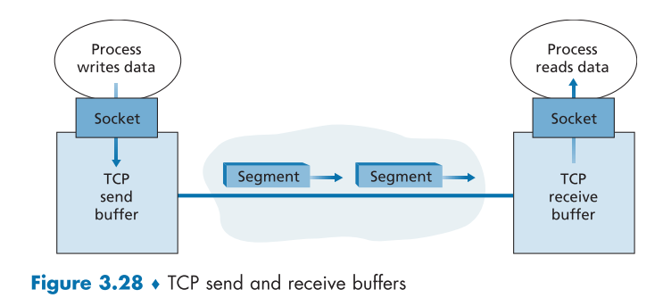

##### TCP Connection ID

**TCP Connections:**

- Connection -> connect()
- Initiator -> listen()
- Responder -> accept()

**Connection flow:**

- send()
- recv()

#### TCP Segment Structure

When TCP sends a large file, such as an image as part of a Web page, it typically breaks the file into chunks of size MSS (except for the last chunk, which will often be less than the MSS)

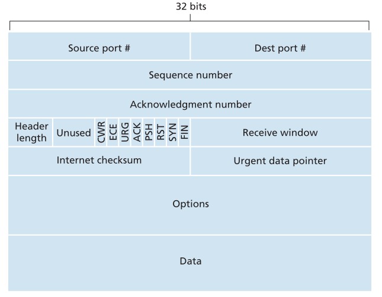

**TCP packet/segment contains the following headers:**

- **Source / Destination Port** - well-known port numbers (0~1023, privileged) (ex. 80: http; 443: https)

- **Sequence number field (32-bit)** - used by the TCP sender and receiver in implementing a reliable data transfer service.
- **Acknowledgment number field (32-bit)** - used by the TCP sender and receiver in implementing a reliable data transfer service.
- **Receive window (16-bit)** - used for flow control. It is used to indicate the number of bytes that a receiver is willing to accept.
- **Header length field (4-bit)** - specifies the length of the TCP header in 32-bit words. The TCP header can be of variable length due to the TCP options field. (Typically, the options field is empty, so that the length of the typical TCP header is 20 bytes.)
- **Options field** - used when a sender and receiver negotiate the maximum segment size (MSS) or as a window scaling factor for use in high-speed networks.
- **Flag Field** **(6-bit)**
  - **ACK bit** - used to indicate that the value carried in the acknowledgment field is valid.
  - **RST bit** - used for connection setup and teardown (Rests connection)
  - **SYN** - used for connection setup and teardown
  - **FIN** - used for connection setup and teardown
  - **PSH** - indicates that the receiver should pass the data to the upper layer immediately.
  - **URG** - used to indicate that there is data in this segment that the sending-side upper layer entity has marked as “urgent.”
- **Urgent data pointer field** **(16-bit)** - TCP must inform the receiving-side upper-layer entity when urgent data exists and pass it a pointer to the end of the urgent data.

##### URG Pointers (Flag Fields)

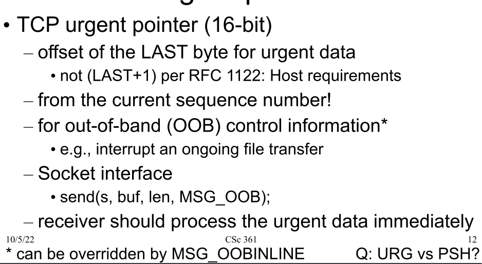

##### Sequence Numbers and Acknowledgment Numbers

###### Sequence Numbers

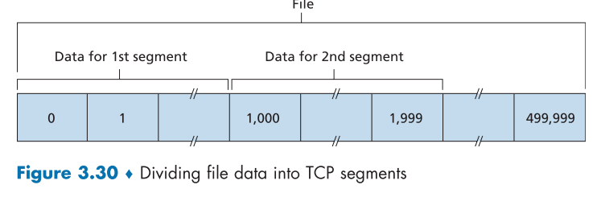

Suppose that the data stream consists of a file consisting of 500,000 bytes, that the MSS is 1,000 bytes, and that the first byte of the data stream is numbered 0. As shown in Figure 3.30, TCP constructs 500 segments out of the data stream. The first segment gets assigned sequence number 0, the second segment gets assigned sequence number 1,000, the third segment gets assigned sequence number 2,000, and so on. Each sequence number is inserted in the sequence number field in the header of the appropriate TCP segment.

###### Acknowledgement numbers

The acknowledgment number that Host A puts in its segment is the sequence number of the next byte Host A is expecting from Host B.

Because TCP only acknowledges bytes up to the first missing byte in the stream, TCP is said to provide **cumulative acknowledgments.**

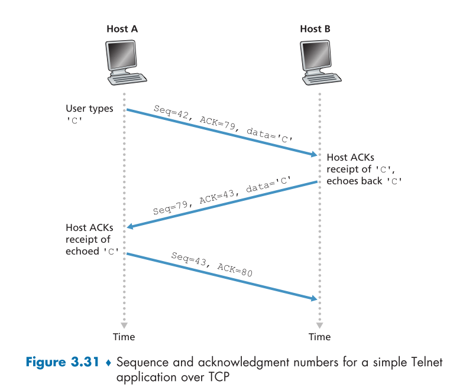

#### Round-Trip Time Estimation and Timeout

The timeout should be larger than the connection’s round-trip time (RTT), that is, the time from when a segment is sent until it is acknowledged. Otherwise, unnecessary retransmissions would be sent. But how much larger?

##### Estimating the Round-Trip Time

TCP updates the RTT estimate via the following formula:
$$
EstimatedRTT = (1-\alpha) * EstimatedRTT + \alpha* sampleRTT
$$

>  ***Note:*** The recommended value of α is α = 0.125 (that is, 1/8) , so:


$$
EstimatedRTT = 0.875*EstimatedRTT+ 0.125*SampleRTT
$$

> ***Note:*** Note that EstimatedRTT is a weighted average of the SampleRTT values. As

RTT Variation or variability:
$$
DevRTT = (1-\beta) * DevRTT+\beta * |SampleRTT - EstimatedRTT|
$$

> ***Note:*** that DevRTT is an EWMA of the difference between SampleRTT and EstimatedRTT. If the SampleRTT values have little fluctuation, then DevRTT will be small; on the other hand, if there is a lot of fluctuation, DevRTT will be large. The recommended value of β is 0.25.

$$
TimeoutInterval = EstimatedRTT + 4* DevRTT
$$

##### Fast Retransmit

> **Fast retransmit** 
>
> retransmitting the missing segment before that segment’s timer expires.

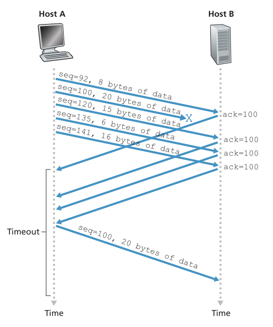

##### Is TCP Selective or a GBN Protocol?

the so-called selective acknowledgment [RFC 2018], allows a TCP receiver to acknowledge out-of-order segments selectively rather than just cumulatively acknowledging the last correctly received, in-order segment. When combined with selective retransmission—skipping the retransmission of segments that have already been selectively acknowledged by the receiver— TCP looks a lot like our generic SR protocol. Thus, TCP’s error-recovery mechanism is probably best categorized as a hybrid of GBN and SR protocols.

#### Flow Control

TCP provides a flow-control service to its applications to eliminate the possibility of the sender overflowing the receiver’s buffer.

Flow control is thus a speed matching service—matching the rate at which the sender is sending against the rate at which the receiving application is reading.

##### TCP Receive window 

the receive window is used to give the sender an idea of how much free buffer space is available at the receiver. Because TCP is full-duplex, the sender at each side of the connection maintains a distinct receive window.

> LastByteRead
>
> the number of the last byte in the data stream read from the buffer by the application process in B.

> LastByteRcvd
>
> the number of the last byte in the data stream that has arrived from the network and has been placed in the receive buffer at B

Because TCP is not permitted to overflow the allocated buffer, we must have:

```bash
LastByteRcvd – LastByteRead <= RcvBuffer
```

The receive window, denoted rwnd is set to the amount of spare room in the buffer:

```bash
rwnd = RcvBuffer – [LastByteRcvd – LastByteRead]
```

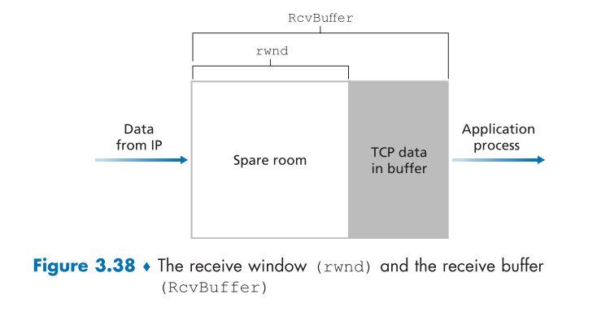

###### Window space

- maximum window size 216-1: ~64K bytes!
- Achievable throughput limit: ~ win/rtt
- How to keep the “pipe” full?

**TCP over "Long-fat" networks**

- Long: large round-trip time

- Fat: high bandwidth

- Low utilization due to window limit

  

  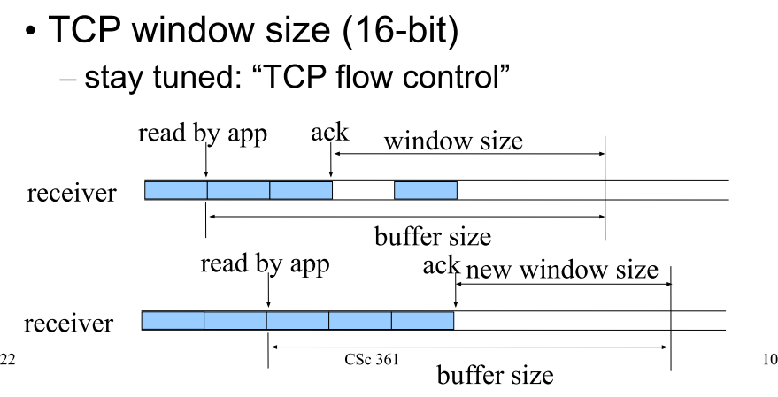

#### TCP connection Management

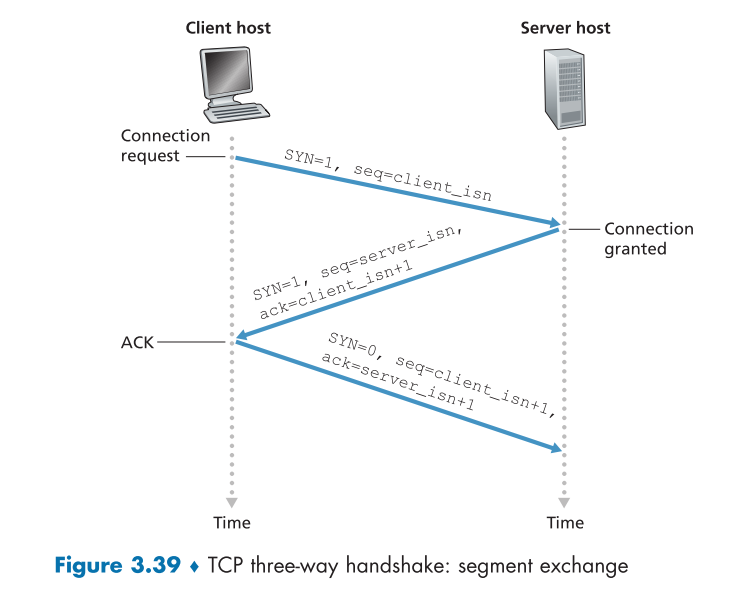

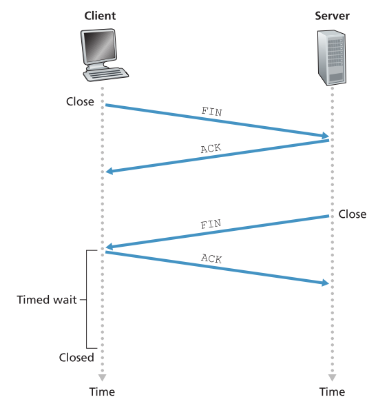

This special segment has a flag bit in the segment’s header, the FIN bit (see Figure 3.29), set to 1. When the server receives this segment, it sends the client an acknowledgment segment in return. The server then sends its own shutdown segment, which has the FIN bit set to 1. Finally, the client acknowledges the server’s shutdown segment.


## 3.6 Principals of congestion control

#### Load-Gain Curve

> **Gain**
>
> Throughput / Delay

- Load gain curve
  - Low load (I)
  - Medium Load (II)
  - High Load (III)
- Congestion
  - Low Throughput (I)
  - High Delay (II)
  - Very Low gain (III)

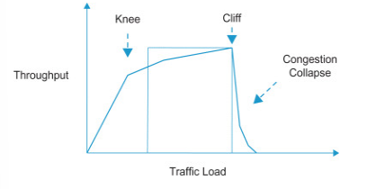

##### The 3 Stages (I, II and III):

1. If the load is small, the throughput keeps up with the increasing load. After the load reaches the network capacity, at the “knee” of the curve, the throughput stops increasing.
2.  Beyond the knee, as the load increases, <u>queues start to build up in the network,</u> thus increasing the end-to-end latency without adding to the throughput. The network is then said to be in a state of congestion.
3. If the traffic load increases even further and gets to the “cliff” part of the curve, then the throughput experiences a rather drastic reduction. This is because <u>queues within the network have increased to the point that packets are being dropped.</u> If the sources choose to retransmit to recover from losses, then this adds further to the total load, resulting in a positive feedback loop that sends the network into congestion collapse.

#### The Causes and the Costs of Congestion

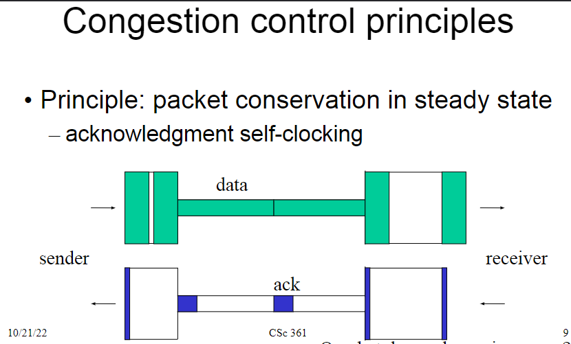

Makes it so that we can be in a constant state.

##### Scenario 1: Two Senders, a Router with Infinite Buffers

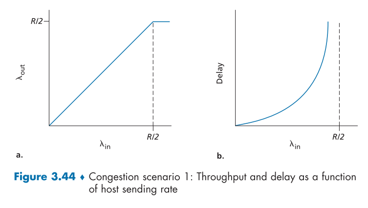

##### Scenario 2: Two Senders and a Router with Finite Buffers

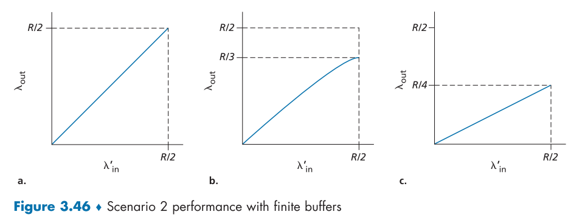

##### Scenario 3: Four Senders, Routers with Finite Buffers, and Multihop Paths

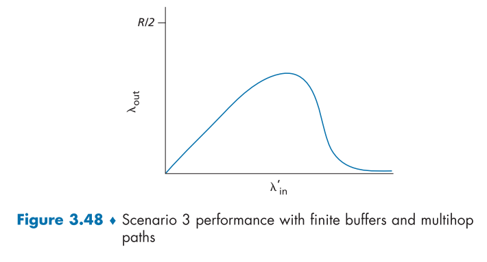

#### Approaches to Congestion Control

two broad approaches to congestion control that are taken in practice and discuss specific network architectures and congestion-control protocols embodying these approaches:

- **End-to-end congestion control** - TCP segment loss (as indicated by a timeout or the receipt of three duplicate acknowledgments) is taken as an indication of network congestion, and TCP decreases its window size accordingly.
- **Network-assisted congestion control** - With network-assisted congestion control, routers provide explicit feedback to the sender and/or receiver regarding the congestion state of the network. This feedback may be as simple as a single bit indicating congestion at a link

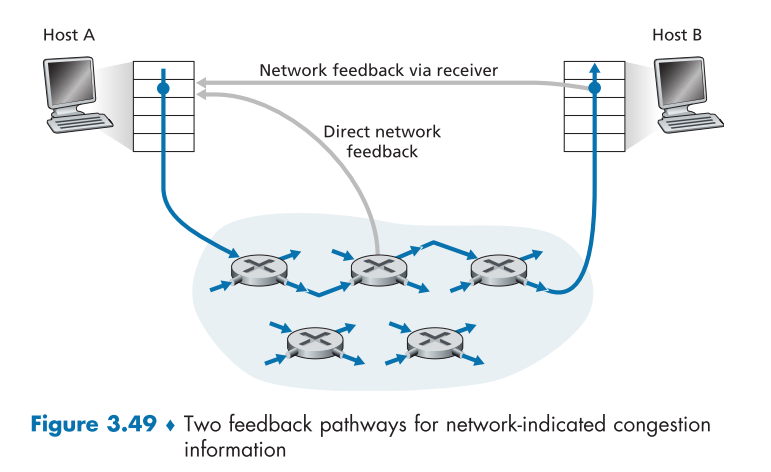

## 3.7 TCP Congestion Control

Because TCP uses acknowledgments to trigger (or clock) its increase in congestion window size, TCP is said to be **self-clocking.**

- A lost segment implies congestion, and hence, the TCP sender’s rate should be decreased when a segment is lost.
- An acknowledged segment indicates that the network is delivering the sender’s segments to the receiver, and hence, the sender’s rate can be increased when an ACK arrives for a previously unacknowledged segment.
- Bandwidth probing.

#### Why congestion control?

- Flow control
  - coordinate sender and receiver (buffer)
- Network Congestion
  - coordination between the sender and network - avoid a sender to overflow a router
  - coordination among many senders -  traffic aggregation from many senders
  - Congestion syndrome - increasing queuing delay, packet drop

#### Load-Gain Curve

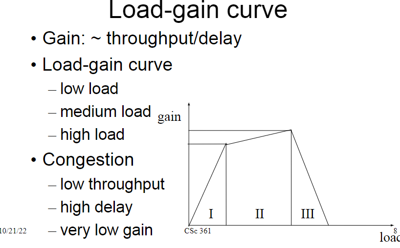

> **Knee**
>
> Area between I and II 
>
> Note: It is not a defined place and trial and error is used 

> **Cliff**
>
> Area between II and III
>
> Note: It is not a defined place and trial and error is used 


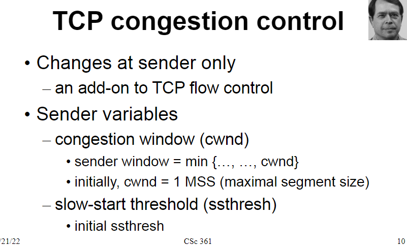

- TCP sender control only because TCP has already been implemented for several years prior.

#### Slow start (In the first section of the curve)

Slow start is adaptive and is not initialized implicitly.

> **ssthresh**
>
> Slow start threshold

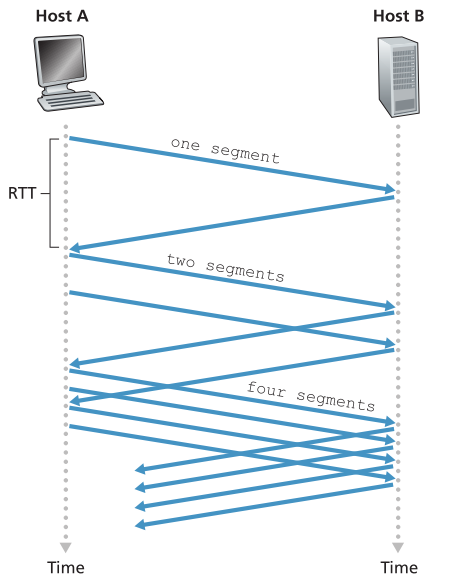

If there is a loss event (i.e., congestion) indicated by a timeout, the TCP sender sets the value of cwnd to 1 and begins the slow start process anew. 

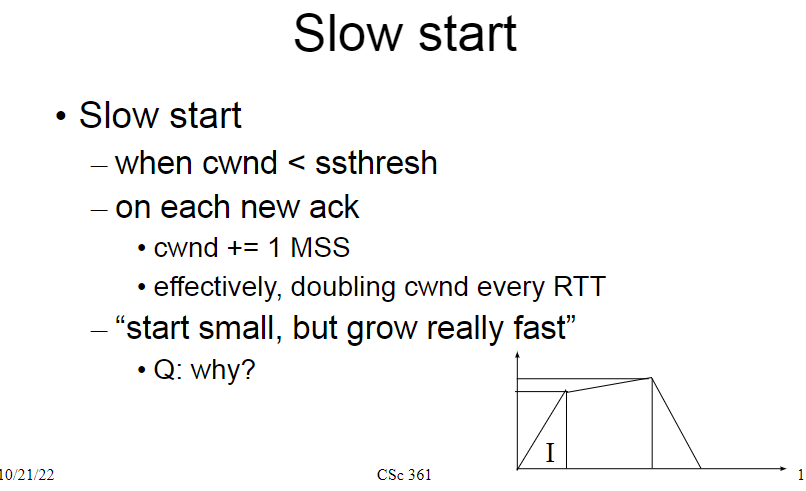

##### Network Congestion

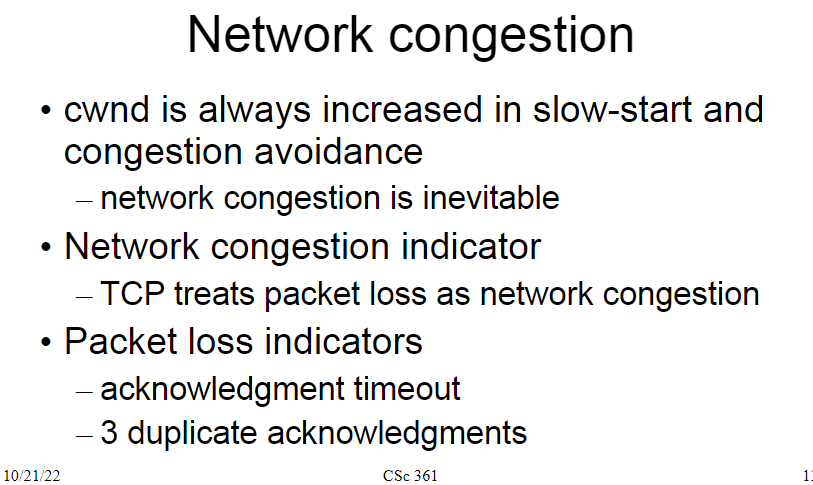

#### Congestion Avoidance (In the middle section of the curve)

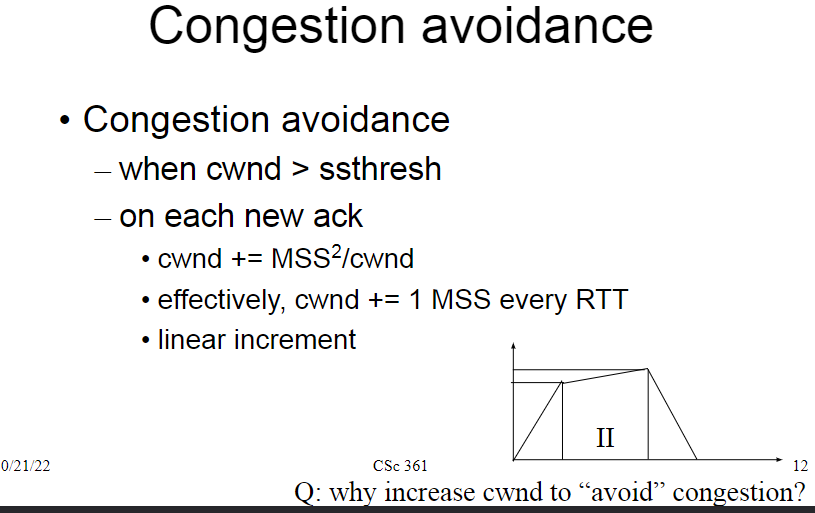

> when should congestion avoidance’s linear increase (of 1 MSS per RTT)
> end?
>
> TCP’s congestion-avoidance algorithm behaves the same when a timeout occurs as in the case of slow start: The value of cwnd is set to 1 MSS, and the value of ssthresh is updated to half the value of cwnd when the loss event occurred.

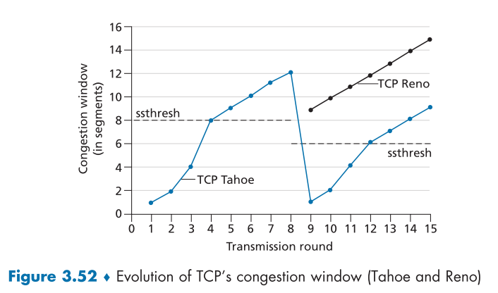

> **additive-increase, multiplicative-decrease (AIMD)**
>
> TCP’s congestion control consists of linear (additive) increase in cwnd of 1 MSS per RTT and then a halving (multiplicative decrease) of cwnd on a triple duplicate-ACK event.

##### Congestion window

> **cwnd**
>
> Congestion Window 

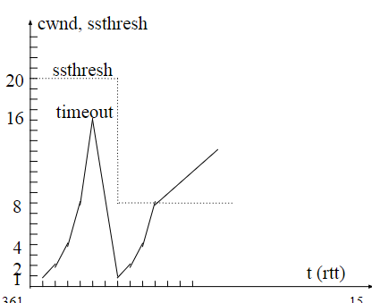

#### Congestion control techniques

- **Slow start** (I)
- **Congestion Avoidance** (II)
- **Timeout retransmission** (III)
  - TCP timeout is quite conservative
  - pay attention to how ssthresh is adjusted

##### Timeout Retransmit (In the 3rd section of the curve)

- **Timeout**
  - RTO = d (SRTT + c RTTV)
- **Congestion control**
  - ssthresh = cwnd / 2
  - cwnd = 1 MSS
  - followed by slow-start
- **Error control**
  - retransmit packet
  - back off timer

##### Fast Retransmit

Duplicating acknowledgment 

>  Example
>
> - rcv: [0, 499], [500, 999], [1500, 1999], [2000, 2499], [2500, 2999]
> - ack: 500, 1000, 1000, 1000, 1000 (3rd dupack)

###### Steps for fast retransmit 

- on 3rd dupack: ssthresh=cwnd/2; cwnd=1 MSS
- followed by slow start

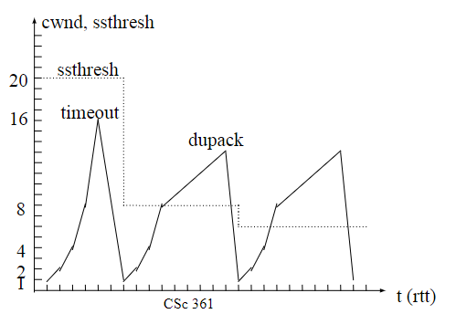

##### Fast Recovery 

Duplicate Acknowledgment 

> example
>
> - rcv: [0, 499], [500, 999], [1500, 1999], [2000, 2499], [2500, 2999]
> - ack: 500, 1000, 1000, 1000, 1000 (3rd dupack)

###### Steps for Fast recovery 

- On 3rd dupack: cwnd=ssthresh=cwnd/2
- Followed by congestion avoidance

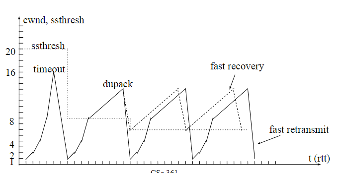

#### Other TCP congestion controls 

- **Tahoe (packet loss as congestion signal)**
  - slow start, congestion avoid, timeout, fast retransmit
- **Reno (packet loss)**
  - slow start, congestion avoid, timeout, fast recovery
- **Vegas (packet delay): react earlier than loss**
- **NewReno (widely used): cwnd inflation**
- **SACK (selective ack): more info on holes**
- **CUBIC in the current Linux, MacOS, Win**

##### TCP Cubic

where packet loss occurred hasn’t changed much, then perhaps it’s better to more quickly ramp up the sending rate to get close to the pre-loss sending rate and only then probe cautiously for bandwidth.

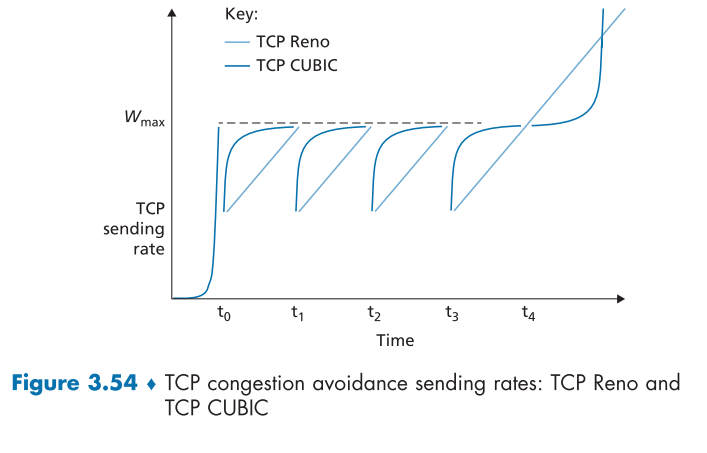

The network drops a packet from the connection when the rate increases to W/RTT; the rate is then cut in half and then increases by MSS/RTT every RTT until it again reaches W/RTT. This process repeats itself over and over again. Because TCP’s throughput (that is, rate) increases linearly between the two extreme values, we have:
$$
throughputOfConnection(avg) = \frac{0.75 * W}{RTT}
$$


##### Explicit Congestion Notification (ECN): Network-assisted Congestion Control

Explicit Congestion Notification [RFC 3168] is the form of network-assisted congestion control performed within the Internet.

- both TCP and IP are involved.

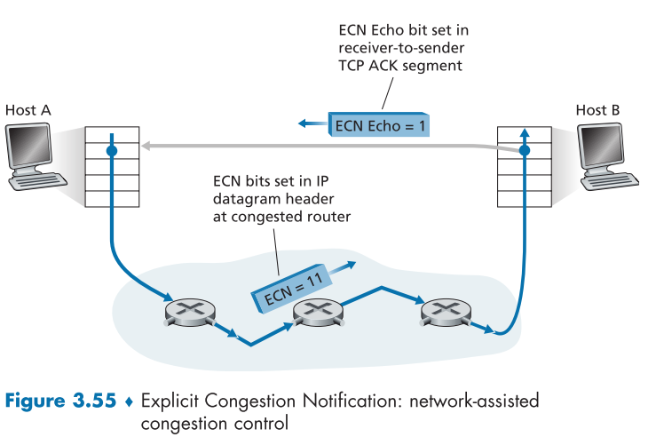

#### Fairness of segments on the network 

- TCP adjusts accordingly to share throughput 
- UDP does not need to control congestion and will transmit at the same rate.
  - can lead to TCP crowding
- Paralleling connections don't help because Browsers still use multiple UDP and TCP packets mixed. 

# Chapter 4 - The Network Layer: Data Plane (Forwarding) 

## 4.1 Overview of Network Layer

#### 4.1.1 Forwarding and Routing: The Network Data and Control Planes 

> **NOTE:** 
>
> CONTROL PLANE = ROUTING = EXTERNAL ROUTER TRAFFIC
>
> DATA PLANE = FORWARDING = INTERNAL ROUTER TRAFFIC

Goal of the Network Layer: to move packets from sending host to the receiving host using two functions:

- **Forwarding** - When a packet arrives at a router’s input link, the router must move the packet to the appropriate output link.
- **Routing** - The network layer must determine the route or path taken by packets as they flow from a sender to a receiver.

> **Routing Algorithms**
>
> A routing algorithm would determine, for example, the path along which packets flow from H1 to H2
>
> 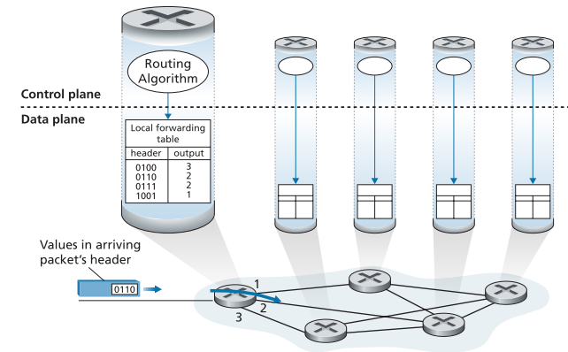

##### Forwarding and Routing

> **Forwarding**
>
> The router-local action of transferring a packet from an input link interface to the appropriate output link interface.

> **Forwarding Table** 
>
> A router forwards a packet by examining the value of one or more fields in the arriving packet’s header, and then using these header values to index into its forwarding table.

> **Routing**
>
> The network-wide process that determines the end-to-end paths that packets take from source to destination. 

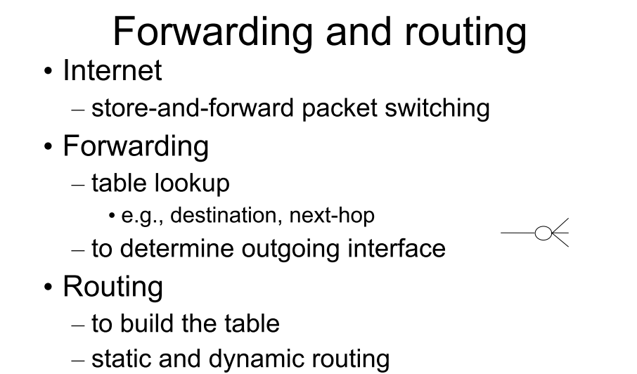

##### Control Plane: The traditional approach 

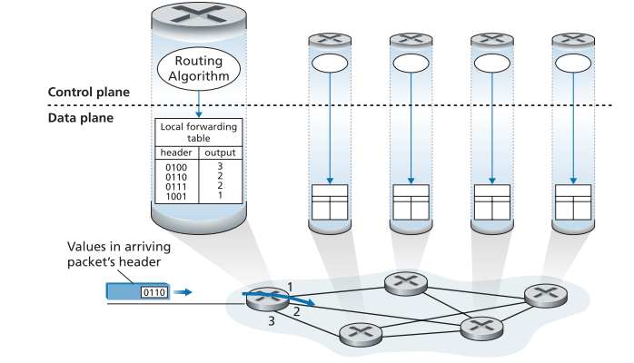

A routing algorithm runs in each and every router and both forwarding and routing functions are contained within a router. All networks have both a forwarding nd routing function.

- Routing done automatically via routing algorithm.
- Humans calculated and enter routing tables manually.

Pros to the routing algorithms:

- Fast, tested and automatic

##### Control Plane: The SDN Approach

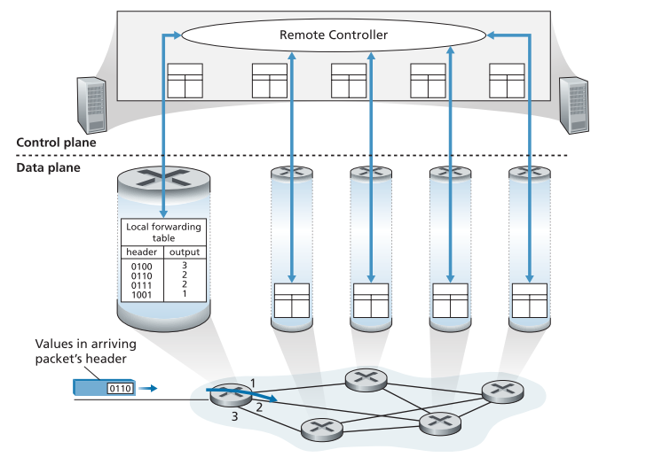

> **SDN**
>
> software-defined networking. Where the network is “software-defined” because the controller that computes forwarding tables and interacts with routers is implemented in software.

An alternative approach in which a physically separate, remote
controller computes and distributes the forwarding tables to be used by each and every router.

Usually this software is <u>open source</u> and available to everyone.

#### 4.1.2 Network Service Models

> **Network Service Models**
>
> Defines the characteristics of end-to-end delivery of packets between sending and receiving hosts.

##### List of services used by Network Layer:

- **Guaranteed delivery** - This service guarantees that a packet sent by a source host will eventually arrive at the destination host.
- **Guaranteed delivery with bounded delay** - This service not only guarantees delivery of the packet, but delivery within a specified host-to-host delay bound (for example, within 100 msec).
- **In-order packet delivery** - This service guarantees that packets arrive at the destination in the order that they were sent.
- **Guaranteed minimal bandwidth** - This network-layer service emulates the behavior of a transmission link of a specified bit rate (for example, 1 Mbps) between sending and receiving hosts. As long as the sending host transmits bits (as part of packets) at a rate below the specified bit rate, then all packets are eventually delivered to the destination host.
- **Security** - The network layer could encrypt all datagrams at the source and decrypt them at the destination, thereby providing confidentiality to all transport-layer segments.

> **Best-effort service** **(No real service at all)**
>
> The Internet service does not guarantee delivery, accuracy or even a response. usually "good enough".
>
> ex. No packet reaching the destination = "Best-effort" satisfied

Utilized application services:

- streaming video services such as <u>Netflix</u> and video-over-IP

- real-time conferencing applications such as <u>Skype</u> and <u>Facetime</u>.


## 4.3 The Internet Protocol (IP): IPv4, Addressing, IPv6, and More

#### 4.3.1 - IPv4 Datagram Format

> **Note:** A datagram is a Network-layer packet. 

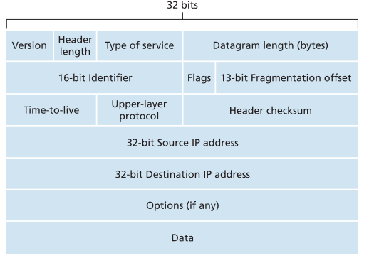

##### The key fields in the IPv4 datagram are the following:

- **Version number (4-bits) -** These 4 bits specify the IP protocol version of the datagram. By looking at the version number, the router can determine how to interpret the remainder of the IP datagram. Different versions of IP use different datagram formats.
- **Header Length (4-bits) -** to determine where in the IP datagram the payload (for example, the transport layer segment being encapsulated in this datagram) actually begins. Most IP datagrams do not contain options, so the typical IP datagram has a 20-byte header.
- **Type of service -** The type of service (TOS) bits were included in the IPv4 header to allow different types of IP datagrams to be distinguished from each other. (ex. FTP, SMTP, etc.)
- **Datagram length -**  This is the total length of the IP datagram (header plus data), measured in bytes. Since this field is 16 bits long, the theoretical maximum size of the IP datagram is 65,535 bytes. However, datagrams are rarely larger than 1,500 bytes, which allows an IP datagram to fit in the payload field of a maximally sized Ethernet frame.
- **Identifier, flags, fragmentation offset -** These three fields have to do with so-called IP fragmentation, when a large IP datagram is broken into several smaller IP datagrams which are then forwarded independently to the destination, where they are reassembled before their payload data is passed up to the transport layer at the destination host.
- **Time-to-Live (TTL) -** field is included to ensure that datagrams do not circulate forever.
- **Protocol (TCP/UDP) -** The value of this field indicates the specific transport-layer protocol to which the data portion of this IP datagram should be passed.
- **Header Checksum -** aids a router in detecting bit errors in a received IP datagram. 
- **Source IP Address -** Host that created the datagram
- **Destination IP address -** Recipient of datagram.
- **Options -** allow an IP header to be extended. Header options were meant to be used rarely—hence the decision to save overhead by not including the information in options fields in every datagram header.
- **Data (Payload) -** data to be delivered. Could be a UDP or TCP packet.

#### 4.3.2 - IPv4 Addressing 

> **Interface** 
>
> The boundary between the host and the physical link.

Each IP address is 32 bits long (equivalently, 4 bytes), and there are thus a total of 232 (or approximately 4 billion) possible IP addresses.

An IP address is technically associated with an interface, rather than with the host or router containing that interface.

> Note: 8 bits = 1 byte ex. 
>
> 192.168.0.1
>
> (8-bit) . (8-bit) . (8-bit) . (8-bit)
>
> 192.168.0.1/24 = Masking the first three numbers
>
> 2^32 (~4 billion) different types of IPs possible
>
> <u>*Power of 2 because in binary you can have either a 1 or a 0*</u>

> **dotted-decimal notation**
>
> Each byte of the address is written in its decimal form and is separated by a period (dot) from other bytes in the address.

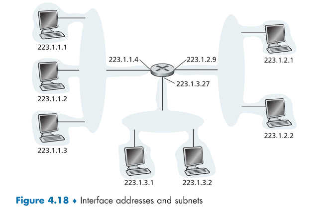

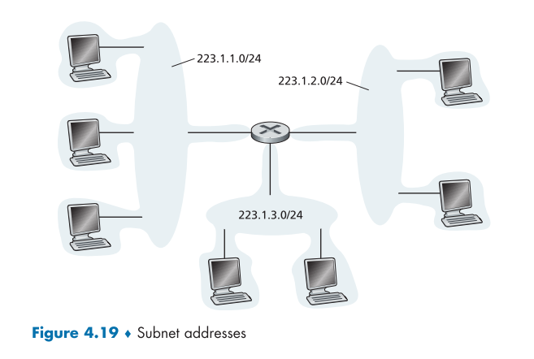

###### Subnets

> **Subnet**
>
> A subnet is an island of interconnected computers isolated from the main network.

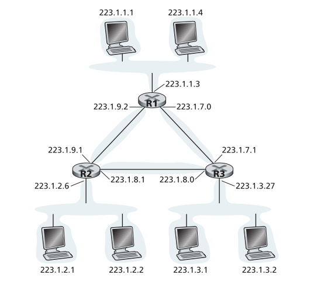

Above has the subnets (6 in total):

- XXX.X.**1**.X
- XXX.X.**2**.X
- XXX.X.**3**.X
- XXX.X.**7**.X
- XXX.X.**8**.X
- XXX.X.**9**.X

> **Classless Interdomain Routing (CIDR—pronounced cider)**
>
> generalizes the notion of subnet addressing. As with subnet addressing, the 32-bit IP address is divided into two parts and again has the dotted-decimal form a.b.c.d/x, where x indicates the number of bits in the first part of the address.

##### Obtaining a Block of Addresses

In order to obtain a block of IP addresses for use within an organization’s subnet, a network administrator might first contact its ISP, which would provide addresses from a larger block of addresses that had already been allocated to the ISP.

##### Obtaining a Host Address: The Dynamic Host Configuration Protocol (DHCP)

> **DHCP (Dynamic Host Configuration Protocol)**
>
> DHCP allows a host to obtain (be allocated) an IP address automatically. Because of the ease of DHCP it is referred to as <u>plug-and-play</u> or <u>zeroconf</u>

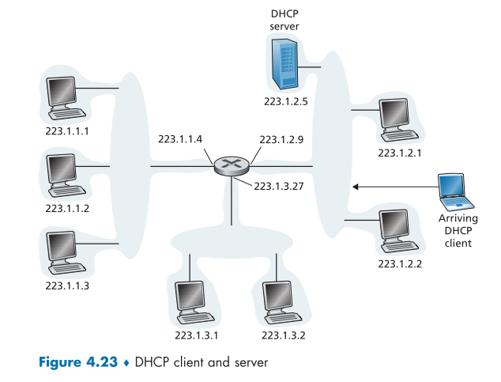

###### DHCP 4 step proccess for new clients

1. **DHCP server discovery** - using a DHCP discover message, which a client sends within a UDP packet to port 67. The UDP packet is encapsulated in an IP datagram.
2. **DHCP server offer(s)** - A DHCP server receiving a DHCP discover message responds to the client with a DHCP offer message that is broadcast to all nodes on the subnet, again using the IP broadcast address of 255.255.255.255. Each server offer message contains the transaction ID of the received discover message, the proposed IP address for the client, the network mask, and an IP address lease time—the amount of time for which the IP address will be valid.
3. **DHCP request** - The newly arriving client will choose from among one or more server offers and respond to its selected offer with a DHCP request message, echoing back the configuration parameters.
4. **DHCP ACK** - The server responds to the DHCP request message with a DHCP ACK message, confirming the requested parameters.

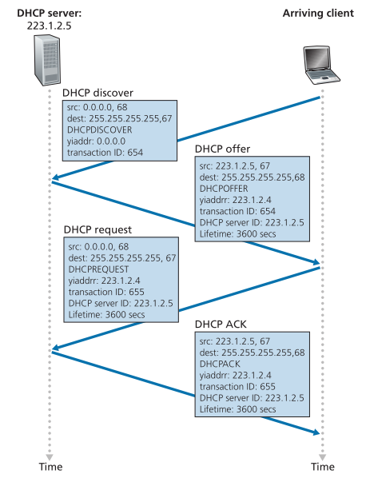

#### 4.3.3 - Network Address Translation (NAT) 

##### Internal vs External Network IPs


The NAT-enabled router does not look like a router to the outside world. Instead the NAT router behaves to the outside world as a single device with a single IP address.

> **NAT translation table**
>
> Contains all internal IPs and Ports than an external datagram can transmit to. Basically port forwarding.

##### Downsides of NAT

- Port numbers being used to address processes vs addressing hosts.
- Routers were meant to stay in network layer and NAT violates this principal.

#### 4.3.4 - IPv6

In the early 1990s, the Internet Engineering Task Force began an effort to develop a successor to the IPv4 protocol. A prime motivation for this effort was the realization that the 32-bit IPv4 address space was beginning to be used up, with new subnets and IP nodes being attached to the Internet (and being allocated unique IP addresses) at a breathtaking rate.

Upgrades to the IPv4 protocol was implemented as well.

##### IPv6 Datagram Format

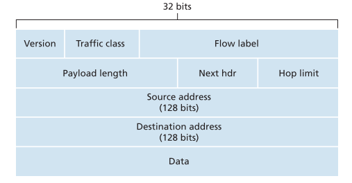

**New upgrades included the following:**

- **Expanded addressing capabilities** - IPv6 increases the size of the IP address from 32 to 128 bits. This ensures that the world won’t run out of IP addresses. Now, every grain of sand on the planet can be IP-addressable.
- **A streamlined 40-byte header** - A number of IPv4 fields have been dropped or made optional. The resulting 40-byte fixed-length header allows for faster processing of the IP datagram by a router. A new encoding of options allows for more flexible options processing.
- **Flow labeling** - This allows “labeling of packets belonging to particular flows for which the sender requests special handling, such as a non-default quality of service or real-time service.”. Designers of IPv6 foresaw the eventual need to be able to differentiate among the flows, even if the exact meaning of a flow had yet to be determined.
- **Next header** - This field identifies the protocol to which the contents (data field) of this datagram will be delivered (for example, to TCP or UDP). The field uses the same values as the protocol field in the IPv4 header.
- **Hop limit** - The contents of this field are decremented by one by each router that forwards the datagram. If the hop limit count reaches zero, a router must discard that datagram.
- **Source and destination addresses** - IPv6 addresses.
- **Data** - This is the payload portion of the IPv6 datagram. When the datagram reaches its destination, the payload will be removed from the IP datagram and passed on to the protocol specified in the next header field.

**Fields now removed from the IPv6 protocol that were in the IPv4 protocol:**

- **Fragmentation/reassembly** - IPv6 does not allow for fragmentation and reassembly at intermediate routers; these operations can be performed only by the source and destination. If an IPv6 datagram received by a router is too large to be forwarded over the outgoing link, the router simply drops the datagram and sends a “Packet Too Big” ICMP error message back to the sender. The sender can then resend the data, using a smaller IP datagram size. Fragmentation and reassembly is a time-consuming operation; removing this functionality from the routers and placing it squarely in the end systems considerably speeds up IP forwarding within the network.
- **Header checksum** - This functionality was sufficiently redundant in the network layer that it could be removed.
- **Options** - An options field is no longer a part of the standard IP header. The options field is one of the possible next headers pointed to from within the IPv6 header. That is, just as TCP or UDP protocol headers can be the next header within an IP packet, so too can an options field. The removal of the options field results in a fixed-length, 40-byte IP header.

##### Transitioning to IPv6 from IPv4

Right now the process uses tunneling. Placing the IPv4 packet within the IPv6 and sending it to its destination.

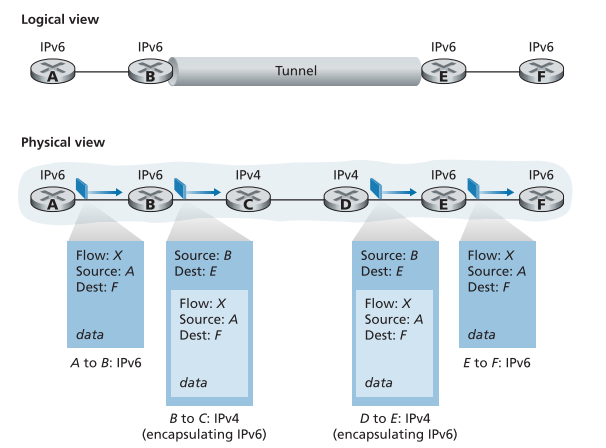

 # Chapter 5 - The Network Layer: Control Plane (Routing)

## 5.1 - Introduction

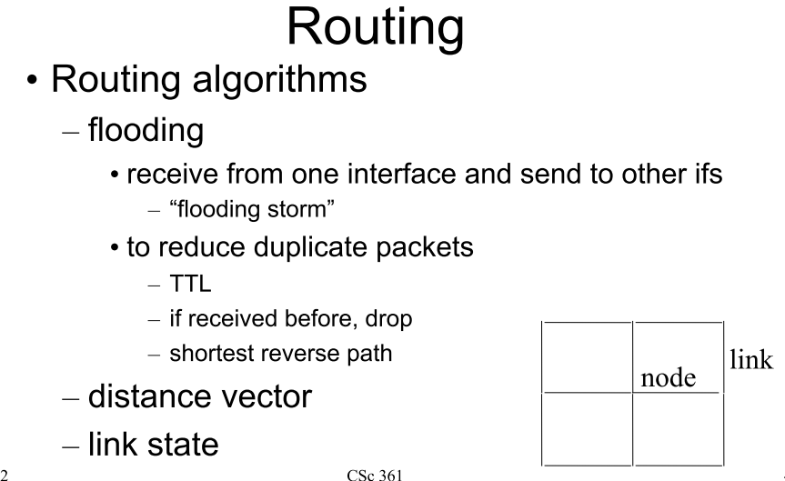

**Two possible approaches for routing:**

> **Per-router control** 
>
> A routing algorithm runs in each and every router; both a forwarding and a routing function are contained within each router. Each router has a routing component that communicates with the routing components in other routers to compute the values for its forwarding table. 
>
> 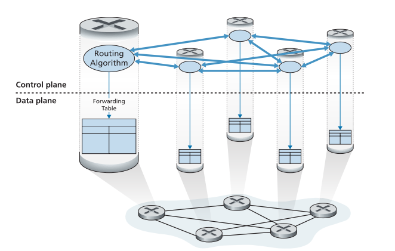

> **Logically centralized control** 
>
> Computes and distributes the forwarding tables to be used by each and every router. the routing control service is accessed as if it were a single central service point, even though the service is likely to be implemented via multiple servers for fault-tolerance, and performance scalability reasons.
>
> 


## 5.2 - routing Algorithms 

goal is to determine good paths (equivalently, routes), from senders to receivers, through the network of routers. Typically, a “good” path is one that has the least cost.

we can classify routing algorithms is according to whether they are centralized or decentralized: 

> **Centralized routing algorithms**
>
> computes the least-cost path between a source and destination using complete, global knowledge about the network. This then requires that the algorithm somehow obtain this information before actually performing the calculation.
>
> Algorithms with global state information are often referred to as <u>link-state (LS) algorithms</u>, since the algorithm must be aware of the cost of each link in the network.

> **Decentralized routing algorithms**
>
> The calculation of the least-cost path is carried out in an iterative, distributed manner by the routers. No node has complete information about the costs of all network links. Each node begins with only the knowledge of the costs of its own directly attached links. 
>
> The decentralized routing algorithm is called a <u>distance-vector (DV) algorithm</u>, because each node maintains a vector of estimates of the costs (distances) to all other nodes in the network. 
>
> Such decentralized algorithms, with interactive message exchange between neighboring routers is perhaps more naturally suited to control planes where the routers interact directly with each other

##### A Comparison of LS and DV Routing Algorithms

The DV and LS algorithms take complementary approaches toward computing routing.

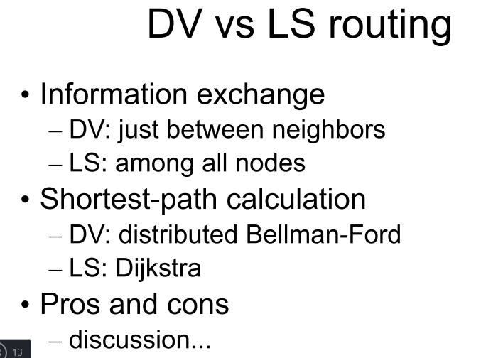

###### DV Algorithm

Each node talks to only its directly connected neighbors, but it provides its neighbors with least-cost estimates from itself to all the nodes (that it knows about) in the network.

| Speed  | Robustness                                                   |
| ------ | ------------------------------------------------------------ |
| O(n^2) | a node can advertise incorrect least-cost paths to any or all destinations. (Indeed, in 1997, a malfunctioning router in a small ISP provided national backbone routers with erroneous routing information. This caused other routers to flood the malfunctioning router with traffic and caused large portions of the Internet to become disconnected for up to several hours |

###### LS Algorithm

The LS algorithm requires global information.

| Speed  | Robustness                                                   |
| ------ | ------------------------------------------------------------ |
| O(M+N) | router could broadcast an incorrect cost for one of its attached links (but no others). A node could also corrupt or drop any packets it received as part of an LS broadcast. But an LS node is computing only its own forwarding tables; other nodes are performing similar calculations for themselves. This means route calculations are somewhat separated under LS, providing a degree of robustness. |


#### 5.2.1 The Link-State (LS) Routing Algorithm (Dijkstra's Algorithm)

The network topology and all link costs are known, that is, available as input to the LS algorithm. This is accomplished by having each node broadcast link-state packets to all other nodes in the network, with each link-state packet containing the identities and costs of its attached links. This is often accomplished by a link-state broadcast algorithm.

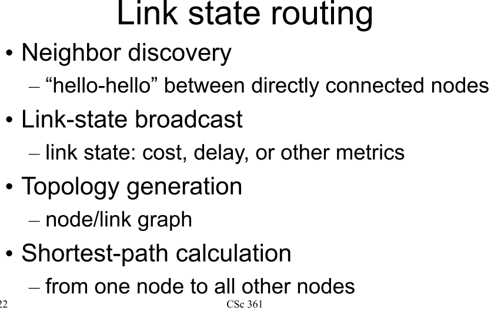

> Definitions for the following notation:
>
> - ***D(v):*** cost of the least-cost path from the source node to destination v as of this iteration of the algorithm.
> - ***p(v):*** previous node (neighbor of v) along the current least-cost path from the source to v.
> - ***N′:*** subset of nodes; v is in N′ if the least-cost path from the source to v is definitively known.

> Worst Case: O(n^2)

```pseudocode
1 	Initialization: 
2 	N’ = {u} 
3	for all nodes v 
4		if v is a neighbor of u
5 			then D(v) = c(u,v) 
6		else D(v) = ∞
7 
8	Loop 
9 		find w not in N’ such that D(w) is a minimum 
10 		add w to N’ 
11 		update D(v) for each neighbor v of w and not in N’: 
12			D(v) = min(D(v), D(w)+ c(w,v) )
13 		/* new cost to v is either old cost to v or*/ 
14 		/*known least path cost to w plus cost from w to v */
15	until N’= N
```

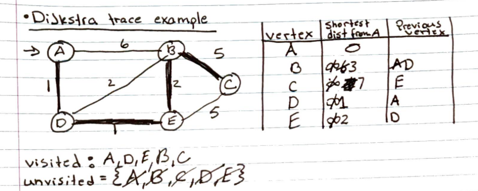

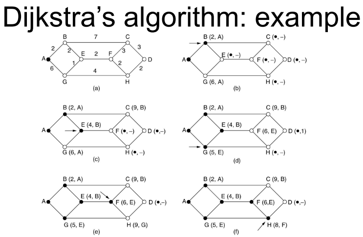

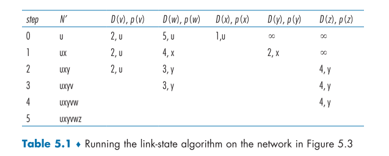

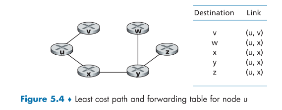

Route loads are not symmetric, thus a clockwise traversal will be different than a counter clockwise traversal. This creates congestion.

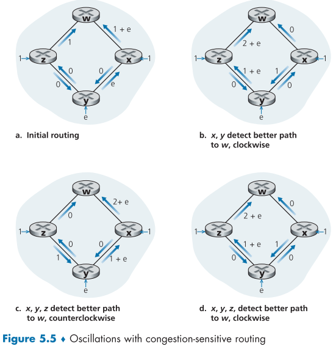

##### Solutions to congestion caused by oscillations

to ensure that not all routers run the LS algorithm at the same time. This seems a more reasonable solution, since we would hope that even if routers ran the LS algorithm with the same periodicity, the execution instance of the algorithm would not be the same at each node.

Routers in the wild are known to "self-synchronize" amongst themselves.

#### 5.2.2 The Distance-Vector (DV) Routing Algorithm (Bellman-Ford Algorithm)

Whereas the LS algorithm is an algorithm using global information, the distance vector (DV) algorithm is iterative, asynchronous, and distributed. It is distributed in that each node receives some information from one or more of its directly attached neighbors, performs a calculation, and then distributes the results of its calculation back to its neighbors.

The algorithm is <u>asynchronous</u> , thus self terminates without a stop event.

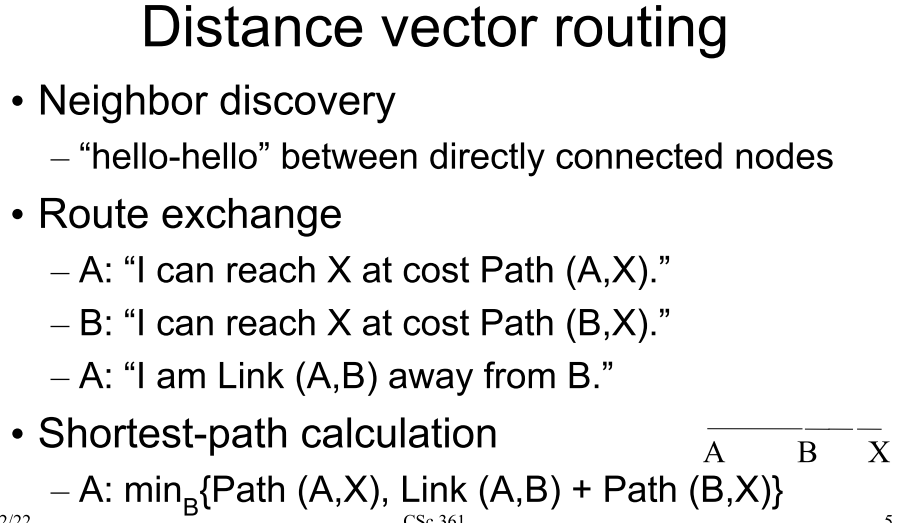

The shortest distance can be related via Bellman-Ford algorithm:
$$
d_x (y) = min_v\{c(x,v)+d_v(y)\}
$$

```pseudocode
1	Initialization: 
2	for all destinations y in N:
3 		Dx(y)= c(x,y)/* if y is not a neighbor then c(x,y)= ∞ */ 
4 	for each neighbor w
5 	Dw(y) = ? for all destinations y in N 
6 	for each neighbor w
7 	send distance vector Dx = [Dx(y): y in N] to w
8 
9	loop 
10 		wait (until I see a link cost change to some neighbor w or 
11		until I receive a distance vector from some neighbor w) 
12 
13	for each y in N: Dx(y) = minv{c(x,v) + Dv(y)}
14	Dx(y) = minv{c(x,v) + Dv(y)}
15 
16	if Dx(y) changed for any destination y 
17	send distance vector Dx = [Dx(y): y in N] to all neighbors
18 
19	forever
```


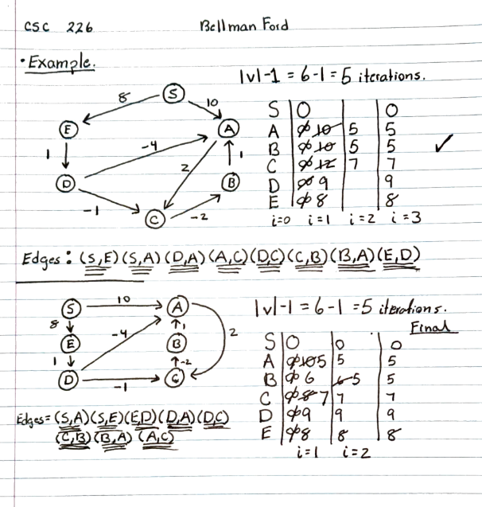


For example, node x sends its distance vector Dx = [0, 2, 7] to both nodes y and z. After receiving the updates, each node recomputes its own distance vector. For example, node x computes:

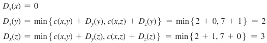

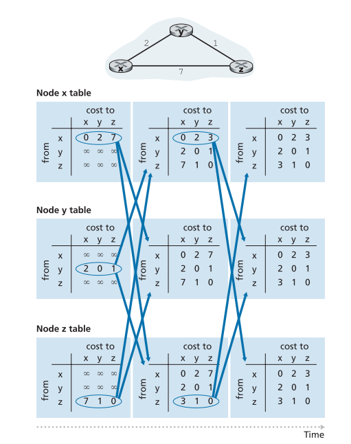

##### DV Algorithm: Link-Cost changes and Link Failure

**The DV algorithm causes the following sequence of events to occur:**

- **At time t0** - y detects the link-cost change (the cost has changed from 4 to 1), updates its distance vector, and informs its neighbors of this change since its distance vector has changed.
- **At time t1** - z receives the update from y and updates its table. It computes a new least cost to x (it has decreased from a cost of 5 to a cost of 2) and sends its new distance vector to its neighbors.
- **At time t2** - y receives z’s update and updates its distance table. y’s least costs do not change and hence y does not send any message to z. The algorithm comes to a quiescent state.

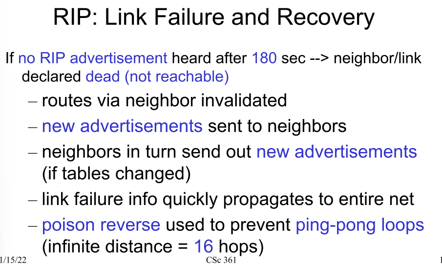

##### Count-to-infinity

> **Problem**
>
> 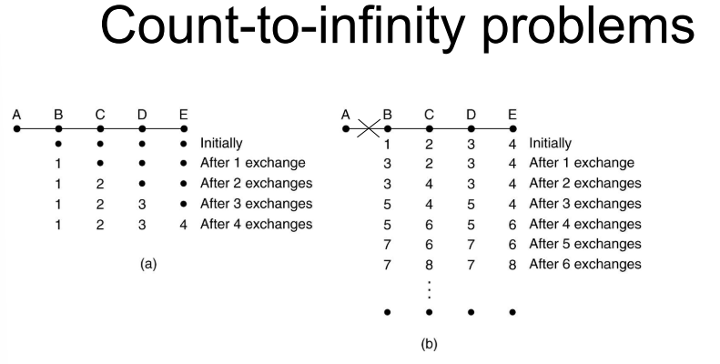

> **Solutions**
>
> 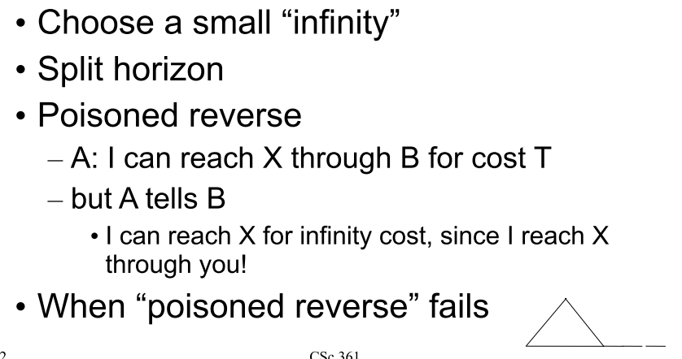


## 5.3 - Intra-AS Routing in the Internet: OSPF

set of routers all executing the same routing algorithm is simplistic for two important reasons:

- **Scale** - As the number of routers becomes large, the overhead involved in communicating, computing, and storing routing information becomes prohibitive. A distance-vector algorithm that iterated among such a large number of routers would never converge.
- **Administrative Autonomy** - An ISP generally desires to operate its network as it pleases and an organization should be able to operate and administer its network as it wishes, while still being able to connect its network to other outside networks.

> **Intra-autonomous system routing protocol**
>
> The routing algorithm running within an autonomous system 

##### Routing Information Protocol (RIP) 

- Uses the Distance vector algorithm
- Based on UDP Protocol
- Included in BSD-UNIX Distribution in 1982
- Distance metric: # of hops (max = 15 hops)
  - Pros: Limits possible loops
  - Cons: Limits traffic that requires more than 15 hops

###### Routing Information Protocol Advertisements 

Distance vectors: exchanged among neighbors every 30 sec via RIP Response Message (also called advertisement). Each advertisement: list of up to 25 destination subnets within AS.

- Uses UDP Port 520 (/etc/services)
- Newer Implementations use TCP
- Uses HOPS to indicate the metric

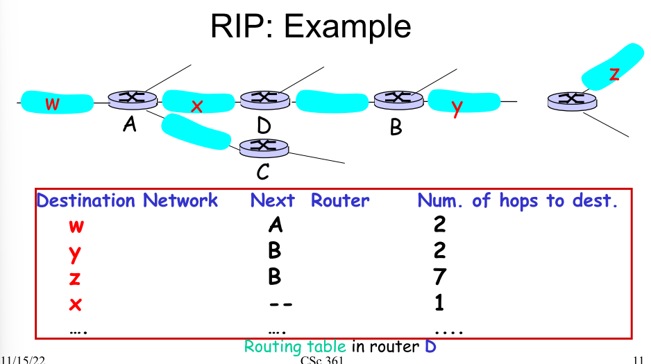

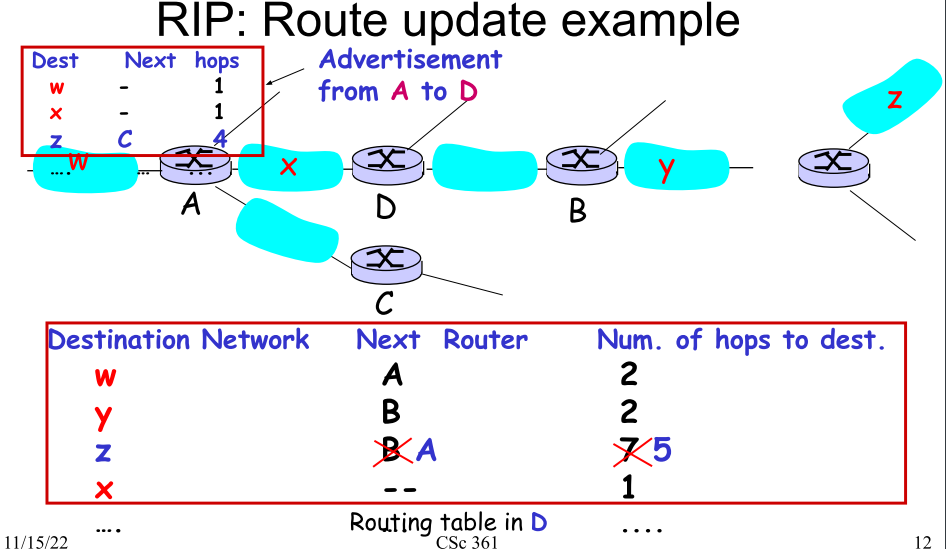

##### Open Shortest Path First (OSPF)

> **Intermediate System - Intermediate System (IS - IS)**
>
> the IS-IS protocol is one of a family of IP Routing protocols

OSPF is a link-state protocol that uses flooding of link-state information
and a Dijkstra’s least-cost path algorithm.

With OSPF, each router constructs a complete topological graph of the entire autonomous system. Each router then locally runs Dijkstra’s shortest-path algorithm to determine a shortest-path tree to all subnets, with itself as the root node.

**The configuration is the administrators decision:**

- Might choose to set all link costs to 1, thus achieving minimum-hop routing.
- Might choose to set the link weights to be inversely proportional to link capacity in order to discourage traffic from using low-bandwidth links

With OSPF, a router broadcasts routing information to all other routers in the autonomous system, not just to its neighboring routers. A router broadcasts link-state information whenever there is a change in a link’s state (Or every 30 mins).

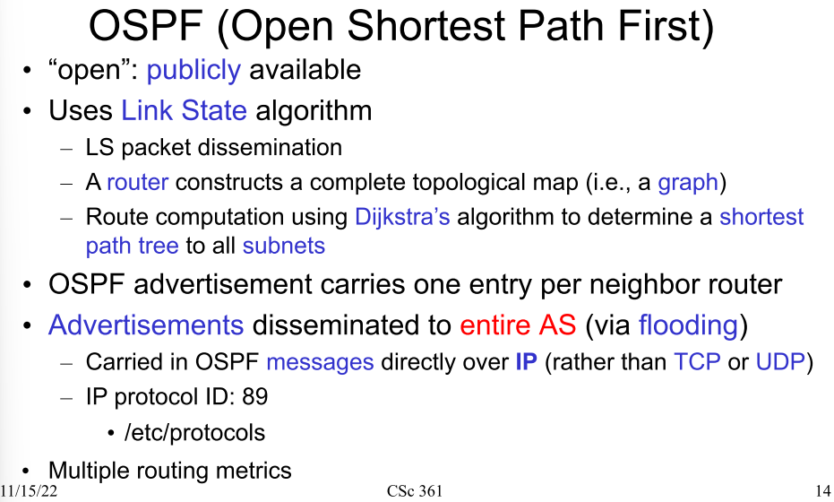

###### OSPF Messages

| Message Type           | Description                                  |
| ---------------------- | -------------------------------------------- |
| Hello                  | Used to discover who the neighbors are.      |
| Link State Update      | Provides the sender's cost to its neighbors. |
| Link State Ack         | Acknowledges link state update.              |
| Link state Description | Announces which updates the sender has.      |
| Link State Request     | Requests information from the partner.       |

###### Hierarchical OSPF

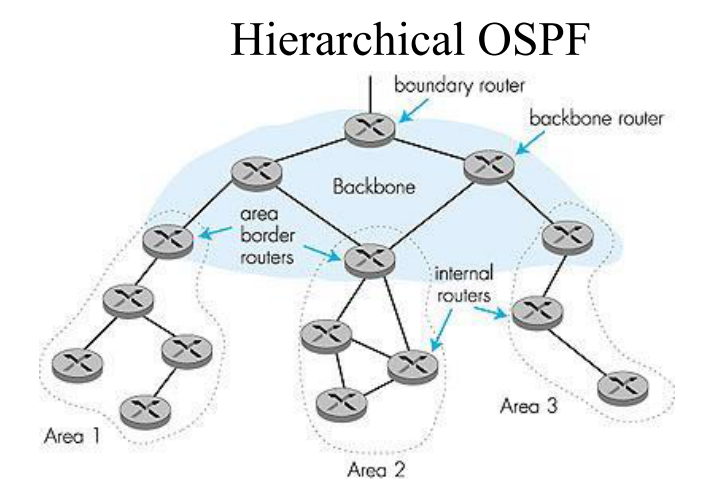

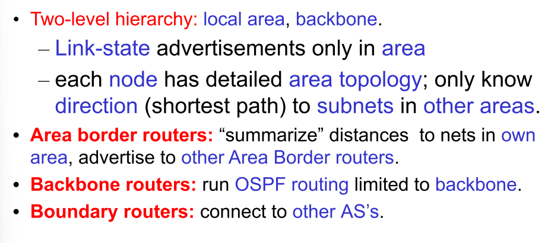

> **MOSPF**
>
> Multicast Open Shortest Path First

**Some of the advances include the following:**

- **security -** Exchanges between OSPF routers can be authenticated. With authentication, only trusted routers can participate in the OSPF protocol within an AS, thus preventing malicious intruders.
- **Multiple same-cost paths -** OSPF allows multiple paths to be used, singe path is not needed.
- **Integrated support for unicast and multicast routing -** MOSPF provides simple extensions to OSPF to provide for multicast routing. MOSPF uses the existing OSPF link database and adds a new type of link-state advertisement to the existing OSPF link-state broadcast mechanism.
- **Support for hierarchy within a single Autonomous system -** OSPF autonomous system can be configured hierarchically into areas. Each area runs its own OSPF link-state routing algorithm, with each router in an area broadcasting its link state to all other routers in that area.

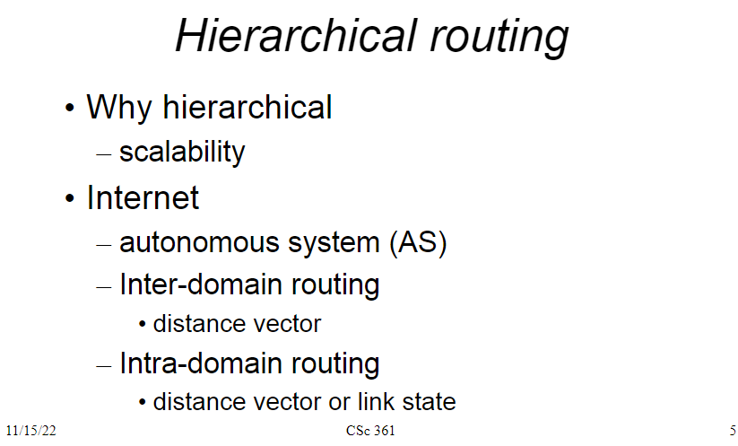

> **Example:** 
>
> 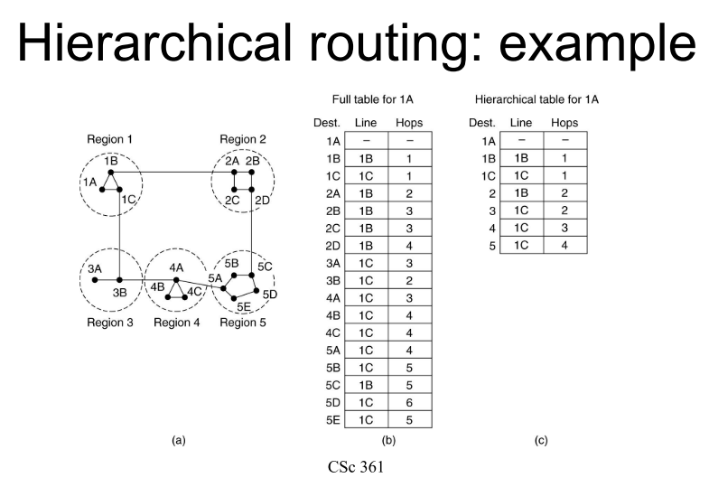

## 5.4 - Routing Among the ISPs: BGP

> **Border Gateway Protocol**
>
> The de facto exterior gateway protocol (version 4).
>
> Since an inter-AS routing protocol involves coordination among multiple ASs, communicating ASs must run the same inter-AS routing protocol. In fact, in the Internet, all ASs run the same inter-AS routing protocol
>
> *TL;DR*: Routing protocol standardizing what algorithm to use between autonomous systems.

#### 5.4.1 The Role of BGP

Routing tables determine the rules inside an Intra-Autonomous System but not outside of it. Another standard applies: BGP

In BGP, packets are not routed to a specific destination address, but instead to CIDRized prefixes, with each prefix representing a subnet or a collection of subnets.

**Goals of BGP:**

- **Obtain prefix reachability information from neighboring ASs** 
- **Determine the “best” routes to the prefixes.** -  A router may learn about two or more different routes to a specific prefix. To determine the best route, the router will locally run a BGP route-selection procedure.
- **Propagate the reachability info to all routers <u>internal</u> to AS**
- **Allows a subnet to advertise its existence.**

#### 5.4.2 Advertising BGP Route Information 

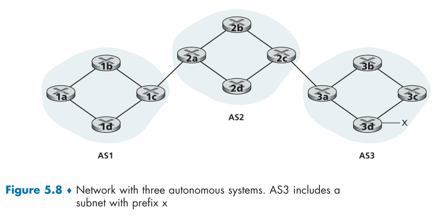

For each AS, each router is either a gateway router or an internal router.

> **Gateway Router**
>
> a router on the edge of an AS that directly connects to one or more routers in other AS's.
>
> ex. 1C, 2A, 2C, 3A

> **Internal Router**
>
> connects only to hosts and routers within its own AS.
>
> ex. all others

##### BGP connections

Established over semi-permanent TCP usually over port 179

> **External/ Internal BGP (eBGP/iBGP)**
>
> - **eBGP** - Two connections from routers spanning over two Autonomous systems.
> - **iBGP** - Internal router connections

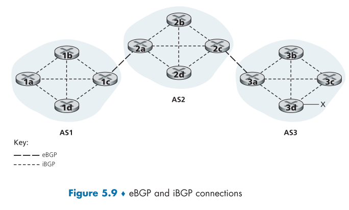

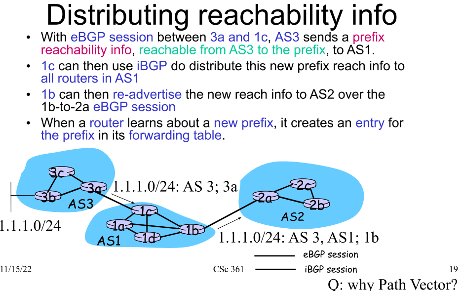

#### 5.4.3 Determining the Best Routes 

> **BGP attributes**
>
> When a router advertises a prefix across a BGP connection with several prefixes.

> **Route** 
>
> Combined Prefix <u>AND</u> attributes

**Two of the most important attributes:**

- **AS-PATH** - contains the list of ASs through which the advertisement has passed.
- **NEXT-HOP** - is the IP address of the router interface that begins the AS-PATH.

When gateway router receives route advert, uses import routing policy to accept/decline.

**AS-PATH Loops** - If a router sees that its own AS is contained in the path list, it will reject the advertisement because it will become a looping path.


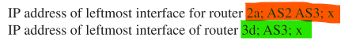

Format of attributes for BGP route: **NEXT-HOP**; **AS-PATH**;**Destination Prefix (x)**

##### BGP Messages

| Message      | Description                                                  |
| ------------ | ------------------------------------------------------------ |
| OPEN         | opens TCP connection to peer and authenticates sender        |
| UPDATE       | advertises new path (or withdraws old)                       |
| KEEPALIVE    | keeps connection alive in absence of UPDATES; also ACKs OPEN request |
| NOTIFICATION | reports errors in previous msg; also used to close connection |


##### Hot Potato Routing

>  **Hot Potato Routing**
>
> Name for a simple algorithm that provides BGP routing.

**When adding an outside-AS prefix into a forwarding table these are used:**

-  inter-AS routing protocol (BGP) 
- intra-AS routing protocol (e.g., OSPF)

The idea behind hot-potato routing is for router 1b to get packets out of its
AS as quickly as possible (more specifically, with the least cost possible) without worrying about the cost of the remaining portions of the path outside of its AS to the destination.

###### Algorithm steps:

1. Learn from inter-AS protocol that subnet x is reachable via multiple gateways.
2. Use routing info from intra-AS protocol to determine costs of least-cost paths to each of the gateways.
3. Hot potato routing: Choose the gateway that has the
   smallest least cost.
4. Determine from forwarding table the interface I that leads to least-cost gateway. Enter (x,I) in forwarding table.

###### Summery of the "Hot Potato Algorithm

- Selfish algorithm - it tries to reduce the cost in its own AS while ignoring the other components of the end-to-end costs outside its AS. 
- Many different paths can be achieved.

##### Route-Selection Algorithm 

Uses a more complex algorithm but incorporates the Hot Potato Algorithm when needed.

> **Local Prefix**
>
> The value of the local preference attribute is a policy decision that is left entirely up to the AS’s network administrator. 

If there are two or more routes to the same prefix, then BGP sequentially invokes the following elimination rules until one route remains

###### Algorithm Steps:

1. A route is assigned a local preference value as one of its attributes (in addition to the AS-PATH and NEXT-HOP attributes). The routes with the <u>highest local preference values are selected</u>.
2. From the remaining routes (all with the same highest local preference value), the route with the shortest AS-PATH is selected. If this rule were the only rule for route selection, then <u>BGP would be using a DV algorithm for path determination</u>, where the distance metric uses the number of AS hops rather than the number of router hops.
3. From the remaining routes (all with the same highest local preference value and the same AS-PATH length), <u>hot potato routing is used</u>, that is, the route with the closest NEXT-HOP router is selected.
4. If more than one route still remains, the router <u>uses BGP identifiers</u> to select the route.

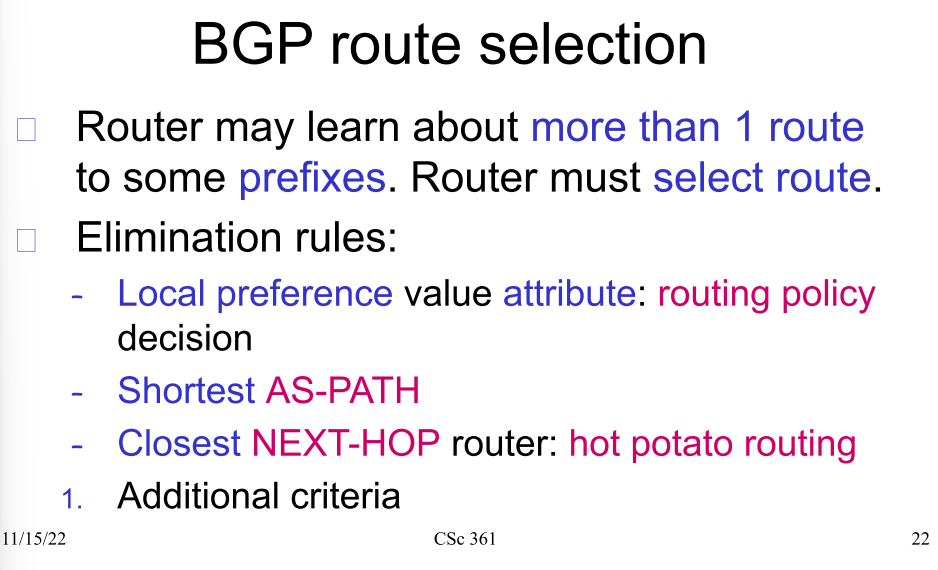

#### 5.4.4 IP-Anycast

> **IP-Anycast**
>
> is commonly used in DNS. 
>
> **Applications such as:** 
>
> - replicating the same content on different servers in many different dispersed geographical locations
> - having each user access the content from the server that is closest.
>
> Ex. a CDN may replicate videos and other objects on servers in different countries.

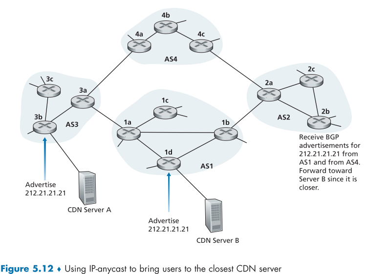

#### 5.4.5 Routing Policy 

When a router selects a route to a destination, the AS routing policy can trump all other considerations, such as shortest AS path or hot potato routing.

In the route-selection algorithm routes are first selected according to the local-preference attribute, whose value is fixed by the policy of the local AS.

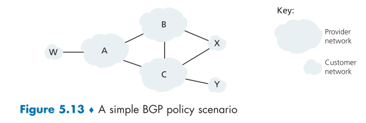

- **X** - <u>Multi-homed</u> Access ISP
- **A,B,C** - Provider Networks 
- **W, Y, X** - Access ISP

#### 5.4.6 Putting the Pieces Together: Obtaining Internet Presence

Putting these into practice:

- IP addressing
- DNS
- BGP


##### Summery 

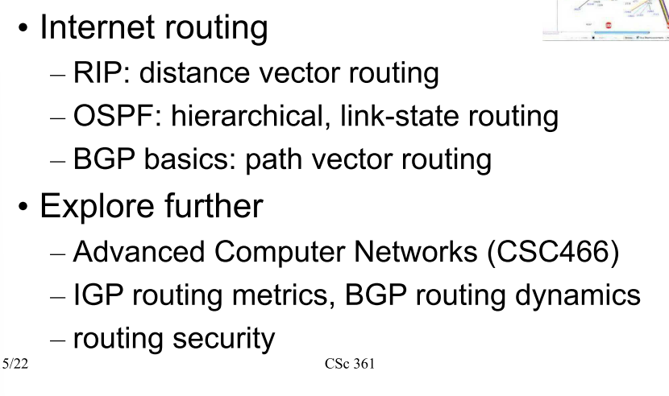

## 5.6 - ICMP: The Internet Control Message Protocol

Used by hosts and routers to communicate network-layer information to each other. The most typical case for ICMP is error reporting. That router created and sent an ICMP message to your host indicating the error. 

ICMP is often considered part of IP, but architecturally it lies just above IP, as
ICMP messages are carried inside IP datagrams. That is, ICMP messages are carried as IP payload, just as TCP or UDP segments are carried as IP payload.

ICMP messages have a type and a code field, and contain the header and the first 8 bytes of the IP datagram that caused the ICMP message to be generated in the first place.

Another interesting ICMP message is the source quench message. This message is seldom used in practice. Its original purpose was to perform congestion control—to allow a congested router to send an ICMP source quench message to a host to force that host to reduce its transmission rate.

#### **ICMP Code table:**

| ICMP Type | Code | Description                        |
| --------- | ---- | ---------------------------------- |
| 0         | 0    | echo reply (to ping)               |
| 3         | 0    | destination network unreachable    |
| 3         | 1    | destination host unreachable       |
| 3         | 2    | destination protocol unreachable   |
| 3         | 3    | destination port unreachable       |
| 3         | 6    | destination network unknown        |
| 3         | 7    | destination host unknown           |
| 4         | 0    | source quench (congestion control) |
| 8         | 0    | echo request                       |
| 9         | 0    | router advertisement               |
| 10        | 0    | router discovery                   |
| 11        | 0    | TTL expired                        |
| 12        | 0    | IP header bad                      |

#### How does a Traceroute source know when to stop sending UDP segments?

The destination host sends a port unreachable ICMP message (type 3 code 3) back to the source. When the source host receives this particular ICMP message, it knows it does not need to send additional probe packets.

#### ICMPv6

ICMPv6 also added new types and codes required by the new IPv6 functionality. These include the “Packet Too Big” type and an “unrecognized IPv6 options” error code.

# Chapter 6 - The Link Layer and LANs

## 6.1 - Introduction to the Link Layer

> **Node**
>
> Anything that runs in the link layer. Include hosts, routers, switches, and WiFi access points

> **Links**
>
> Communication channels that connect adjacent nodes along the communication path.

#### 6.1.1 - The Services Provided by the Link Layer 

- **Framing** - A frame consists of a data field, in which the network-layer datagram is inserted, and a number of header fields.
- **Link Access** - A medium access control (MAC) protocol specifies the rules by which a frame is transmitted onto the link. For point-to-point links that have a single sender at one end of the link and a single receiver at the other end of the link, the MAC protocol is simple (or nonexistent)—the sender can send a frame whenever the link is idle. 
- **Reliable delivery** - When a link-layer protocol provides reliable delivery service, it guarantees to move each network-layer datagram across the link without error.
- **Error detection and correction** - Such bit errors are introduced by signal attenuation and electromagnetic noise. Because there is no need to forward a datagram that has an error, many link-layer protocols provide a mechanism to detect such bit errors. This is done by having the transmitting node include error-detection bits in the frame, and having the receiving node perform an error check.

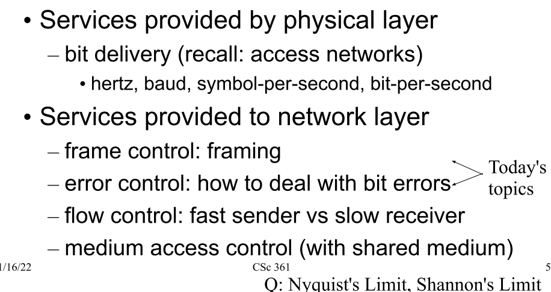

#### 6.1.1.1 Flow Control (Lecture Slides)

##### Sliding-window-based flow control

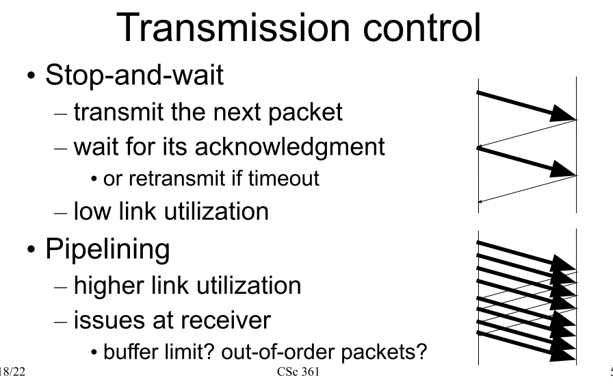

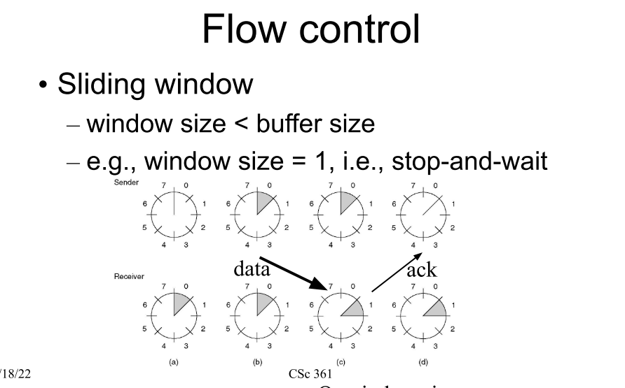

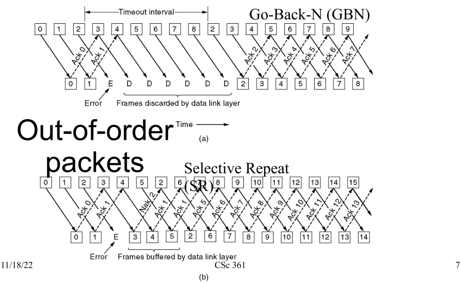

#### 6.1.1.2 representative link layer protocols (Lecture Slides)

##### HDLC (High-level Data Link Control) 

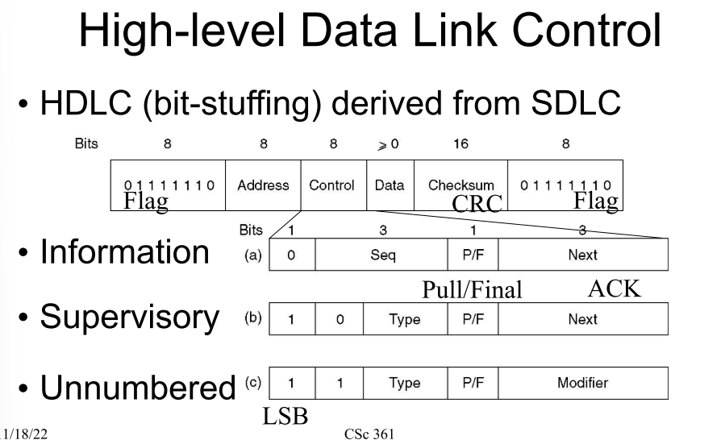


##### SLIP (Serial Line Internet Protocol)


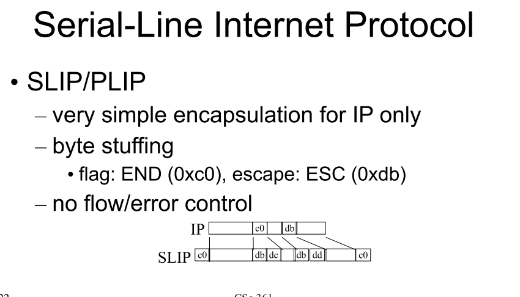

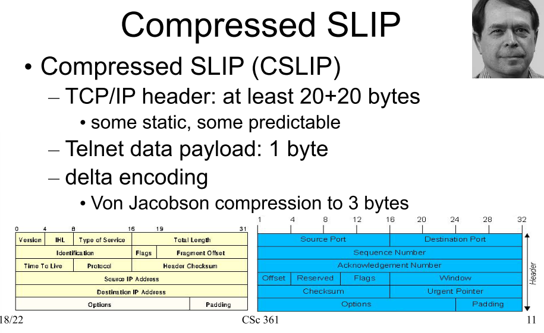

##### PPP (Point-to-Point Protocol)

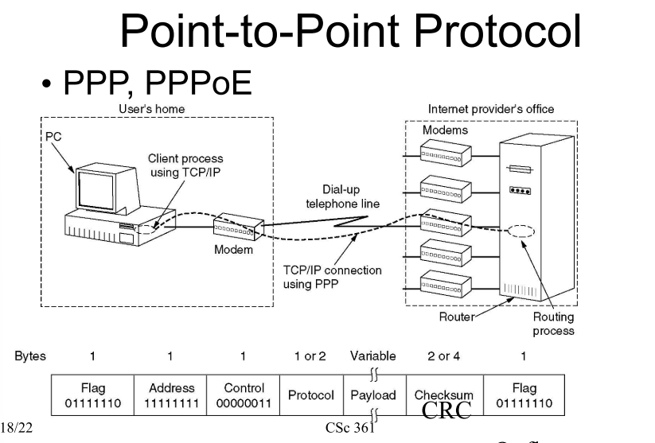

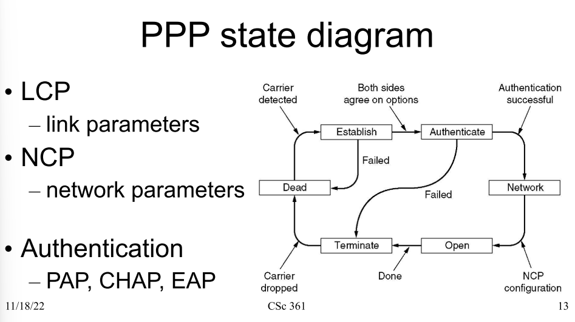

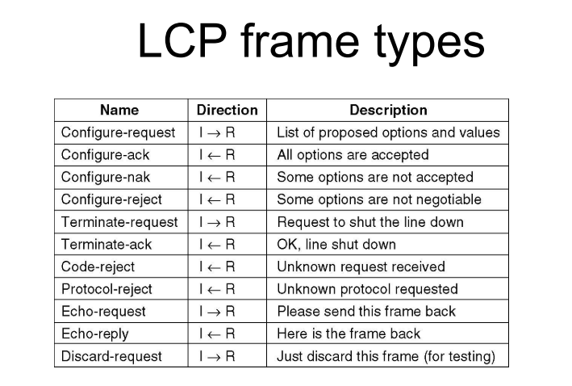

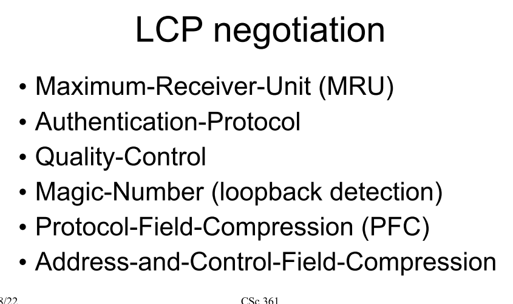

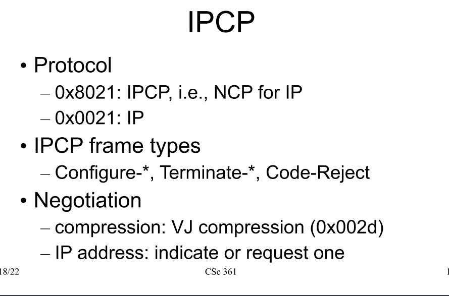


#### 6.1.2 - Where Is the Link Layer Implemented?

The link layer is implemented on a chip called the network adapter, also sometimes known as a network <u>interface controller (NIC)</u>.

most of the link layer is implemented in hardware,
part of the link layer is implemented in software that runs on the host’s CPU. The software components of the link layer implement higher-level link-layer functionality such as assembling link-layer addressing information and activating the controller hardware.

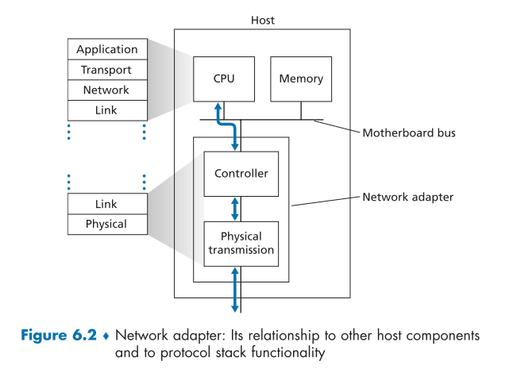

## 6.2 - Error-Detection and -Correction Techniques

>  **bit-level error detection and correction**
>
> detecting and correcting the corruption of bits in a link-layer frame sent from one node to another physically connected neighboring node—are two services often provided by the link layer.

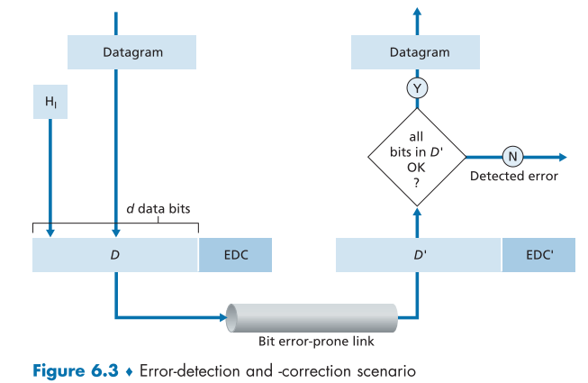

##### Byte-oriented framing

- Uses Byte stuffing

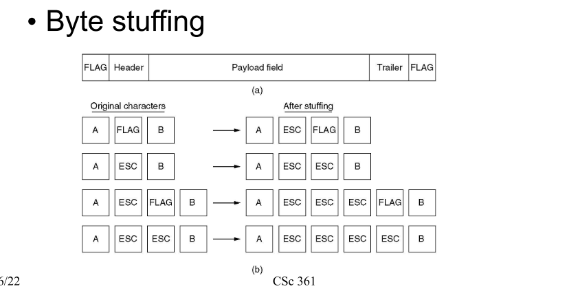

##### Bit-oriented framing

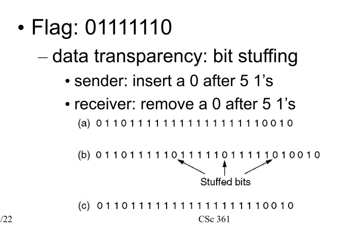

##### Error control, Hamming and Hamming's code

- Utilized in ALOHA protocols

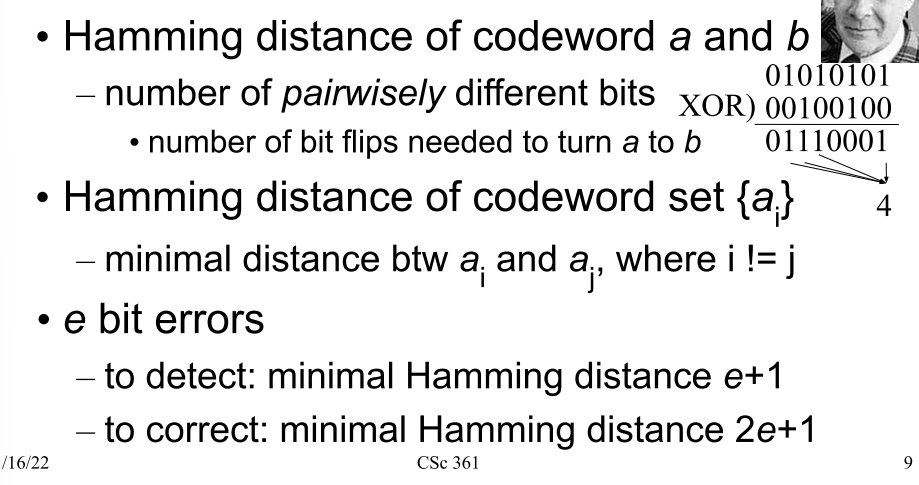

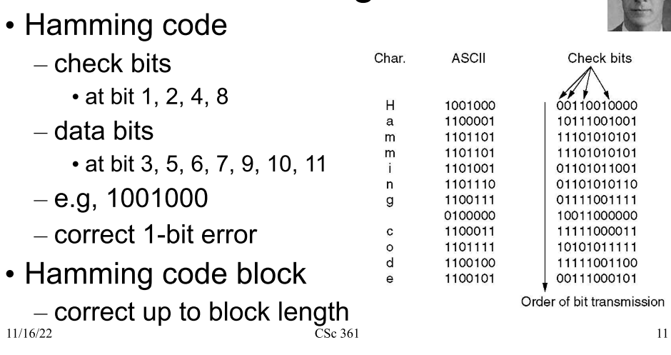

#### 6.2.1 - Parity Checks

##### Even vs odd parity bits

- In an even parity scheme, the sender simply includes one additional bit and chooses its value such that the total number of 1s in the d + 1 bits (the original information plus a parity bit) is even.
- For odd parity schemes, the parity bit value is chosen such that there is an odd number of 1s. Figure 6.4 illustrates an even parity scheme, with the single parity bit being stored in a separate field.

Undetected parity error if even number of error bits occur, this is rare.

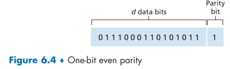

##### Two-Dimensional Parity bit check

Here, the d bits in D are divided into i rows and j columns. A parity value is computed for each row and for each column. The resulting i + j + 1 parity bits comprise the link-layer frame’s error-detection bits.

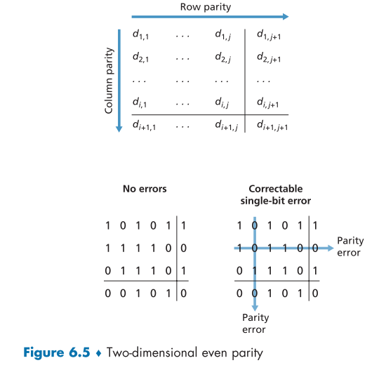

> **Forward error correction (FEC)**
>
> The ability of the receiver to both detect and correct errors. These techniques are commonly used in audio storage and playback devices such as audio CDs.

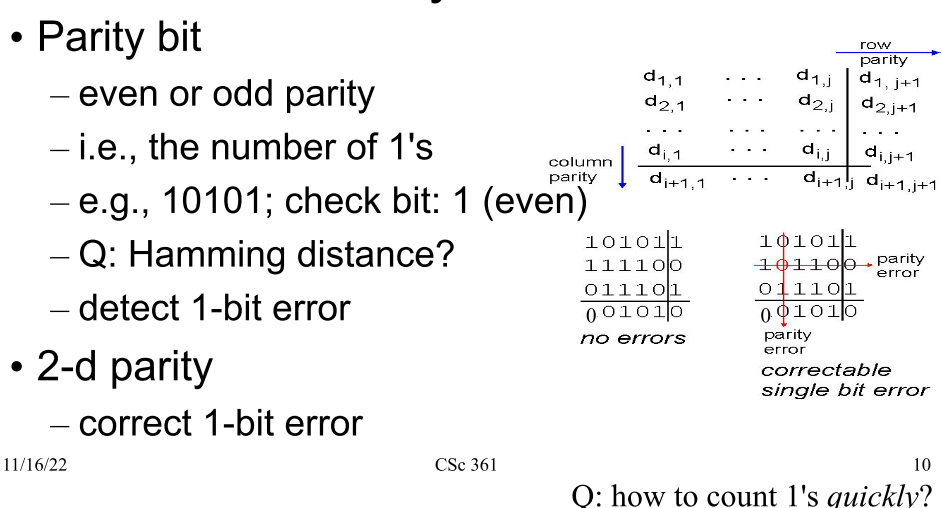

#### 6.2.2 - Check summing Methods

In checksumming techniques, the d bits of data in Figure 6.4 are treated as a sequence of k-bit integers. One simple checksumming method is to simply sum these k-bit integers and use the resulting sum as the error-detection bits.

**Steps**:

1. bytes of data are treated as 16-bit integers and summed
2. The 1s complement of this sum then forms the Internet checksum that is carried in the segment header.
3. the receiver checks the checksum by taking the 1s complement of the sum of the received data (including the checksum) and checking whether the result is all 0 bits.
4. If any of the bits are 1, an error is indicated.

Checksumming methods require relatively little packet overhead (16-bits). Provides relatively weak protection against errors as compared with cyclic redundancy check

##### Check Summing vs Cyclic Redundancy

**Transport layer** is typically implemented in software in a host as part of the host’s operating system. Because transport-layer error detection is implemented in **software**, it is important to have a simple and fast error-detection scheme such as **checksumming**.

**Link Layer** error detection is implemented in **dedicated hardware** in adapters, which can rapidly perform the more **complex CRC operations**.

- Link Layer = Hardware = Cyclic Redundancy
- Transport Layer = Software = Check Summing

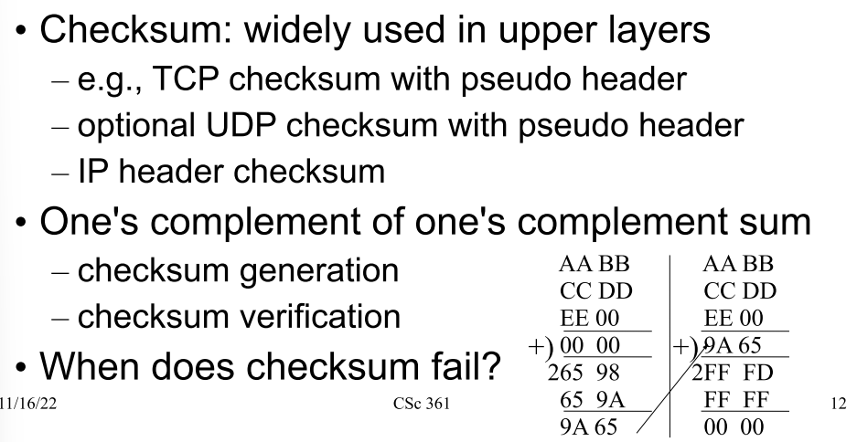

#### 6.2.3 - Cyclic Redundancy Check (CRC)

> **cyclic redundancy check (CRC) codes // Polynomial Codes**
>
> It is possible to view the bit string to be sent as a polynomial whose coefficients are the 0 and 1 values in the bit string, with operations on the bit string interpreted as polynomial arithmetic.

**Steps:**

1. The sender and receiver must first agree on an r + 1 bit pattern, known as a **generator**, which we will denote as G.
2. We will require that the most significant (leftmost) bit of G be a 1.
3. For a given piece of data, D, the sender will choose r additional bits, R, and append them to D such that the resulting d + r bit pattern (interpreted as a binary number) is exactly divisible by G (i.e., has no remainder) using modulo-2 arithmetic.
4. The receiver divides the d + r received bits by G. If the remainder is nonzero, the receiver knows that an error has occurred; otherwise the data is accepted as being correct.

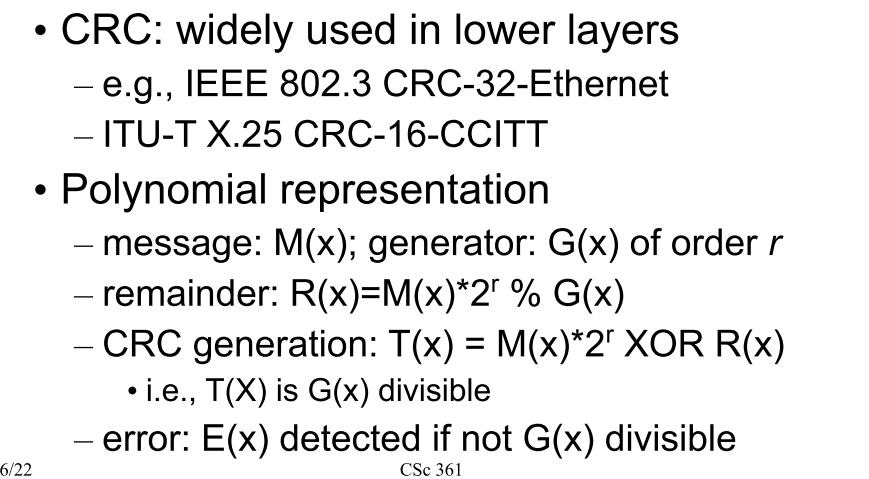

>  ***Note*:** All CRC calculations are done in modulo-2 arithmetic without carries in addition or borrows in subtraction.

> Example:
>
> 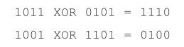
>
> Also, we similarly have:
>
> 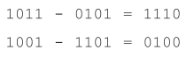

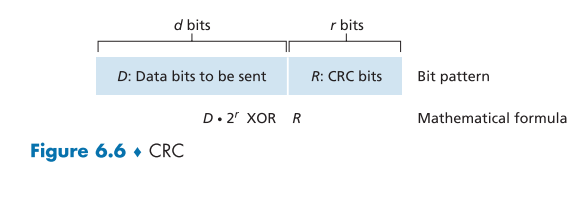

##### CRC Algorithm 

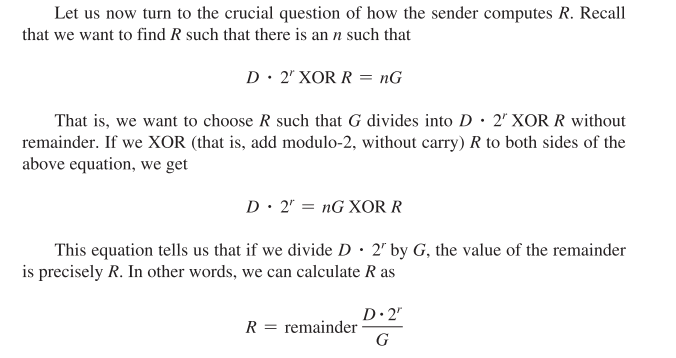

> **Examples:**
>
> 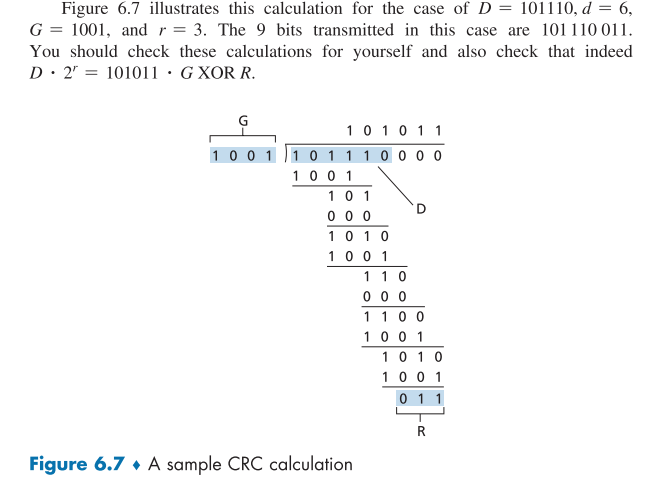
>
> 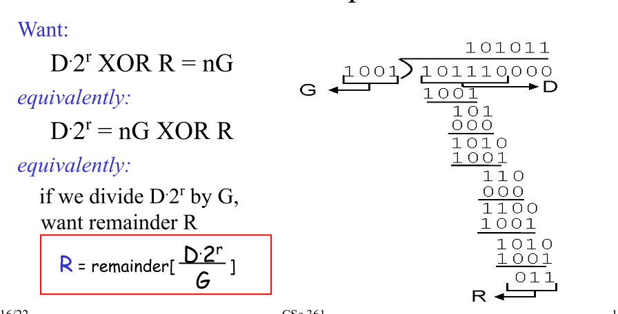

##### Error Recovery 

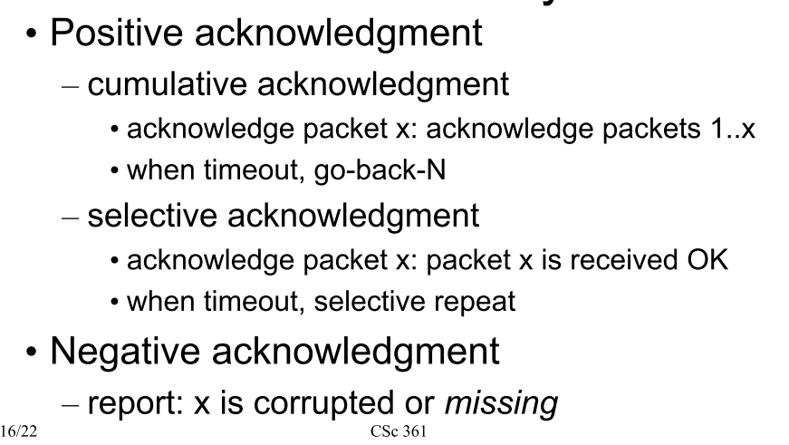

## 6.3 - Multiple Access Links and Protocols

Two types of protocols:

- **point-to-point link** - A single sender at one end of the link and a single receiver at the other end of the link.
- **broadcast link** - Can have multiple sending and receiving nodes all connected to the same, single, shared broadcast channel. (Ex. Ethernet and wireless LANs)

> **multiple access problem**
>
> How to coordinate the access of multiple sending and receiving nodes to a shared broadcast channel.

> **multiple access protocols**
>
> Nodes regulate their transmission into the shared broadcast channel.

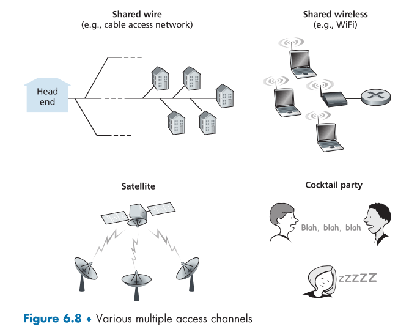

**The 3 Multiple access protocol categories:**

- Channel partitioning protocols
- Random access protocols
- Taking-turns protocols

**Characteristics of a Multiple Access Protocol:**

1. When only one node has data to send, that node has a throughput of R bps.
2. When M nodes have data to send, each of these nodes has a throughput of R/M bps. This need not necessarily imply that each of the M nodes always has an instantaneous rate of R/M, but rather that each node should have an average transmission rate of R/M over some suitably defined interval of time.
3. The protocol is decentralized; that is, there is no master node that represents a single point of failure for the network.
4. The protocol is simple, so that it is inexpensive to implement.

#### 6.3.1 - Channel Partitioning Protocols 

Partitioning can use FDM, TDM or CDMA.

> ##### Frequency-division multiplexing (FDM)
>
> 
>
> 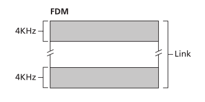
>
> **Pros:**
>
> - It avoids collisions
> - divides the bandwidth fairly among the N nodes.
>
> **Cons:**
>
> - Node is limited to a bandwidth of R/N, even when it is the only node with packets to send.

> ##### Time-division multiplexing (TDM)
>
> 
>
> 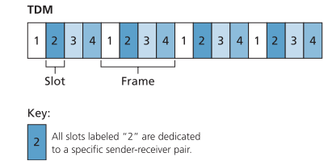
>
> **Pros:**
>
> - Eliminates Collisions.
> - Perfectly Fair - Each node gets a dedicated transmission rate.
>
> **Cons:**
>
> - Node is limited to an average rate of R/N bps even when it is the only node with packets to send.
> - that a node must always wait for its turn in the transmission sequence.

> ##### Code division multiple access (CDMA)
>
> 
>
> CDMA assigns a different code to each node. Each node then uses its unique code to encode the data bits it sends. Data can be sent simultaneously.
>
> - Military applications (Anti-jamming Properties)
> - Call towers because of its ties to Wireless networks

#### 6.3.2 - Random Access Protocols 

A transmitting node always transmits at the full rate of the channel, namely, R bps. When there is a collision, each node involved in the collision repeatedly retransmits its frame (that is, packet) until its frame gets through without a collision. 

> ***Note:*** Utilizes a Random delay to avoid collisions.

**Four major Random access protocols:**

- Slotted ALOHA
- Pure ALOHA
- Carrier Sense Multiple Access (CSMA)
- Carrier Sense Multiple Access with Collison detection (CSMA/CD)

> ##### Slotted ALOHA
>
> 
>
> 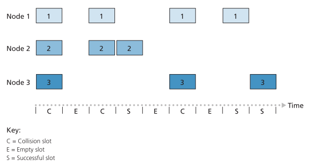
>
> ######  Properties:
>
> - All frames consist of exactly L bits. 
> - Time is divided into slots of size L/R seconds (that is, a slot equals the time to transmit one frame).
> - Nodes start to transmit frames only at the beginnings of slots.
> - The nodes are synchronized so that each node knows when the slots begin. 
> - If two or more frames collide in a slot, then all the nodes detect the collision event before the slot ends.
>
> ###### Operation:
>
> 1. When the node has a fresh frame to send, it waits until the beginning of the next slot and transmits the entire frame in the slot.
> 2. If there isn’t a collision, the node has successfully transmitted its frame and thus need not consider retransmitting the frame. (The node can prepare a new frame for transmission, if it has one.)
> 3. If there is a collision, the node detects the collision before the end of the slot. The node retransmits its frame in each subsequent slot with probability p until the frame is transmitted without a collision.
>
> ###### Pros:
>
> - Allows a node to transmit continuously at the full rate, R, when that node is the only active node.
> - Is also highly decentralized, because each node detects collisions and independently decides when to retransmit.
> - Extremely simple protocol.
>
> ###### Cons:
>
> - Requires the slots to be synchronized in the nodes.
>
> ###### Efficiency: 
>
> $$
>  \lim_{N \rightarrow \infty } Np \big(1-p\big) N-1 =  \frac{1}{e} 
> $$
>
> when there are N active nodes, the efficiency of slotted ALOHA is
> Np(1 - p)N-1. To obtain the maximum efficiency for N active nodes, we have to find the p* that maximizes this expression. (See the homework problems for a general outline of this derivation.) And to obtain the maximum efficiency for a large number of active nodes, we take the limit of Np*(1 - p*)N-1 as N approaches infinity. (Again, see the homework problems.) After performing these calculations, we’ll find that the maximum efficiency of the protocol is given by 1/e = 0.37. That is, when a large number of nodes have many frames to transmit, then (at best) only 37 percent of the slots do useful work. Thus, the effective transmission rate of the channel is not R bps but only 0.37 R bps!

> ##### Pure ALOHA
>
> 
>
> 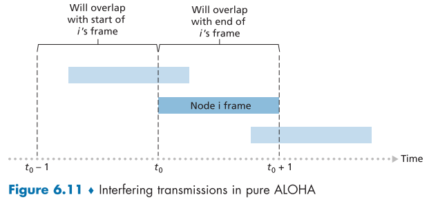
>
> - Fully decentralized protocol
> - No time slots 
>
> ###### Efficiency:
>
> $$
>  \lim_{N \rightarrow \infty } Np \big(1-p\big) 2\big(N-1\big) =  \frac{1}{2e} 
> $$
>
> The probability that all other nodes do not begin a transmission in this interval is (1 - p)N-1. Similarly, no other node can begin a transmission while node i is transmitting, as such a transmission would overlap with the latter part of node i’s transmission. The probability that all other nodes do not begin a transmission in this interval is also (1 - p)N-1. Thus, the probability that a given node has a successful transmission is p(1 - p)2(N-1). By taking limits as in the slotted ALOHA case, we find that the maximum efficiency of the pure ALOHA protocol is only 1/(2e)—exactly half that of slotted ALOHA.

> ##### Carrier Sense Multiple Access (CSMA)
>
> 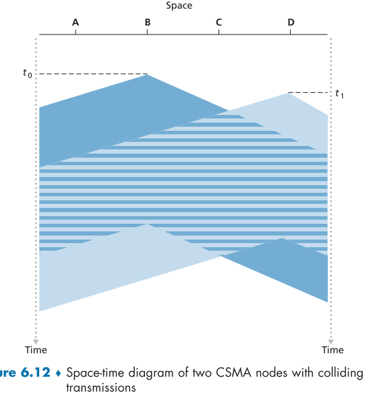

> ##### Carrier Sense Multiple Access with Collison detection (CSMA/CD)
>
> 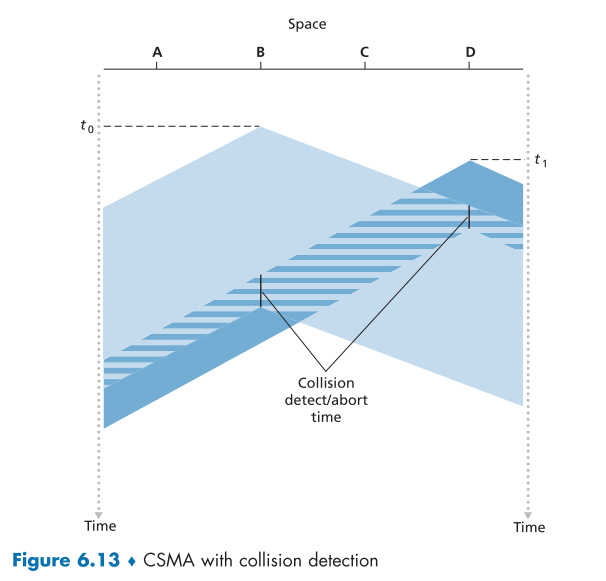

#### 6.3.3 - Taking-Turns Protocols

## 6.4 - Switched Local Area Networks

#### 6.4.1 - Link-Layer Addressing and ARP 

#### 6.4.2 - Ethernet 

#### 6.4.3 - Link-Layer Switches

## 6.7 - Retrospective: A Day in the Life of a Web Page Request

#### 6.7.1 - Getting Started: DHCP, UDP, IP, and Ethernet 

#### 6.7.2 - Still Getting Started: DNS and ARP

#### 6.7.3 - Still Getting Started: Intra-Domain Routing to the DNS Server 

#### 6.7.4 - Web Client-Server Interaction: TCP and HTTP

# Chapter 7 - Wireless and Mobile Networks

## 7.1 - Introduction

## 7.2 - Wireless Links and Network Characteristics

#### 7.2.1 - CDMA

## 7.3 - WiFi: 802.11 Wireless LANs

#### 7.3.1 - The 802.11 Architecture 

#### 7.3.2 - The 802.11 MAC Protocol 

#### 7.3.3 - The IEEE 802.11 Frame
